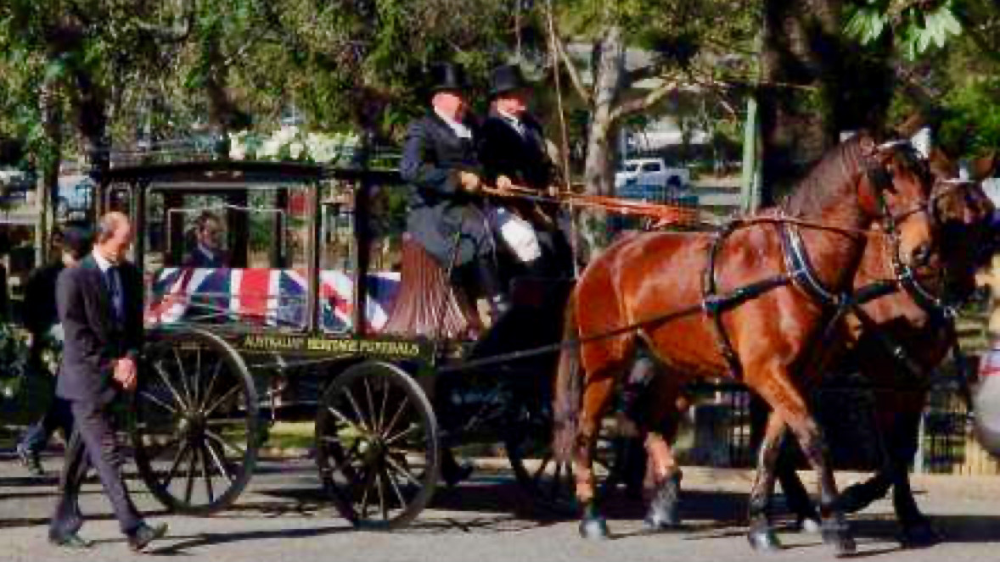
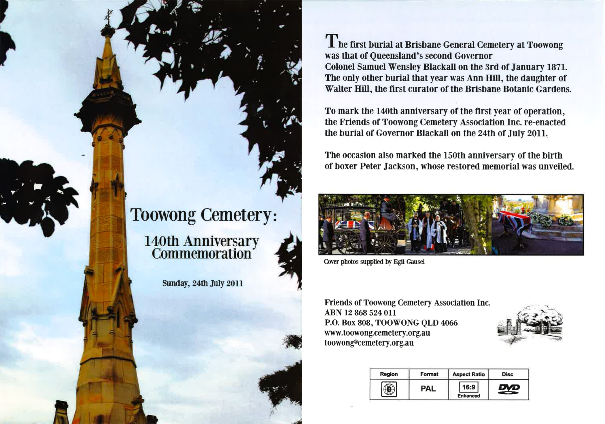

# 140^th^ Anniversary Commemoration of the Toowong Cemetery

To mark the anniversary of Toowong Cemetery's first year of operation, there was a Heritage Day on Sunday, 24^th^ of July 2011 featuring a re-enactment of the burial of Governor Blackall. A speech was made by Her Excellency Ms Penelope Wensley AC. 

Watch the **[Governor's funeral re-enacted in Brisbane](https://youtu.be/8sdVuMGc_1s)** on ABC News (Australia) 

{ width="70%" }

Read about the:

- **[death and burial of Governor Blackall](https://trove.nla.gov.au/newspaper/article/1295293)** from the pages of the Brisbane Courier, 3 January 1871.
- **[re-enactment of Governor Blackall's burial](https://www.slq.qld.gov.au/blog/toowong-cemetery-marks-140-years)** in the State Library of Queensland Blog.

A book, **[Colonel Samuel Wensley Blackall : 1809-1871](../assets/guides/samuel-blackall.pdf)** was published to celebrate the 140^th^ anniversary of the first year of operation of the Brisbane General Cemetery, now known as the Toowong Cemetery, and the internment of the first person buried there, Governor Samuel Wensley Blackall.

The Friends of Toowong Cemetery received a Silver Award in the 2012 [National Trust of Queensland Heritage Awards for Volunteer Projects](https://www.nationaltrustqld.org.au/what-we-do/heritage-awards) for the 140^th^ Anniversary Commemoration of the cemetery.

{ width="70%" }

The event was filmed and a DVD has been produced featuring footage of the re-enactment and segments outlining the history of the cemetery and stories of some people buried there. The DVD is available for purchase for $25 (including GST and postage within Australia).

[Buy the Toowong Cemetery: 140^th^ Anniversary Commemoration DVD](https://forms.gle/8Eont7fDf7BdScxA7){ .md-button .md-button--primary }
