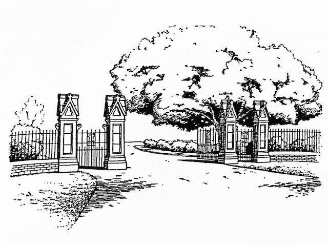
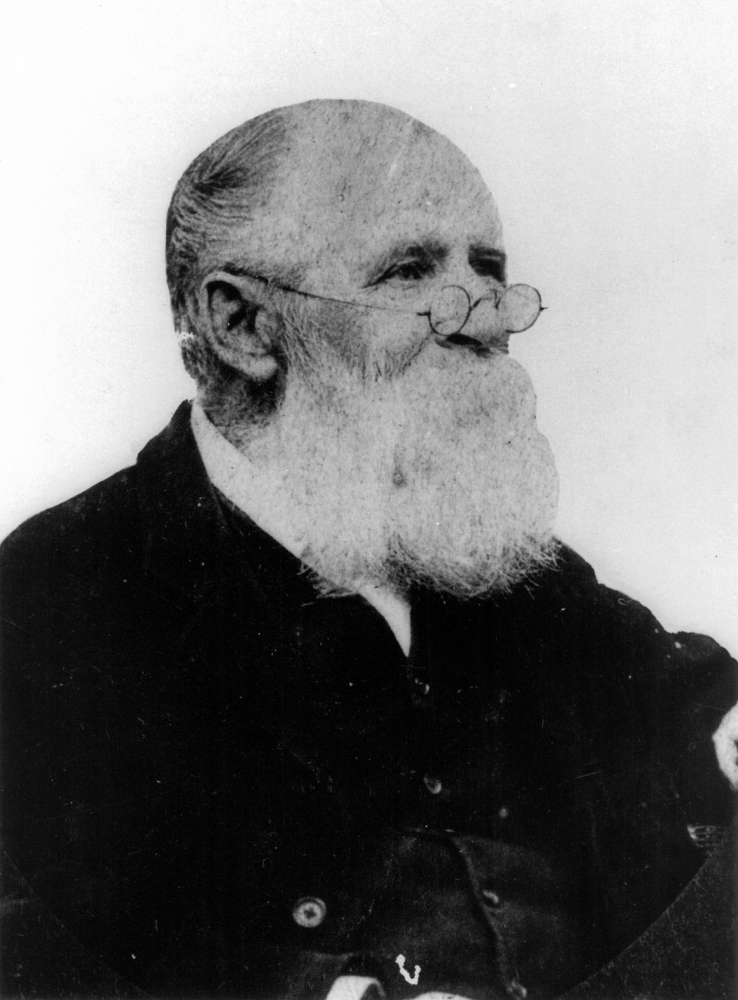

# Extraordinary Stories of Ordinary People

**Some stories about people interred at Toowong Cemetery**

Edited by Hilda MacLean

{ width="80%" }  

*<small>Drawing of Toowong Cemetery Gates — Jeff Turner.</small>*

!!! directions "A web version of the book" 

    This is web version of *Extraordinary Stories of Ordinary People*, ISBN 0-646-37317-X, available at [Brisbane City Council Libraries](https://library-brisbane.ent.sirsidynix.net.au/client/en_AU/eLibCat/search/detailnonmodal/ent:$002f$002fSD_ILS$002f0$002fSD_ILS:120843/one).
        
    Some corrections have been made. Images may differ from those in the book. Minor formatting changes. 

## Foreword

Old cemeteries reflect aspects of our social, religious, cultural, architectural and literary history not found in such a combination in any other place. Toowong Cemetery is the largest in Queensland and is an important record of the history of Brisbane and Queensland.

At the end of the convict period the main cemetery was near the northern end of the present William Jolly Bridge. In 1844 the Paddington Cemetery (on the site of the current Suncorp Stadium at Lang Park) came into use. This cemetery quickly became overcrowded. As early as 1853 a petition requesting a new general cemetery was sent to the Government of New South Wales, of which Queensland was then a part.

In June 1866 a site of 203 acres at the base of One Tree Hill (now Mt Coot-tha) about 6 kilometres from the centre of Brisbane was surveyed for a cemetery reserve. This was extended to 257 acres in October 1870.

Queensland's second Governor, Colonel Samuel Blackall, was ill and this prompted him to choose a plot the highest in the cemetery - for his grave. He died in January 1871 and was the first to be buried in the new cemetery. His impressive memorial continues to dominate the hill.

Trustees were appointed to administer the cemetery in October 1871. The inhabitants of Brisbane were reluctant to use the new cemetery because of the lack of public transport and resultant higher funeral costs. In 1875 the railway was extended through to Toowong and the cemetery was officially opened on the 5^th^ of July 1875.

Although Governor Blackall was the first person buried in Toowong Cemetery, several memorials predate his grave. In 1881 the bodies of three children who died in the early 1830s (their fathers were guards in the convict settlement) were exhumed from a North Quay site and, with the original headstones, transferred to Toowong Cemetery. Around 1911 a small number of remains and memorials from the Paddington Cemetery were also removed to Toowong Cemetery.

In 1915 a parcel of 132 acres was transferred to the Toowong Town Council to provide parkland and the proceeds used for the erection of a cemetery wall, iron railing and gates. In 1930 the administration of the cemetery was handed over by the trustees to the newly formed Brisbane City Council.

By April 1975 almost all available plots in Toowong Cemetery had been sold but burials still take place in family graves. More new graves were made available in January 1999.

It is estimated that around 116,000 are buried in Toowong Cemetery. While there is a large amount of information available on a small number of very notable individuals, little is known about the majority of the people buried at Toowong. These are the 'ordinary people'. Every one has an 'extraordinary story'. All contributed in some way to the fabric of our early Queensland society.

Members of the public, including descendants, have provided these stories with the aim of letting the contributions of these individuals be known.

While every care has been taken in checking the accuracy of the contributions, many are stories passed down through the generations, and are unable to be substantiated. In any case, the stories are fascinating reading. 

Photographs have been supplied by the contributors. Sources are acknowledged where known. 

The Friends of Toowong Cemetery Association Inc. would like to sincerely thank all of the contributors for sharing their 'Extraordinary Stories'. <!-- Their names are listed in the back of this book. -->

This publication is the first of a series. Further volumes will be published progressively as contributions are received.

The cover drawing is one of a series by Jeff Turner, funded by a Brisbane City Council Cultural Grant.

Publication of this book was made possible through a [Brisbane City Council Local History Grant](https://www.brisbane.qld.gov.au/community-and-safety/grants-awards-and-sponsorships/creative-and-history-grants).

Hilda Maclean  
Honorary Secretary  
Friends of Toowong Cemetery  
April 1999

--- 

--8<-- "snippets/agnes-susan-maclean.md"

--- 

--8<-- "snippets/jessie-massey.md"

---

--8<-- "snippets/catherine-greasley.md"

--- 

--8<-- "snippets/emily-sophia-pickett.md"

--- 

<!-- TODO reconcile with issac-walter-jenner snippett -->

## Walter Issac Jenner <small>(5‑43‑16)</small>

<!-- 8 March 1836 - 1 March 1902 -->

Walter Jenner was born on the 8^th^ of March 1836 in Godalming, Surrey, England. In 1854 he joined the Navy, retiring from it in 1865. He tried various jobs and at age 29 settled in Brighton and started to paint. He became quite well known, exhibiting at the English and Scottish Academies, the Royal Pavilion Gallery, Brighton and the Crystal Palace, London.

On the 31^st^ of July 1883, aged 47, he left with his family for Queensland on the *RMS Roma*. They first lived at Dornoch Terrace, Highgate Hill and later in Montrose Street, Taringa. In 1884, only a year after arriving in Brisbane, he exhibited at the Queensland National Association. Subsequently he won prizes and medals interstate and at the Colonial and Indian Exhibition in London. Soon after his arrival in Brisbane, Walter initiated meetings to discuss the founding of a Queensland Art Society. The QAS was then formally inaugurated at the School of Arts, Ann Street, on the 4^th^ of August 1887.

Walter then proposed the founding of a public art gallery in Queensland and led a deputation to the Premier to that end. After much lobbying the Queensland National Art Gallery (as it was then known) was established by the Government in March 1895. Jenner continued to paint and exhibit until ill health prevented him from working. He died on the 1^st^ of March 1902.

The prominent part Jenner played in art matters is recognised in the catalogue of the Gallery Collection of 1908 and again in the Gallery's 1982 Commemorative Catalogue. A retrospective exhibition of Jenner's work was held late in 1994. The exhibition drew heavily on works owned by Jenner's great-granddaughter and works from the collection of the Queensland Art Gallery.

{ width="40%" }  

*<small>[Noted Queensland artist Isaac Walter Jenner](http://onesearch.slq.qld.gov.au/permalink/f/1upgmng/slq_alma21218843570002061) — State Library of Queensland.</small>*

### Acknowledgement

This story was contributed by Frances Pavlu.

--- 

--8<-- "snippets/glenville-massy.md"

--- 

## Michael Fryar Shield <small>(18‑8‑24)</small>

<!-- ca. 1851 - 5 August 1935 -->

## Mary Ann Shield <small>(18‑8‑24)</small> 

<!-- ca. 1852 - 7 July 1905 -->

## Albert Shield <small>(29A‑67‑9)</small>

Michel Fryar Shield was born in England. He came to Australia with his parents and siblings from Newcastle-Upon-Tyne on the ship *Stamboul* in 1854. They settled in Moggill and were very early colonists there. He moved to Brookfield and married his first cousin, Mary Ann Makepeace. They raised twelve children. He never remarried after Mary Ann's death in 1905 aged 53. Michel died on the 5^th^ of August 1935 aged 84 years.

Mary Ann's parents, Thomas Tindale Makepeace and his wife Hannah Fryar, migrated from Gosforth, Newcastle, England and arrived in Australia in 1857. After settling initially in Newcastle, the family moved to Moggill, where her father work in the Redbank Mines. A serious accident resulting in the amputation of a leg forced Thomas to take up farming at Moggill. Thomas was a foundation member of the Moggill Methodist Church (now the Wesleyan Church).

Albert Shield was the son of Michel and Mary Ann Shield. He was a surveyor and a teacher and taught at the old Normal School in Brisbane. He was the first teacher at the Kuala Lumpur Survey School. He became the Administrator of the Malay States. He had 12 servants but he was single. He became very ill with malaria when he was there and returned to Australia a very sick man. Albert died on the 15^th^ of January 1936 aged 41 years.

### Acknowledgement

This story was contributed by M. Kelly.

--- 

--8<-- "snippets/mary-craig-atkinson.md"

--- 

--8<-- "snippets/silvester-diggles.md"

--- 

## John T. S. Bird <small>(5‑30‑9A)</small>

<!-- 10 May 1842 - 7 May 1932 -->

John T. S. Bird was born on the 10^th^ of May 1842 in Buckland Brewer, Devon. He was entered in the birth register as Zephenneh Theopilus Symons Bird and was known as Jephunneh for some time. In Australia he was always known as John or 'J. T. S.' Bird.

John began working with the Rockhampton *Morning Bulletin* newspaper on the day after his arrival in June 1863. He was one of the 457 English and Irish migrants to arrive in Rockhampton aboard the ship *Beejapore*. Although a qualified printer, he spent some years seeking gold, mostly in central Queensland. He was the co-discoverer, with Arthur Hoskings, of the Ridgelands alluvial goldfields near Rockhampton in 1867. A year later he married Kezia Seymour. By 1870, with his wife and daughter Ella, he was invited back onto the *Morning Bulletin* staff and served in various capacities during his long career.

Kezia gained some fame by providing the first clue in the arrest of Commissioner Griffin for the murder of Troopers Power and Bird during a gold shipment robbery in 1869.

Originally on the mechanical printing staff, John was appointed foreman in 1875 and later became overseer. By 1876 he was writing very popular sporting articles under the name 'Veno', and because of his practical mining experience he became the mining reporter. The newspaper was the first to describe Queensland's famous Mount Morgan mine. He was Rockhampton's first historian, and his articles on the early days and notable people were collected and published by the *Morning Bulletin* in 1904 as *The Early History of Rockhampton* by J. T. S. Bird. This is now a rare volume and is accepted as being one of the best of its genre.

Two of John's sons, Robert and John, followed their father into the newspaper business. At one stage the entire family was on the staff, and they claimed that, if necessary, they could produce the whole paper.

In 1909 he was appointed sub-editor of the *Capricornian* and continued on the literary staff of these newspapers until his wife's death in 1918, when he moved to Brisbane. Even from there he wrote freelance articles for the *Rockhampton Bulletin* until about six months before his death on the 7^th^ of May 1932, just three days short of his 90^th^ birthday. Rockhampton honoured him by naming a street, Bird Court and a park after him.

John and Kezia had a total of eight children, some of whom are buried at Toowong Cemetery. His eldest child, Ella, who looked after John until her death in 1928, is buried in the family plot along with her brother John T. H. Bird who became the chief Hansard reporter for the Queensland Parliament. J. T. S. Bird's sixth child, Beatrice Kezia, is buried alongside her husband, James T. Wiley, who was tragically killed in an Ascot house fire in 1952. Beatrice raised the orphaned children of her sister Violet. Violet had died prematurely in 1918 and her husband, Ernest Moulday, succumbed to influenza during the great epidemic of 1919.

### Acknowledgement

This story was contributed by Dottie Kemp.

--- 

--8<-- "snippets/james-campbell.md"

--- 

## Mary Kennedy <small>(1‑4‑11/12)</small>

<!-- circa 1820 - 5 August 1885 -->

## Andrew Kennedy <small>(1‑19‑3)</small>

<!-- circa 1858 - 22 February 1930 -->

## Doris Vivian Kennedy <small>(1‑50‑11A)</small>

<!-- 1899 - 28 September 1979 -->

Mary  was a school teacher before and after four her marriage to Samuel Kennedy. Together they had four children, three daughters and a son they named Andrew. Mary was widowed when Andrew was only eight months old. She was living and working at the Drumbie School near Armagh, Ireland. The family emigrated to Brisbane in 1865 and moved into a property in Isaac Street, Spring Hill. Mary died aged 65 on the 5^th^ of August 1885.

Andrew also became a teacher, starting as a pupil-teacher in 1870 and retiring as the Acting Under Secretary of the Department of Public Instruction in 1922. He married Anna Katherine Gripp in 1880 and the couple had ten children. The family lived at *Kingsholm* at New Farm where Andrew died on the 22^nd^ of February 1930 aged 72.

Teaching was in the Kennedy family blood. Andrew and Anna's youngest child, Doris Vivian, was born at *Kingsholm* in 1899. Doris graduated from the University of Queensland with a Bachelor of Arts in 1920. She taught at Brisbane Girls Grammar School for 42 years. Doris died on the 28^th^ of September 1979 aged 80.

### Acknowledgement

This story was contributed by Ian Kennedy.

--- 

<!-- TODO reconcile with Notable Women -->

## Florence Griffiths Buchanan <small>(11‑33‑4)</small>

<!-- 16 September 1861 - 30 December 1913  -->

Florence Griffiths Buchanan was born on the 16^th^ of September 1861 at Barton Fields, Canterbury, England, the youngest of the six children of Captain Neil Griffiths Buchanan of the 93^rd^ Highlanders. In 1882 she came out to join her brother in Bundaberg. She became interested in the missionary work done among the South Sea Islanders. She returned to England in the following year, but, finding the weather too cold, lived in Malta and then Egypt. Florence returned to Bundaberg in 1877 and at once resumed her work among the Islanders on her brother's plantation and elsewhere. Florence suffered a horrific riding accident which left her crippled and subject to terrible pain and headaches for the rest of her life.

Florence left Bundaberg after the great flood of 1893, where she had to be rescued from her submerged cottage. She arrived on Thursday Island where she started worked for the church. This would be her vocation for 19 years until her death in 1913.

On the 5^th^ of January 1908, Florence was ordained Deaconess by the Anglican Bishop of Carpentaria and later that year was in charge of the newly established mission in Moa during the Bishop's absence. Florence worked as a teacher as well as carrying out her duties as superintendent for three years. Despite her physical difficulties, Florence would walk great distances to assist those in need.

Fearing that to the this was getting of too much for her as her, the Bishop lent to the Diocese of Singapore as a temporary helper. On her return to Darwin, Florence again worked as a teacher.

A very modest woman, Florence always dressed in the plainest of uniforms. She was noted for her self sacrifice, a cup of tea and a slice of toast being her usual meal. Florence was much loved by the children she taught and the parishioners of the North.

Florence was in Brisbane attending the Church Congress when she became ill for the last time. She died aged 53 after a terribly painful lingering illness. The inscription on her headstone reads 

>*Well Done Good and Faithful Servant.*

### Acknowledgement

This story was contributed by Patrica Ramsay.

--- 

## Anders Peter Petersen-Neilsen <small>(9‑7‑7)</small>

<!-- 1842 - 10 May 1928 -->

## Emma Christina Petersen-Neilsen <small>(9‑7‑7)</small>

<!-- 1842 - 27 January 1925 -->

Anders Peter Petersen-Neilsen and his wife, Emma Christina, were both born in 1842 in Tjorn, about 45 kilometres north of Goteborg in Sweden. They both came from farming families and are believed to have married in Goteborg on the 7^th^ of January 1870. A son, Carl, was born to them in Sweden later that year. 

The 1870s were a time of acute distress in Sweden as the result of overpopulation and poor farm production and during that period almost one million people emigrated. Most went to the USA but quite a number came to Australia.

In October 1872, Anders, Emma and toddler Carl departed from Sweden and sailed for Queensland in the ship *Lammershagen*.

The *Lammershagen* was a German immigrant ship which sailed from Hamburg with a migrant complement of 112 married adults, 116 single males, 76 single females and 67 children. The passengers were principally Swedish, Danish, Norwegian and German farming people, most of whom were assisted migrants whose fares were either subsidised or fully paid for by the Queensland Colonial Government. 

The voyage to Australia was a long and bitter experience. In line with the practice of the times, each passenger was allowed a ration of very basic food daily and it was a requirement that each bring several changes of clothing as laundering was permitted only at ports of call during the trip. Thirteen passengers died and 17 children were born during the voyage. Young Carl was one of those who died. He was buried at sea.

On arrival in Australian waters, an outbreak of typhoid occurred among the passengers and crew, which resulted in the ship being placed in quarantine at Peel Island, Moreton Bay on the 9^th^ of January, 1873. It was during the quarantine period that a second child, Anna Caroline, was born on the 21^st^ of January 1873. The ship was finally allowed to berth in the Port of Brisbane on the 12^th^ of February 1873 and the migrant passengers were placed in a hostel at Kangaroo Point, where the family stayed for several weeks.

Anders first worked for wages on a farm at Bald Hills and then went to a farm owned by a Mr Robinson on the South Pine River. It was on this farm that the Aboriginals helped them strip bark from trees to roof their house and cow bails. Quite often the Aboriginals came to the house for tobacco and flour. Later Anders leased a small farm in an area bounded by Albany Creek Road,wherehe ran the first cattle he owned. In 1889 he leased a further 37 acres situated on the South Pine River at Cash's Crossing.

In those times, about once per month the family harnessed the sulky or their wagon and drove into the city of Brisbane with dressed pigs and calves for sale to an Adelaide Street butcher and produce which was sold at the markets which then stood in Roma Street.

Anders purchased a farm at Samford in October 1893. The area consisted of approximately 120 hectares. He borrowed about a third of the purchase price. By now, eleven children had been born to the family of whom nine survived infancy. The family initially lived in a slab hut but in 1900 a new house was built, financed by the sale of some of the land.

While the farm was only 24 kilometres from Brisbane, trips to town by sulky or wagon were somewhat of an expedition, entailing a 3am start and a return late at night. Occasionally an overnight stay at a city boarding house was necessary.

Anders and Emma were pillars of the local Methodist church, subscribing to have a new church built about 100 metres from their home. The church was known as the Cedar Creek Methodist Church. The parson would drive his sulky there from Enoggera. The parson would stay the weekend with the Petersen-Neilsens while he conducted services in the church and visited the local parishioners. After Anders and Emma retired to Brisbane, the farm passed into the hands of their son. The weekend visits of the parson to the farm did not thrill the younger members of the family to the same extent and eventually Frederick gave rather generously to have the church removed to Samford township.

When Anders sold the farm to Frederick on the 4^th^ of May 1915, he and Emma were 72. They moved to Paddington, next door to their daughter Emily. Emma died at the age of 82 years on the 27^th^ of January 1925 and Anders died on the 10^th^ of May 1928 aged 85.

### Acknowledgement

This story was contributed by Gordon Neilson.

--- 

--8<-- "snippets/joseph-needham-scrope-shrapnel.md"

--- 

--8<-- "snippets/john-boyne-mclennan.md"

--- 

--8<-- "snippets/william-james-affleck.md"

--- 

--8<-- "snippets/maud-voller-affleck.md"

--- 

## John Wood Rendall <small>(1‑51‑2)</small>

<!-- 1828 - 27 November 1873 -->

## Amelia Hewitt Rendall <small>(1‑51‑2)</small>

<!-- 1829 - 1922 -->

## Mary Ann Rodrigues <small>(1‑51‑2)</small>

<!-- circa 1800 - 23 June 1883 -->

--8<-- "snippets/john-wood-rendall.md"

--- 

## Alfred Roberts <small>(13‑1‑2)</small>

<!-- 1837 - 10 May 1920 -->

Alfred Roberts was born in 1837 in Putney, London,
England and he arrived in Queensland about 1860. In 1872 he began a horse-drawn omnibus line which operated between Eagle Street in the city and the present site of the Taringa shopping centre. The business was lost when the stables burned down about 1893, and Roberts returned to farming at Moggill. He died on the 10^th^ of May 1920.

--- 

--8<-- "snippets/james-klaassen.md"

--- 

## Robert Arthur Johnstone <small>(5‑36‑15/16)</small>

<!-- 1843 - January 1905 -->

Robert Arthur Johnstone was born at Richmond, Van Diemen's Land in 1843. He was a grandson of George Johnston. He was educated in Scotland, then returned to work with stock in Queensland in 1865. In 1868 he became manager of the first sugar plantation at Bellenden Plains, north of Cardwell. He was appointed sub-inspector of native police for Cardwell in 1871 and his patrols took him into unexplored areas, investigating reports of shipwrecks, murders and massacres. His response to Aboriginal hostilities was sometimes considered extreme. In 1873 he accompanied G. E. Dalrymple to explore the northern coastline to Cooktown. The Johnstone River was named after him, as were a freshwater crocodile and a species of freshwater turtle. In 1876 he named the Barron River. His exploration led to the establishment of Cairns and Innisfail.

In 1881 he became the first police magistrate at Winton. He also served at Bundaberg, Howard, Maryborough and
Beenleigh before moving to Toowong, where he died in 1905. He had nine children, of whom three sons and four daughters survived him.

{ width="40%"}

*<small>Robert Arthur Johnstone in [The Queenslander, 28 January 1905, p. 32](https://commons.wikimedia.org/w/index.php?curid=26306068), Public Domain.</small>*

### Acknowledgement

This story was contributed by Dr Bill Kitson.

--- 

--8<-- "snippets/elizabeth-smith.md"

--- 

## John Melville <small>(9‑10‑4)</small>

<!-- 10 September 1834 - 8 March 1912 -->

John Melville was born at Boreham Wood, Hertfordshire, England on the 10^th^ of September 1834. In 1848 he came with his parents under the sponsorship of Dr John Dunmore Lang, to Queensland. They left England in the ship Fortitude on the 4th of September arriving in Moreton Bay during January 1849. In 1851 when the gold rush started in Victoria, John went to try his luck but returned to Brisbane at Christmas 1854 to visit his family. He then met Sir (then Mr) A. C. Gregory and was asked to join his Great Northern exploration party for the purpose of exploring the Victoria and Albert Rivers, an invitation which he accepted.

The party consisted of 18 members, including Augustus C. Gregory as Commander, his brother, H.C. Gregory as Assistant Commander and Ferdinand von Muller, who was a botanist.

They left Brisbane on the 12^th^ of August 1855 in two vessels, The Monarch and the Tom Tough, and the experiences related by John were always a source of pleasure to his friends who were privileged to hear them. He was the last surviving member of this expedition. After returning from the expedition John was engaged in survey work until 1871, when he acted as chainman to Mr George Phillips, who had been engaged to survey part of the present cemetery at Toowong. In 1873 John was appointed overseer of the cemetery by the Trustees, the position he held for 38 years. During which time he endeared himself to all by his kindness and courtesy. He passed away at the age of 77 years and was survived by his widow, two sons and three daughters.

His grand-daughter, Mrs Joyce Glassop, remembers the house where John Melville and his family lived. It was later demolished when the Toowong Bus Depot was built.

### Acknowledgement

This story was contributed by Joyce Glassop.

--- 

## David Henry Chapman <small>(4‑38‑10/11)</small>

<!-- circa 1906 - 20 October 1923 -->

## Percival Louis Chapman <small>(4‑38‑10/11)</small>

<!-- circa 1910 - 12 February 1925 -->

## Eric Austin Chapman <small>(4‑38‑10/11)</small>

<!-- circa 1912 - 11 January 1926 -->

## Margaret Agnes Chapman <small>(4‑38‑10/11)</small>

<!-- circa 1913 - 1 July 1936 -->

The Chapman family tragedy unfolded over a number of years. The first death in the family was that of David Chapman, who died on the 20^th^ of October 1923, aged 17. Less than two years later, on the 12th of February 1925, his brother, Percival, died aged 15. Almost a year later, yet another brother, Eric, died on the 11^th^ of January 1926 aged 14. No more children died for ten years, until their sister, Margaret, died on the 1^st^ of July 1936 aged 23.

What could have caused this tragic string of deaths? According to a family member, they all died of lead poisoning. After the rain, the children would lick the water off the railings because it tasted sweet. In those days, paint containing lead was widely used. The family was oblivious to the danger for years.

### Acknowledgement

This story was contributed by Ron Gibson.

--- 

## Robert Anderson Wightman <small>(18‑154‑15)</small>

<!-- 3 February 1853 - 25 December 1921 -->

## Jeanie Greenlees Wightman <small>(18‑154‑15)</small>

<!-- 15 July 1856 - 10 October 1936 -->

Robert Wightman was born on the 3^rd^ of February 1853 at Tradeston, Scotland. He was an architect and a member of the Plantation U. F. Church for forty years and held all of the offices of the congregation during that time.

Robert married Jeanie Greenlees Dunsmore on the 12th June of 1883. Her father was Henry Dunsmore and her mother was Agnes Carruth. Jeanie was born on the 15^th^ of July 1856 in Glasgow, Scotland.

Robert entered the Town Council of Govan, Scotland in 1893 as a representative of the sixth ward, and continued as such for sixteen years. Shortly after his election he was promoted convener of the Watching and Lighting Committee, and in this capacity initiated the movement which resulted in the Council deciding to manufacture electricity for the use of the burgh. His wife, Jeanie, was said to have turned on the first electric light in Govan.

Robert also served terms representing the Govan Council on the Combination Hospital Board for two terms, while he filled the Magistrates chair for three years very successfully.

Robert and Jeanie with two of their sons, Henry and Robert, and their daughter Jeanie migrated to Australia on the *S.S. Omrah* in 1911. Their eldest son Thomas was already a resident here. The family resided at Ascog Terrace, Toowong. Robert became a member of the committee for the management of Toowong Presbyterian Church. Robert Anderson Wightman died on Christmas Day 1921 at his home at Toowong.

Jeanie Greenlees Wightman died on the 10^th^ of October 1936 at the age of 80 years. She was knocked down by a truck one Saturday morning while shopping in Toowong. She was buried in the same grave as her husband.

### Acknowledgement

This story was contributed by Dorothy Collyer.

--- 

## Emma Miller <small>(13‑6‑5/6)</small>

<!-- June 1839 - January 1917 -->

Emma Miller is greatly honoured in Brisbane. The parkland located between the Roma Street Station and Albert Street Uniting Church carries the name *Emma Miller Place* and is noted for public oratory. There is a statue of her in King George Square, a white marble bust in the Trades Hall in Peel Street, South Brisbane, and a memorial headstone in Toowong Cemetery.

A feature of some of these marks of honour is the inscription: "*The world is my country, to do good is my religion*". This was the motto of Emma Miller. She was a women whose tremendous moral courage enabled her to endure the contempt and ridicule of the privileged in her lifelong drive to counter poverty and oppression wherever she encountered it.

### Acknowledgement

This story was contributed by Noni Malone.

--- 

--8<-- "snippets/william-ernest-schleusener.md"
