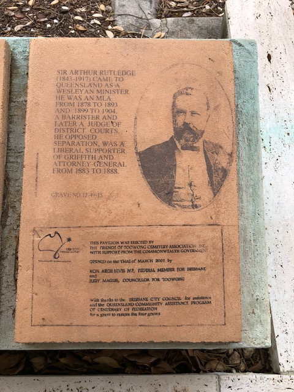

# Federation Pavilion

The Federation Pavilion commemorates the contribution of the delegates who attended the 1891 Australian Federation Convention that are buried at the Toowong Cemetery. It was officially opened on 3 March 2001.

>This Pavilion honours  
>   
>Samuel Walker Griffith  
>John Donaldson  
>Thomas MacDonald‑Paterson  
>and Arthur Rutledge  
>   
>Queensland delegates to the 1891  
>Australian Federation Convention  
>   
>Who are interred nearby  

## Four stones tell the delegate's stories.

> This Pavilion commemorates  
>  
> Four men who were among the seven Queensland delegates to the 1891 National Australasian Convention which led to the federation of the Australian States in 1901.
>  
> Under the leadership of Griffith the Australian Constitution was drafted at this convention.  
>  
> They are buried in Toowong Cemetery.

## Samuel Walker Griffith

> Sir Samuel Walker Griffith (1845-1920) was born in Wales and migrated to Australia as a child. He was a brilliant student and at the age of 18 unsuccessfully applied for the position of Ipswich Grammar School Headmaster, having graduated from Sydney University with Honours in maths and classics.  
>  
> He was elected to the Legislative Assembly in 1872, and was Attorney General and twice Premier of Queensland. He was Vice President of the National Australasian Convention and Chairman of the Drafting Committee. His political career included both rivalry with the conservative Premier Sir Thomas McIlwrath (1835-1907) and a period of government in coalition with him, in 1893.  
>  
> He left government to become Chief Justice of Queensland and from 1903 to 1919 was the first Chief Justice of the High Court of Australia.  
>  
> His literary achievements include the translation of Dante’s *Divine Comedy ('in the hendacasyllabic measure of the original Italian')* published in 1911 by Oxford University.  
>  
> Grave No. 12-11-6/7 

## John Donaldson 

> John Donaldson (1841-1896) was a Queensland pastoralist and a member of the Council of United Pastoralists' Association during the Great Strikes. He served as Colonial Treasurer from 1889-1890 during turbulent times in Queensland.  
>  
> Grave No. 12-47-13 

## Thomas MacDonald-Paterson 

> Thomas Macdonald‑Paterson (1844-1906) arrived from Scotland in 1861. He was a Butcher, Solicitor, Investor, Mayor of Rockhampton, MLA 1878-1885 and 1896-1901, MLC from 1885 to 1896 and the first Federal Member of Brisbane of the Australian House of Representatives from 1901 to 1903. He was a supporter of the Separation for North Queensland.  
>  
> Grave No. 12‑53-10 

## Arthur Rutledge

> Sir Arthur Rutledge (1843-1917) came to Queensland as a Wesleyan Minister. He was an MLA from 1878 to 1893 and 1899 to 1904. A Barrister and later a Judge of the District Courts. He opposed separation, was a Liberal, supporter of Griffith, and Attorney General from 1883 to 1888. 
>  
> Grave No. 13‑49‑15

## Acknowledgements 

> This Pavilion was erected by the Friends of Toowong Cemetery Association Inc. with the support from the Commonwealth Government.  
>  
> Open on the Third of March 2001 by  
>  
> Hon. Arch Bevis MP, Federal Minister for Brisbane  
> and  
> Judy Magub, Councillor for Toowong  
>  
> With thanks also to the Brisbane City Council for assistance and the Queensland Community Assistance Program of Centenary of Federation for a grant to restore the four graves  

## Learn more

- Visit the graves by following the [Federation Walk](../stories/federation-walk.md) 
- Read about the [Federation of Australia](https://peo.gov.au/understand-our-parliament/history-of-parliament/federation/the-federation-of-australia/)
