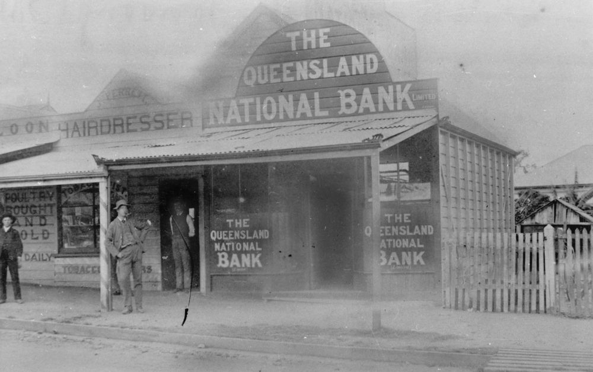
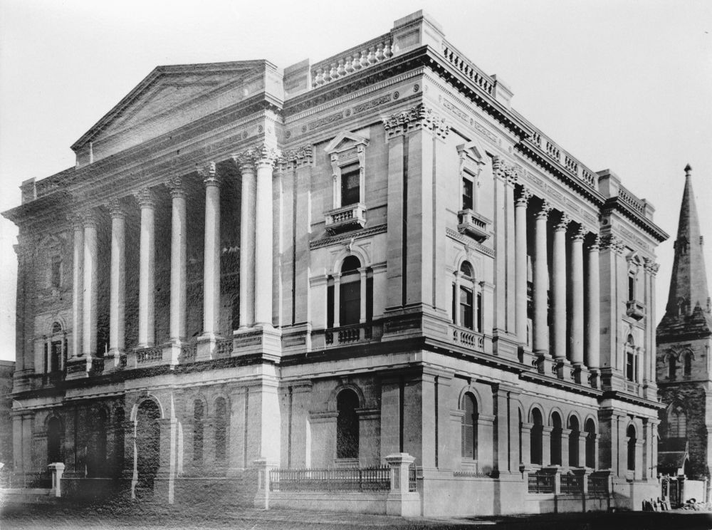

--8<-- "snippets/sem/about.json"

# About Us 

**Friends of Toowong Cemetery keep the cemetery's history and stories alive.**

 

{ .off-glb }

## Contact Us

[Say Hello, send us an email :fontawesome-solid-paper-plane:](mailto:president@fotc.au?subject=Hello%20Friends%20of%20Toowong%20Cemetery&body=Hello%20Friends%20of%20Toowong%20Cemetery%2C%0A%0A){ .md-button .md-button--primary }

## What we do 

The Friends of Toowong Cemetery:

- **research the [history of Toowong Cemetery](../research/history.md)**, its [headstones](../headstones/index.md), and the [stories](../stories/index.md) of the people remembered here. 
- **share our discoveries** with the community through our [guided tours](../guided-tours.md), museum, [self-guided walks](../walks/index.md), [publications](publications.md), and [data](../research/data.md).
- **contribute stories** of people remembered at the Toowong and Paddington cemeteries to other publications, biographical databases, and information signs around the cemetery.
- **search for buried headstones** in [archaeological digs](../headstones/archaeological-digs.md) in the cemetery grounds. 
- **consult with the Brisbane City Council** on future plans and heritage preservation.
- **[help families locate and clean graves](mailto:president@fotc.au?subject=I%20need%20help%20with%20a%20family%20grave)**.

<!-- 
- run volunteer events to **clean gravesites and preserve headstones**.
-->

## What we've done

The Friends of Toowong Cemetery have:

- **established the [Federation Pavilion](../visit/federation-pavilion.md)**, which commemorates the contribution of the delegates who attended the 1891 Australian Federation Convention that are buried at the Toowong Cemetery. 
- **commemorated the [140^th^ Anniversary of the cemetery](140-commemoration.md)**. We received an Award from the National Trust of Queensland for our work.
- provided stories for **[information signs](information-signs.md)** at significant grave sites.
- **renamed cemetery roads** after notable people buried nearby, added the road names to [Google Maps](https://goo.gl/maps/7VX36iDLFNnShN6D8), [Apple Maps](https://maps.apple.com/?ll=-27.474621,152.982575&spn=0.005187,0.008217&t=m), and improved the <a href="../../assets/toowong-cemetery-map-large.jpg" target="_blank">Toowong Cemetery map</a> to make it easier to for you to find your way around the cemetery.
- **[published books, a DVD](publications.md)**, and this website.
- **[recognised 42 soldiers in unmarked graves](https://minister.dva.gov.au/news-and-media/minister/recognition-and-respect-their-final-resting-place)** with help from the Australian Government.  

*<small>Federation Pavilion</small>* 

<!--
## What we're working on

Currently we are: 

- planning to erect an **[honour board](https://youtu.be/mVfixEzUpwk)** at the cemetery's main entrance to commemorate people who have served their nation in military uniform and now rest in Toowong Cemetery.
- **photographing every headstone** in the cemetery.
-->

<!-- 
## Join in

Friends of Toowong Cemetery meet at **[Mt Coot‑tha Botanical Gardens Auditorium](https://www.brisbane.qld.gov.au/things-to-see-and-do/council-venues-and-precincts/parks/botanic-gardens-in-brisbane/brisbane-botanic-gardens-mt-Coot-tha)** on the last Wednesday of the month (except December) from 6pm to 7pm.

<!-
:fontawesome-regular-calendar-plus: **[Add the 2022 meetings to your Calendar](../assets/calendar/meetings-2022.ics)**
->

**[Email Us](mailto:president@fotc.au)** if you'd like to apply to join. Applications are subject Management Committee approval.

-->

## Our details

The Friends of Toowong Cemetery Association Inc. is a:

- Queensland Incorporated Association: **[IA17170](https://www.qld.gov.au/law/laws-regulated-industries-and-accountability/queensland-laws-and-regulations/check-a-licence-association-charity-or-register/check-a-charity-or-association)**. <!-- that abides by a set of **[rules](../assets/documents/fotc-rules.pdf)** -->
- Registered Australian Business, ABN: **[12868524011](https://abr.business.gov.au/ABN/View?id=12868524011)**. <!--  that holds holds public liability insurance with **[History Queensland Inc.](https://www.historyqueensland.org.au/insurance/)** for $20 million -->
- **[Registered Charity](https://www.acnc.gov.au/charity/charities/cbe72786-39af-e811-a963-000d3ad24077/profile)** with the Australian Charities and Not-for-profits Commission (ACNC)

{ width="25%" .off-glb } 

Our Bank details are: 

- Branch: **NAB Brisbane**
- BSB: **084034** 
- Account Number: **522327844**

<!--
Please include your Surname as a reference if paying a membership subscription by direct deposit. 
--> 

<figure markdown>
  
  <figcaption markdown>[Shops along High Street, Toowong, Brisbane, Queensland, ca. 1890](http://onesearch.slq.qld.gov.au/permalink/f/1upgmng/slq_alma21256972890002061) — State Library of Queensland.</figcaption>
</figure>

<!--
{ width="45%" }
 
*<small>[Queensland National Bank, Brisbane, ca. 1885](http://onesearch.slq.qld.gov.au/permalink/f/1upgmng/slq_alma21218524600002061). The Creek Street Presbyterian Church at the rear was demolished shortly after this image was taken — State Library of Queensland.</small>*
-->
