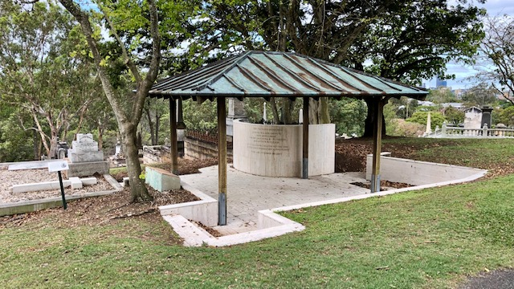

--8<-- "snippets/sem/about.json"

# About Us 

**Friends of Toowong Cemetery is a volunteer group that discover and share the history and stories of Toowong Cemetery.**

 

## What we do 

The Friends of Toowong Cemetery:

- **research the [history of Toowong Cemetery](../history.md)**, its [headstones](../headstones/symbols.md), and the [stories](../stories/) of the people remembered here. 
- **share our discoveries** with the community through our [guided tours](../guided-tours.md), published [stories](../stories/), museum, [publications](publications.md), and [data](../research/data.md).
- **contribute stories** of people remembered at the Toowong and [Paddington cemeteries](https://www.brisbane.qld.gov.au/community-and-safety/community-support/cemeteries/historic-cemeteries/paddington-cemetery) to other publications, biographical databases, and information signs around the cemetery.
- **clean and conserve headstones**.
- **search for buried headstones** in [archaeological digs](../headstones/archaeological-digs.md) in the cemetery grounds. 
- **consult with the Brisbane City Council** on future plans and the restoration of graves.
- **locate marked and unmarked graves**.

## What we've done

The Friends of Toowong Cemetery have:

- **established the [Federation Pavilion](federation-pavilion.md)**, which commemorates the contribution of the delegates who attended the 1891 Australian Federation Convention that are buried at the Toowong Cemetery. 
- **commemorated the [140^th^ Anniversary of the cemetery](140-commemoration.md)**. We received an Award from the National Trust of Queensland for our work.
- provided **stories for information signs** at significant grave sites.
- **renamed cemetery roads** after notable people buried nearby, and added the road names to [Google Maps](https://goo.gl/maps/7VX36iDLFNnShN6D8) to make it easier to for you to find your way around the cemetery.
- shared the history and stories of Toowong Cemetery through monthly **[guided tours](../guided-tours.md)**.
- **[published books, a DVD](publications.md)** and this website.  

*<small>Federation Pavilion</small>* 

## What we're working on

Currently we are: 

- planning to erect an **[honour board](https://youtu.be/mVfixEzUpwk)** at the cemetery's main entrance to commemorate people who have served their nation in military uniform and now rest in Toowong Cemetery.
- **photographing every headstone** in the cemetery.
- **encouraging the community to volunteer** :fontawesome-solid-hand-holding-heart: through simple one-off tasks shown on this site.  <!-- like the one below. -->

<!--
!!! question "Volunteer - help us update the cemetery maps"

    To update our maps we need:
    
    - access and a licence to the cemetery location data and [grave data](https://www.brisbane.qld.gov.au/community-and-safety/community-support/cemeteries/grave-location-search). 
    - someone skilled in making maps. **Can you help?** 
-->

<!-- 
## What have we got planned? 

With the **150^th^ Anniversary** of the opening of Toowong Cemetery on **Saturday 5 July 2025** we're planning a very special event. More will be revealed closer to the day.

-->

## Join in

Friends of Toowong Cemetery meet at **[Mt Coot-tha Botanical Gardens Auditorium](https://www.brisbane.qld.gov.au/things-to-see-and-do/council-venues-and-precincts/parks/botanic-gardens-in-brisbane/brisbane-botanic-gardens-mt-coot-tha)** on the **[last Wednesday of the month](https://www.timeanddate.com/calendar/custom.html?year=2022&y2=2023&months=24&country=29&typ=3&display=3&cols=0&fdow=7&hol=0&ctf=5&ctc=2&holmark=2&hod=1&hcl=1&cdt=7&cwd=___1___&cwf=______&holm=1&df=1)** (except December and January) from 6pm to 7pm.

<!--
:fontawesome-regular-calendar-plus: **[Add the 2022 meetings to your Calendar](../assets/calendar/meetings-2022.ics)**
-->

To join in, complete the **[Application form](https://forms.gle/iwFKCnpNYRTSeHLb8)** and pay the annual membership subscription (includes GST):

- $11 Individuals
- $5.50 Students and Pensioners

[Apply to Join Friends of Toowong Cemetery](https://forms.gle/iwFKCnpNYRTSeHLb8){ .md-button .md-button--primary }

## Important information

The Friends of Toowong Cemetery Association Inc. is a:

- Queensland Incorporated Association: **[IA17170](https://www.qld.gov.au/law/laws-regulated-industries-and-accountability/queensland-laws-and-regulations/check-a-licence-association-charity-or-register/check-a-charity-or-association)** that abides by a set of **[rules](../assets/documents/fotc-rules.pdf)**
- Registered Australian Business, ABN: **[12868524011](https://abr.business.gov.au/ABN/View?id=12868524011)**  that holds holds public liability insurance with **[History Queensland Inc.](https://www.historyqueensland.org.au/insurance/)** for $20 million 
- **[Registered Charity](https://www.acnc.gov.au/charity/charities/cbe72786-39af-e811-a963-000d3ad24077/profile)** with the Australian Charities and Not-for-profits Commission (ACNC)

{ width="25%" } 

Our Bank details are: 

- Branch: **NAB Toowong**
- BSB: **084-424** 
- Account Number: **67-601-3012**

Please include your Surname as a reference if paying a membership subscription by direct deposit. 

*<small>[Shops along High Street, Toowong, Brisbane, Queensland, ca. 1890](http://onesearch.slq.qld.gov.au/permalink/f/1upgmng/slq_alma21256972890002061) - State Library of Queensland.</small>*

<!--
{ width="45%" }
 
*<small>[Queensland National Bank, Brisbane, ca. 1885](http://onesearch.slq.qld.gov.au/permalink/f/1upgmng/slq_alma21218524600002061). The Creek Street Presbyterian Church at the rear was demolished shortly after this image was taken - State Library of Queensland.</small>*
-->
