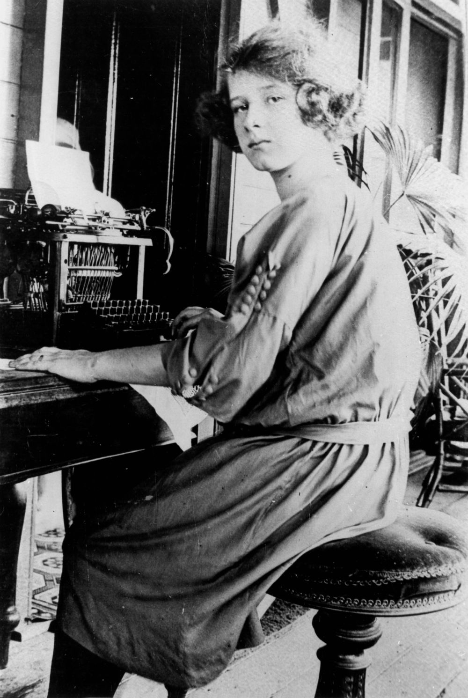

<!-- -8- "snippets/sem/contact.json" TODO or NOT NEEDED -->

--8<-- "snippets/hide-nav.html"

# Contact Us 

**Hi 👋 great to see you here. We'd love to help.**

We use forms to help you:

- **[provide feedback on this site](https://docs.google.com/forms/d/e/1FAIpQLSeS7K7-e-ofnn2OkPDL6ql7-CkBL67wwsQiv9upMDoRcXCRJQ/viewform)**
- **[contribute a story](https://forms.gle/U94dcEj6RihM9BPq9)**
- **[apply to join Friends of Toowong Cemetery](https://forms.gle/iwFKCnpNYRTSeHLb8)**
- **[buy the Toowong Cemetery 140th Anniversary DVD](https://forms.gle/vHhV1rYCoPeRPPBSA)**

You can contact us via: 

- Email: **[inquiries@fotc.org.au](mailto:inquiries@fotc.org.au)**
- Phone: **[0439998053](tel:0439998053)**
- Facebook: **[@1871fotc](https://www.facebook.com/1871fotc/)**

<!--
- Twitter: **[@1871fotc](https://twitter.com/1871fotc)**
- GitHub: **[@1871fotc](https://github.com/1871fotc)**
-->

You can send a letter to: 

**Friends of Toowong Cemetery Association Inc.**  
**PO Box 808**  
**Toowong QLD 4066**

<!--
{ width="40%" }

*<small>[Woman typing on a typewriter, ca. 1915](http://onesearch.slq.qld.gov.au/permalink/f/1upgmng/slq_alma21218088650002061) - State Library of Queensland.</small>*
-->

*<small>[Telephonists working at the, Brisbane Central telephone exchange, Brisbane, 1910](http://onesearch.slq.qld.gov.au/permalink/f/1upgmng/slq_alma21297980500002061) - State Library of Queensland.</small>*
