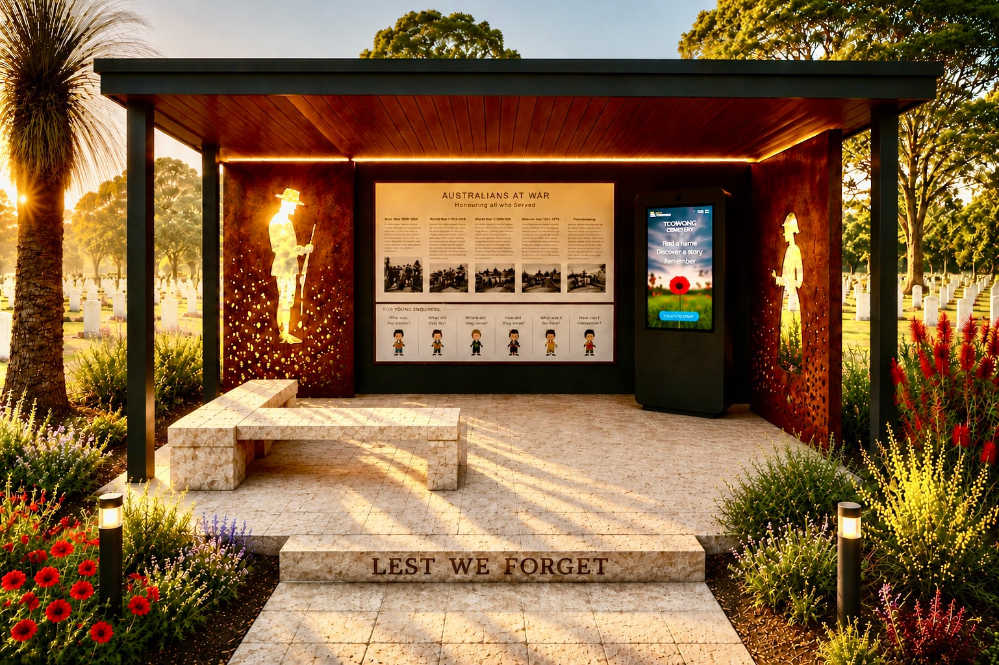

---
search:
  boost: 2
---

# Donate

**Thanks for thinking about supporting our work** :fontawesome-solid-piggy-bank:{ .heart }

### Why donate?

- To show your appreciation for Friends of Toowong Cemetery finding, cleaning, or re-lettering a family grave.
- To say thank you for a guided tour you attended.
- To help fund our improvement ideas or one of your own.

  
[Email us to discuss your ideas &nbsp; :fontawesome-solid-paper-plane:](mailto:president@fotc.au?subject=I'd%20like%20to%20support%20Friends%20of%20Toowong%20Cemetery){ .md-button .md-button--primary }

### Help fund the Toowong Cemetery Honour Board

We're raising funds for an Honour Board and Pavilion in Toowong Cemetery to recognise people who served their country in war, who are now buried in Toowong Cemetery. 

{ width="96%" } 

[Donate to the Honour Board &nbsp; :fontawesome-solid-paper-plane:](mailto:president@fotc.au?subject=I'd%20like%20to%20support%20the%20Honour%20Board){ .md-button .md-button--primary }

### Bank details

You can deposit directly into our bank account: 

- Branch: NAB Brisbane
- BSB: 084034
- Account Number: 522327844
- Reference: *your name*

Sorry: Donations are not tax deductible.
