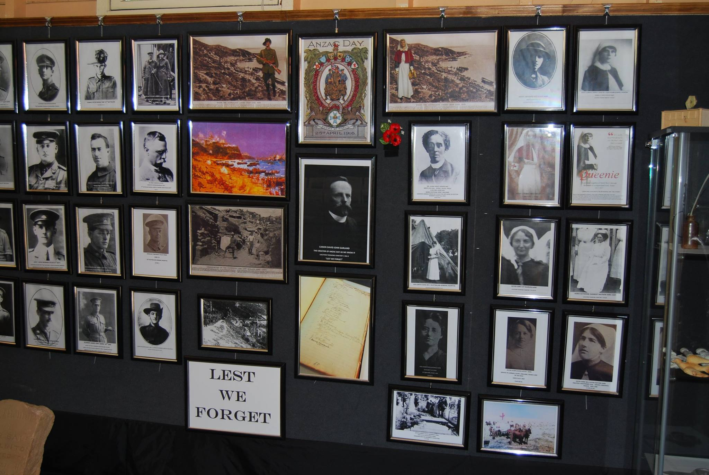
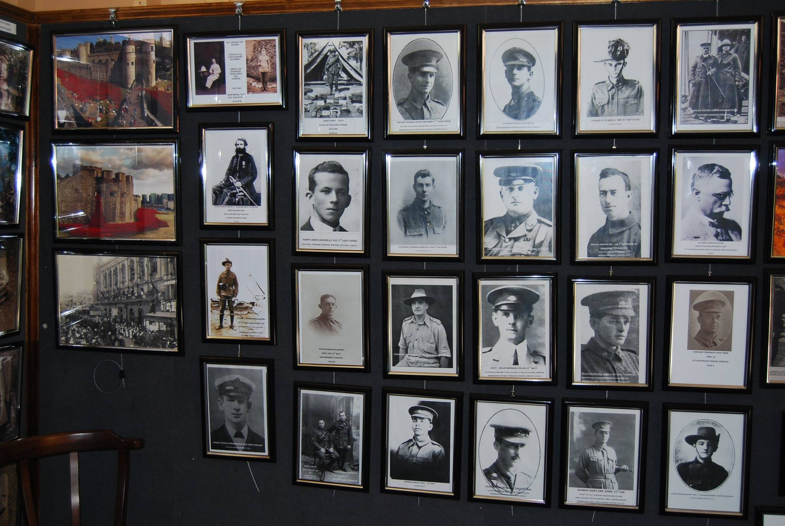
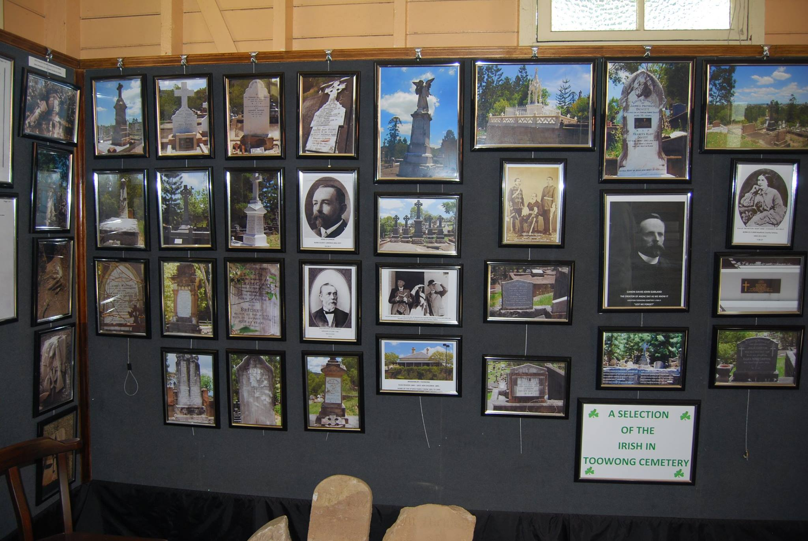
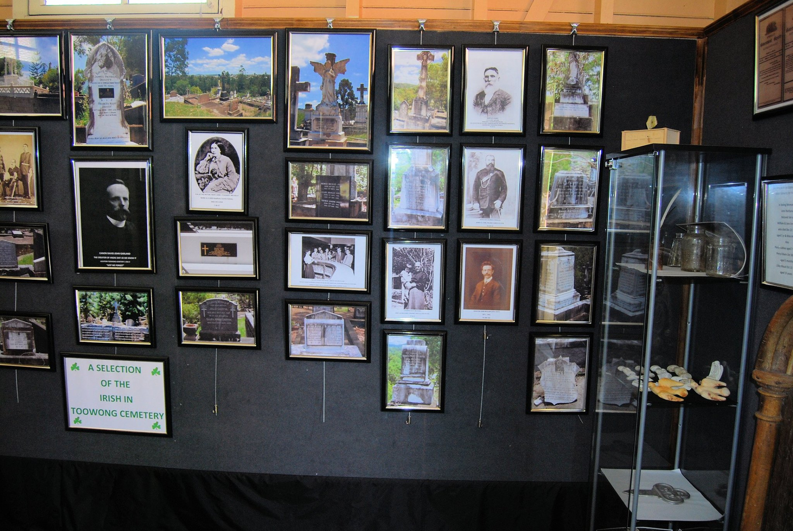
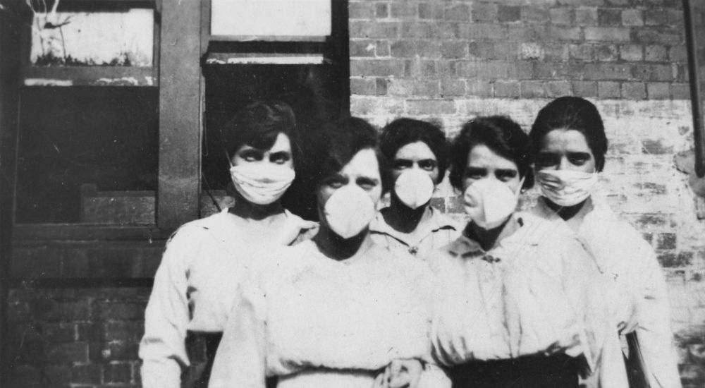

--8<-- "snippets/sem/guided-tours.json"

--8<-- "snippets/hide-nav.html"

# Toowong Cemetery Guided Tours

## Guided Tours

**Friends of Toowong Cemetery run 11 different guided walking tours each year.**

![Pat Hill's headstone][image11]{ width="32%" } ![Harry Potter's headstone][image9]{ width="32%" } ![Cherub headstone][image8]{ width="32%" }

**Guided tours are free** but donations are appreciated to help us continue **[our work](about/index.md)**.

Tours are on the **first Sunday of each month** (February to December) from **10:30am to 12:00**. 

There's no need to book, just meet under the flagpole in Canon Garland Place at the Toowong Cemetery. Parking is available inside the cemetery.

{ width="98%" data-title="Guided tours start at Canon Garland Place" }

*<small>The Flagpole in Canon Garland Place</small>*

## Upcoming Guided Tours

Our next tour is on **Sunday 1 February 2026**.

The tour is limited to 20 people. 

!!! Warning "What to bring"

    Wear enclosed shoes, a hat and sunscrean or bring an umbrella, and don't forget a bottle of water. 
    Some tours include steep hills and a walking stick or walking poles may be helpful.

## Directions to Toowong Cemetery

Use the map to get directions to Toowong Cemetery. Learn more about [visiting Toowong Cemetery](index.md#visit-toowong-cemetery).

<iframe src="https://www.google.com/maps/embed?pb=!1m10!1m8!1m3!1d3943.6078757500636!2d152.9825477508893!3d-27.474338574253586!3m2!1i1024!2i768!4f13.1!5e0!3m2!1sen!2sau!4v1642488281276!5m2!1sen!2sau" width="100%" height="450" style="border:0;" allowfullscreen="" loading="lazy"></iframe>

<!-- 
Add it to your calendar.

[Add to Calendar :fontawesome-regular-calendar-plus:](assets/calendar/fotc-tour-february.ics){ .md-button .md-button--primary }
-->

## Toowong Cemetery Museum

The Museum is open in conjunction with our guided tours if cemetery staff are on-site.

{ width="98%" data-title="Toowong Cemetery Museum is open in conjunction with our guided tours"}

*<small>The Toowong Cemetery Museum is the former Sexton's office.</small>*

The Museum has an extensive display of photographs and artefacts.

{ width="48.5%" } { width="48.5%" }
{ width="48.5%" } { width="48.5%" }

## Guided Tour Alternatives

If you can't join our guided tour, consider taking a **[Toowong Cemetery self-guided walk](walks/index.md)** or the visiting the **[headstone symbolism display](headstones/symbols.md)**.

<!--
!!! warning "COVID-19 Restrictions"

    Due to COVID-19 our guided tours are **limited to 20 guests** to enable social distancing to be maintained. 

*<small>[Women wearing surgical masks during the influenza epidemic, Brisbane, 1919](http://onesearch.slq.qld.gov.au/permalink/f/1upgmng/slq_alma21218113110002061), — State Library of Queensland. Cropped.</small>*

-->

[image4]: assets/140-commemoration-sml.png
[image5]: assets/museum.jpg
[image6]: assets/federation-pavilion.jpg
[image7]: assets/peter-jackson.jpg "Peter Jackson's Headstone"
[image8]: assets/cherub.jpg
[image9]: assets/harry-potter-16x9.jpg 
[image10]: assets/clasped-hands.jpg "We Part To Meet Again"
[image11]: assets/pat-hill-headstone.jpg 
