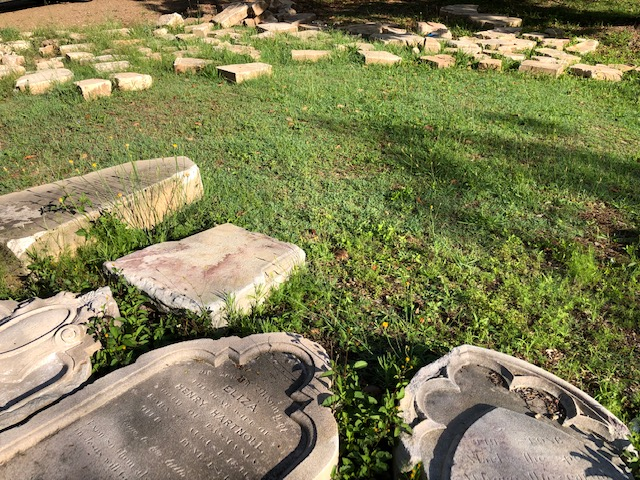

---
search:
  boost: 1
title: Archaeological Digs
description: Get your hands dirty and uncover stories from Brisbane's past 
---

--8<-- "snippets/sem/headstones/archaeological-digs.json"

# Toowong Cemetery Archaeological digs

Friends of Toowong Cemetery, in conjunction with the [University of Queensland Archaeology Department](https://social-science.uq.edu.au/undergraduate/archaeology), have been searching for buried headstones in the cemetery grounds since 2006. The annual archaeology dig is [a chance to unearth Brisbane's history](https://www.abc.net.au/news/2018-05-26/archaeology-dig-at-toowong-cemetery-a-chance-to-unearth-history/9800474). 

The next [Toowong Cemetery Archaeological Dig](https://archaeologyweek.org/events-list?category=Qld) was planned for **19-21 May 2022** but has been delayed due to the extreme weather. We hope to reschedule the dig soon.

  <iframe src="https://www.youtube.com/embed/hgCx4OW69cY" title="YouTube video player" frameborder="0" allow="accelerometer; clipboard-write; encrypted-media; gyroscope; picture-in-picture" allowfullscreen></iframe>

 

## Where did the buried headstones come from?

The buried headstones are believed to come from two sources: 

- **[Headstones from the Paddington Cemetery Reserved Area](lost-paddington-headstones.md)** dumped in Toowong Cemetery in the 1930's
- Toowong Cemetery headstones destroyed and buried in the 1970's as part of the Brisbane City Council's 'Beautification Scheme'

## Toowong Cemetery Archaeological dig finds 

Many headstones have been found in Toowong Cemetery Archaeological digs. **[See photos of our discoveries](https://www.facebook.com/pg/1871fotc/photos/?ref=page_internal)** on Facebook.

{ width="96%" } 

*<small>Toowong Cemetery Archaeological Dig Finds</small>*
