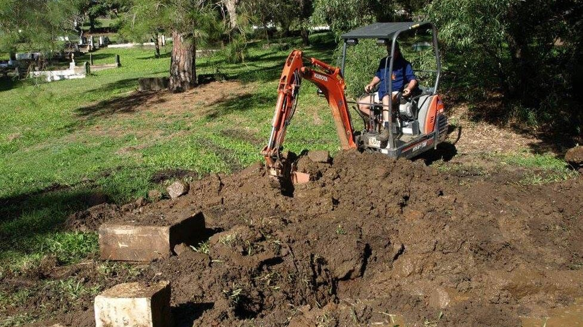

---
search:
  boost: 1
title: Archaeological Digs
description: Get your hands dirty and uncover stories from Brisbane's past 
---

--8<-- "snippets/sem/headstones/archaeological-digs.json"

# Toowong Cemetery Archaeological Digs

Friends of Toowong Cemetery, in conjunction with the [University of Queensland Archaeology Department](https://social-science.uq.edu.au/undergraduate/archaeology), have been searching for buried headstones in the cemetery grounds since 2006. The annual archaeology dig is [a chance to unearth Brisbane's history](https://www.abc.net.au/news/2018-05-26/archaeology-dig-at-toowong-cemetery-a-chance-to-unearth-history/9800474). 

The next [Toowong Cemetery Archaeological Dig](https://archaeologyweek.org/events-list?category=Qld) is planned for **Thursday 18 - Saturday 20 May 2023**.

  <iframe src="https://www.youtube.com/embed/hgCx4OW69cY" title="YouTube video player" frameborder="0" allow="accelerometer; clipboard-write; encrypted-media; gyroscope; picture-in-picture" allowfullscreen></iframe>

 

## Where did the buried headstones come from?

The headstones discovered in Toowong Cemetery Archaeological digs are believed to come from two sources: 

- **[Headstones from the Paddington Cemetery Reserved Area](lost-paddington-headstones.md)** dumped in Toowong Cemetery in the 1930's
- Headstones from Toowong Cemetery destroyed and buried in the 1970's as part of the Brisbane City Council's 'Beautification Scheme'

Archaeologist [Dr. Jon Prangell](https://social-science.uq.edu.au/profile/138/jon-prangnell) from The University of Queensland, and member of Friends of Toowong Cemetery, explains to Radio Station 4BC how the city’s forgotten headstones are being rediscovered. 

<iframe src="https://omny.fm/shows/4bc-weekends-with-spencer-howson/archaeologists-unearth-forgotten-headstones-in-too/embed" width="96%" height="180" allow="autoplay; clipboard-write" frameborder="0" title="Archaeologists unearth  forgotten headstones in Toowong"></iframe>

## Headstones uncovered in Toowong Cemetery

Many headstones have been found in Toowong Cemetery Archaeological digs. **[See photos of our discoveries](https://www.facebook.com/pg/1871fotc/photos/?ref=page_internal)** on Facebook.

{ width="96%" } 

*<small>Headstones discovered in Toowong Cemetery Archaeological digs</small>*

## Finding Thomas Mowbray

Mr. Mowbray was a [prominent police magistrate in Brisbane](https://trove.nla.gov.au/newspaper/article/82175317). His headstone was removed as part of the 'Beautification Scheme', and discovered in 2011 as part of the Toowong Cemetery Archaeological digs. The headstone was reinstated in its original location.

{ width="96%" } 

{ width="96%" } 

{ width="50.2%" } { width="44.7%" } 
