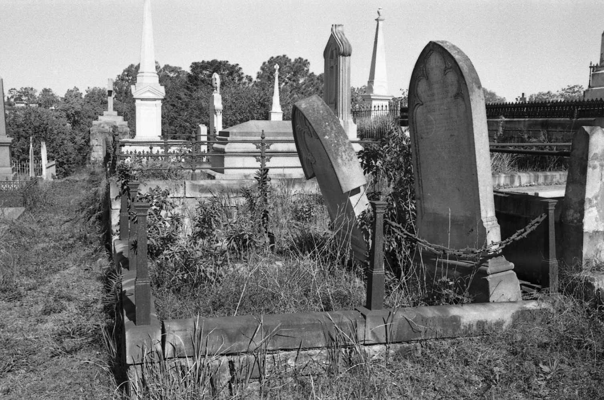
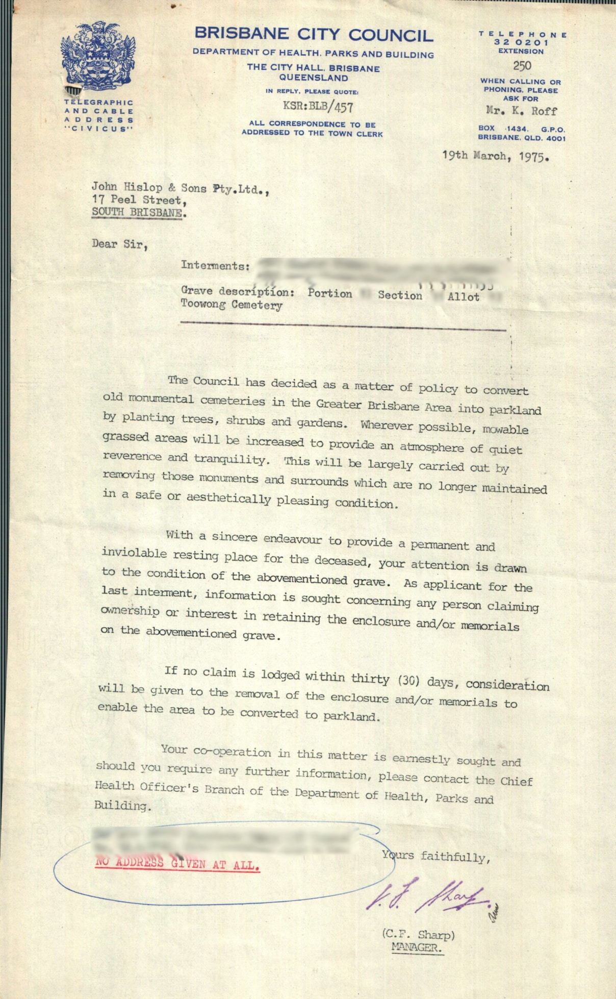

# Demolished Toowong Cemetery Headstones

By April 1975, Toowong Cemetery was full with all plots sold. The Brisbane City Council Health Dept was ordered by the then Mayor to start a project to remove hundreds of family owned headstones and grave surrounds in Toowong, Lutwyche, South Brisbane, Balmoral, and God's Acre Pioneer cemetery. Headstones were removed from these cemeteries with the aim to make open parklands.

Mayors, soldiers, politicians all fell victim to the clearance. At Toowong Cemetery, headstones were demolished and buried in the canal. The [Toowong Cemetery heritage listing](https://apps.des.qld.gov.au/heritage-register/detail/?id=601773) suggests, "*approximately 1,000 memorials were removed from Toowong*". Intervention in 1979 saw an end to the "beautification scheme". The Cemetery reopened in 1998 with approximately 450 plots for sale. 

{ width="69.6%" data-title="Dilapidated and Unsightly Graves at Toowong Cemetery, 1974" }  { width="28.4%" } 

*<small>Toowong Cemetery - Dilapidated and Unsightly Graves, 3 July 1974 — Brisbane City Council, Brisbane City Archives [BCC-B35Q-5-14]</small>*  
*<small>A letter from Brisbane City Council giving 30 days notice before removal of grave enclosures and memorials.</small>*

## Toowong Cemetery Headstones demolished in the 1970's

The table below lists the headstones listed in an "Unsightly/Dangerous Grave report". 

Friends of Toowong Cemetery have counted 1039 grave sites that were marked for removal. There are 725 rows in the table below as some grave reports were lost.

<!--  
Search the table below to find who you're looking for. 

- Click the **Headstone Location** to go to the related [Brisbane City Council Memorial Search](https://brisbane.discovereverafter.com) entry.
- Click the **Last Name** to go to that person's individual story page if Friends of Toowong Cemetery have written one.
- Click on the **Headstone Photo** to view a photo of the headstone.
- Click on the **Grave Report** to view an "Unsightly/Dangerous Grave report" that includes the interments, headstone description, inscription, and grave marker number.

-->

??? directions "About the data"

    Source: Brisbane City Council, [Toowong Cemetery Demolished Graves Correspondence (1975-1978)](https://brisbane.recollectcms.com/nodes/view/38609), [BCA0423]. Brisbane City Archives. 

    The table has a row per Grave Report. 
    
    **Headstone Location**

    - The headstone location is in Portion - Section - Grave format.
    - A Grave Report may include grave sites in multiple locations. If so, multiple locations are provided in the one entry.
    - Links go to the [Brisbane City Council Memorial Search](https://brisbane.discovereverafter.com). The link is only for one person buried in the grave and may not show all people buried in large grave sites.

    **First Name(s)**

    - First name is only recorded if there is only one person buried in the grave. 

    **Last Names(s)**

    - Multiple people with different last names may be buried in a grave. Each last name is listed in the entry.

    **Grave Report and Headstone Photo**

    - Headstone photos and Grave reports are © Brisbane City Council. 

    **Data quality** 

    - There are different spellings of names in the grave report, headstone inscription, and Memorial Search record. (We use our judgement to choose the best name to publish.)
    - Some people in the grave report may be buried in another location. For example, reinterred to another cemetery. 
    - People are mentioned in the headstone inscription but may not be buried in Toowong Cemetery. 
    - People are buried in the grave but may not be mentioned in the headstone inscription.

--8<-- "snippets/demolished-toowong-headstones.html"
