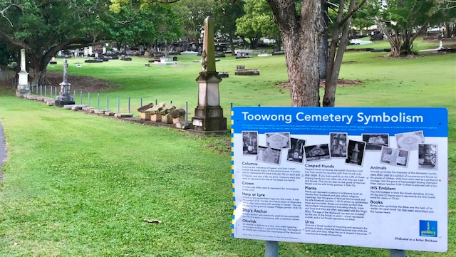

# Headstones

In cemeteries, people are often commemorated with a headstone or a plaque on a columbarium. Headstones can reflect a person's beliefs or values, their cultural identity, and their relationships to other people, organisations, or events.

<!-- TODO get better photos

{ width="23%" } { width="72.5%" }

*<small>Headstone with a propeller decoration indicating a person's professional identity.  
A plaque on a columbarium in Toowong Cemetery.</small>*
-->

## Toowong Cemetery Headstones 

Toowong Cemetery contains:

- **[Queensland's oldest headstones](queenslands-oldest-headstones.md)** from the 1830's
- **[headstones moved from Paddington Cemetery](moved-paddington-headstones.md)** (1844 - 1875) in the 1910's
- headstones of people buried at Toowong Cemetery since 1871 

<!-- Show below memorable memorials not in BCC self-guided walks (photos of ralston, mayne, oldest ) -->

{ width="100%" }

*<small>Pioneer Children's Graves (13-10-4), Queensland's oldest surviving headstones from the 1830's </small>*

## Headstone symbols and signs

Headstones can contain many hidden messages. 

- Learn about the meaning of **[headstone symbols](symbols.md)**. Visit the Toowong Cemetery Symbolism display in Portion 2
- Discover **[headstone signs](signs.md)** showing a relationship to a friendly society, secretive order or trade guild.

{ width="100%" }

## Archaeological digs

Friends of Toowong Cemetery and the [University of Queensland Archaeology Department](https://social-science.uq.edu.au/undergraduate/archaeology), have been searching for buried headstones in the cemetery grounds since 2006. 

Headstones uncovered in the **[archaeological digs](archaeological-digs.md)** are believed to come from two sources: 

- **[Headstones lost from Paddington Cemetery](lost-paddington-headstones.md)** in the 1930's 
- Toowong Cemetery headstones destroyed and buried in the 1970's as part of the Brisbane City Council's 'Beautification Scheme'

{ width="100%" }
