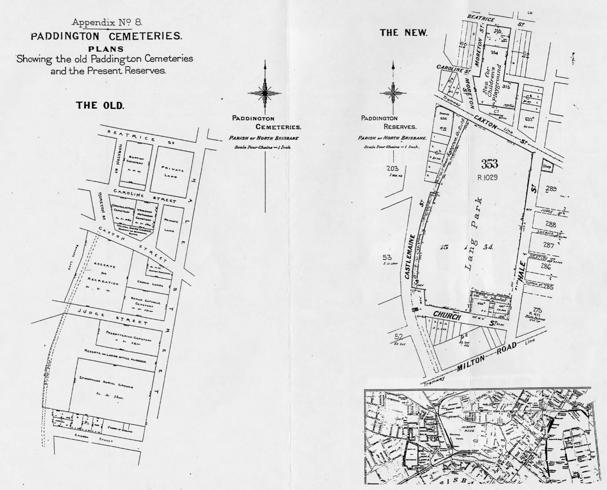

--8<-- "snippets/sem/headstones/moved-paddington-headstones.json"

# Moved Paddington Cemetery Headstones

The North Brisbane Burial Grounds were also known as 'Paddington Cemetery' or 'Milton Cemetery'. The burial grounds opened in 1844 and closed in 1875. 

The burial grounds had seven distinct denominational sections: Episcopalian (Anglican), Presbyterian, Roman Catholic, Jewish, Wesleyan Methodist, Congregational, and Baptist.

By 1907 there were calls to turn the neglected burial grounds into a park and sports field. In 1911 the Queensland Government passed the *[Paddington Cemetery Act][Paddington Cemetery Act]* allowing them to move the bodies to another location. 

[Paddington Cemetery Act]: http://classic.austlii.edu.au/au/legis/qld/hist_act/pcao19112gvn9298/ "Read the 1911 Paddington Cemetery Act"

{ width="100%"}

*<small>[View of the Brisbane suburb of Milton, ca. 1870](http://onesearch.slq.qld.gov.au/permalink/f/1upgmng/slq_alma21219311070002061) Photograph taken in the vicinity of Caxton Street, Petrie Terrace, looking due west across the intersection of Judge and Hale Streets and across the Milton Cemetery. The mortuary chapel visible in the centre of the photograph was converted to a church in 1873, and was demolished when Christ Church (Milton) was constructed in 1874-76 — State Library of Queensland. Cropped.</small>*

<!--

-->

*<small>[Paddington Cemeteries Plans](https://www.brisbane.qld.gov.au/sites/default/files/Cemeteries_Visiting_our_Cemeteries_Plans_showing_the_old_Paddington_Cemeteries_and_the_present_reserves.pdf) from Appendix 8 in Volume 2 of the 1914 Parliamentary papers.</small>*

## Paddington Cemetery Remains and Headstones moved to Toowong Cemetery { data-search-exclude }

The table below lists the 139 human remains and 106[^1] headstones were moved from Paddington Cemetery to Toowong Cemetery.

[^1]: Appendix 3 in Volume 2 of the 1914 Parliamentary papers states 105 headstones were moved, Wm. Stokes' headstone wasn't counted as it was 'Removed at the applicants expense'.

??? directions "About the data"

    - Sources: 
        - [List of remains and memorials removed to the Brisbane General Cemetery (Toowong)](https://www.brisbane.qld.gov.au/sites/default/files/Cemeteries_Visiting_our_Cemeteries_List_of_memorials_now_standing_on_the_reserved_area_at_Paddington.pdf), Appendix No.4 in Volume 2 of the 1914 Parliamentary papers. 
        - Toowong Cemetery locations are sourced from Brisbane City Council's [Cemeteries Search](https://graves.brisbane.qld.gov.au).
    - People and Headstones have been given a unique identifier.
    - Extra name information from the Cemeteries Search is shown in *italics*.
    - 'n/a' means no entry was found in the Cemeteries Search or it is not possible determine a correct entry from those available

--8<-- "snippets/paddington-cemetery-moved-remains-and-headstones.html"

Abbreviations used in the source document have been expanded using the following mappings: 

| Abbreviation | Name or Honorific Prefix |
| -----------  | ----------- |
| Alex.        | Alexander   |
| Chas.        | Charles     |
| Eliz.        | Elizabeth   |
| Fdk.         | Frederick   |
| Geo.         | George      |
| Hy.          | Henry       |
| Patk.        | Patrick     |
| Robt.        | Robert      |
| Tim.         | Timothy     |
| Thos.        | Thomas      |
| Wm.          | William     |

## Download the data

The [Moved Paddington Cemetery Headstones](moved-paddington-headstones.md) by [Friends of Toowong Cemetery Association Inc.](../index.md), is licensed under [CC BY 4.0](https://creativecommons.org/licenses/by/4.0/). You must provide attribution if you reuse this work.

Download the Moved Paddington Cemetery Headstones as a <a href="../../assets/data/moved-paddington-cemetery-headstones.csv" download>Comma Separated Value file</a> (.csv) 

!!! warning "Excel interprets some grave locations as dates"

    If you open the .csv file using Microsoft Excel, be aware that it changes some grave locations into dates. [This behaviour cannot be prevented](https://support.microsoft.com/en-us/office/stop-automatically-changing-numbers-to-dates-452bd2db-cc96-47d1-81e4-72cec11c4ed8?ns=excel&version=90&ui=en-us&rs=en-us&ad=us). We suggest you consider using another tool.

## Paddington Memorial 

{ width="40%" } 

*<small>Paddington Memorial, Portion 17 Section 1, on the corner of Emma Miller and William Brown Avenues.</small>*

The Paddington Memorial commemorates people originally buried in the North Brisbane Burial Grounds, now interred at Toowong Cemetery. The Paddington Memorial plaque reads:

>***The North Brisbane Burial Grounds at Paddington were opened by 1844 and became the final resting place for thousands of Brisbane's inhabitants over the ensuing decades. Following the opening of the Brisbane General Cemetery of Toowong in 1875, the seven sectarian cemeteries were gradually abandoned. By the end of the 19^th^ century, the site had fallen into a state of disrepair. A decision was made in 1911 to have the Paddington Cemetery converted to public parklands. The memorials were subsequently removed and the opportunity was provided to relatives to relocate the remains and or memorials to other cemeteries including Toowong. Only a few hundred bodies were removed leaving several thousand on the site that became known as Lang Park.***

 

>***Lang Park evolved into an iconic inner-city sports ground, with a major redevelopment of the stadium from 2001 to 2003. This resulted in the necessary excavation of sections of the former burial grounds that would be disturbed by construction. A methodical archaeological investigation was undertaken, and the fragmentary remains of 394 unidentified individuals were exhumed from the Episopalian (Anglican), Roman Catholic, and Presbyterian cemeteries. The remains were interred in this memorial in July 2003.***

<!--
## Richard Belford <small>(15‑11‑6)</small>

For many years Richard was connected with the colonial press in NSW, Victoria and Queensland. He was a native of Newtown, Limavady, in the county of Londonderry, Northern Ireland and came to NSW in 1838 with his parents, Richard (Snr) and Ann (née Linton). 

He was a partner in starting the *Ballarat Star* but after the partnership collapsed, moved to Brisbane and then to Ipswich where he took charge of the *North Australian* newspaper. Richard followed when that newspaper moved to Brisbane and died at the age of 42 from consumption on 28 April 1865. He was originally interred in the Roman Catholic burial ground at Milton but his remains and headstone were relocated to Toowong Cemetery in 1913.
-->
