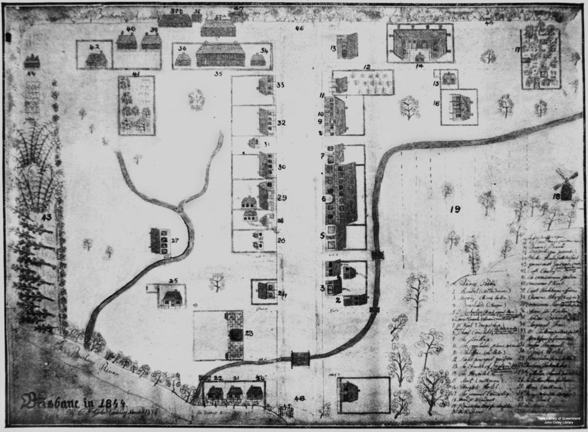
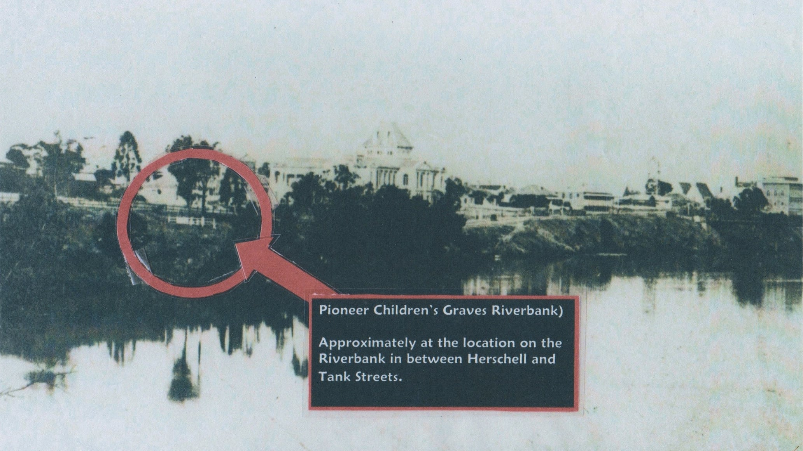

# Queensland's Oldest Headstones

The oldest surviving headstone in Queensland is from 15 November 1831 and can be found in Toowong Cemetery.

{ width="100%" }

*<small>Pioneer Children's Graves (13-10-4), Queensland's oldest surviving headstones from the 1830's </small>*

Three children, William Henry Roberts, Peter McCauley, and Jane Pittard were originally interred on the banks of the Brisbane River. They were re‑interred at Toowong Cemetery in October 1881. 

{ width="100%"}

*<small>[Map of Brisbane, 1844](http://onesearch.slq.qld.gov.au/permalink/f/1upgmng/slq_digitool119348) Map of Brisbane drawn by C. F. Gerler. This basic map has a numbered list of 48 locations in the bottom right corner. Number 48 is "The First Tombstone (two graves)" — State Library of Queensland. </small>*

{ width="100%" }  

*<small>Pioneer Children's Graves (Riverbank). Approximately at the location on the Riverbank in-between Herschell and Tank Streets. Source unknown.</small>*

## William Henry Roberts <small>(13-10-4)</small>

Esther Roberts, mother of William Henry Roberts, was the first teacher of girls in the Moreton Bay settlement. His father, Charles Roberts was transferred to Dunwich to take charge of the government store in August 1828. William was born on 15 September 1828 and died of illness on 15 November 1831. 

The tomb lid originally had a bible verse inscribed on it based on Matthew 19:14:

>***Suffer the little children, and forbid them not, to come unto me: for of such belongeth the Kingdom of God.***

It has since been lost to weathering. After the death of their son, the Roberts family returned to Sydney in 1834.

## Peter McCauley <small>(13-10-4)</small>

Peter McCauley was born in Sydney on 17 April 1826, the son of Private Peter McCauley, a member of the 17^th^ Regiment. His monther, Mary, was appointed as matron of the Brisbane Town Female Factory in June 1831. On 5 January 1832, young Peter wandered away from his brothers on an outing and drowned in the Brisbane River near the present Botanical Gardens. The family returned to Sydney in 1832.

## Jane Pittard <small>(13-10-4)</small>

Jane Pittard was the infant daughter of John Pittard, late Color Sergeant of the 57^th^ Regiment. He had drowned in Van Diemen's Land on 23 July 1831, shortly before his daughter's birth. Jane's mother, Margaret, remarried and came to Moreton Bay with Color Sergeant David Collins in August 1832. On 23 January 1833, Jane died and her family returned to Sydney the following year.
