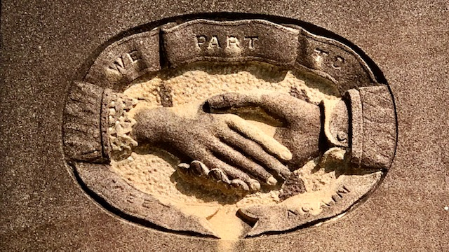

---
search:
  boost: 1
title: Headstone Signs
description: Learn about signs on headstones and their connection to friendly societies, guilds and secretive orders 
---

#  Headstone Signs

Freed from the restrictions of parish churchyards, municipal cemeteries provided an outlet for expression of individualism which reached its zenith in the mid to late Victorian Era. The headstone reflected the deceased's cultural identity by its inscription, material, shape, [symbol](symbols.md), or sign. These headstones are a reminder of how varied Brisbane society was from the late 1870s to the outbreak of World War One. Many signs on headstones represent the Friendly Society, Masonic Order or Trade Guild a person was part of. 

## Friendly Societies

Friendly societies were mutual aid organisations designed to help predominately working-class people insure themselves against destitution caused by death and illness. Many operated funeral clubs which for a few pence a month protected the contributors from the perceived disgrace of a pauper's grave.

{ width="44.7%" }  { width="49%" }  

*<small>[Members of the Ancient Order of Forester, Court Brunswick, Brisbane, 1922](http://onesearch.slq.qld.gov.au/primo-explore/fulldisplay?docid=slq_alma21218746750002061&context=L&vid=SLQ&lang=en_US&search_scope=DT&adaptor=Local%20Search%20Engine&tab=dt&query=any,contains,Ancient%20Order%20of%20Foresters&offset=0), State Library of Queensland</small>*  
*<small>[Australian Natives' Association's allegorial display, Brisbane, 1901](http://onesearch.slq.qld.gov.au/primo-explore/fulldisplay?docid=slq_digitool125779&context=L&vid=SLQ&lang=en_US&search_scope=DT&adaptor=Local%20Search%20Engine&tab=dt&query=any,contains,Australian%20Natives%20Association&offset=0), State Library of Queensland</small>*

{ width="45.8%" }  { width="48%" }   

*<small>[St. Patrick's Day procession, Queen Street, Brisbane, 1903](http://onesearch.slq.qld.gov.au/permalink/f/1upgmng/slq_alma21249906440002061) — State Library of Queensland. Note the 'HACBS' (Hibernian Australia Catholic Benefit Society) shown on the banner.</small>*  
*<small>[Independent Order of Rechabites, Brisbane, ca. 1933](http://onesearch.slq.qld.gov.au/permalink/f/1upgmng/slq_alma21220362320002061) — State Library of Queensland. </small>*

Most organisations had rules, ranks and rites and developed a symbolic language which identified its members either by acronym or sign. Members were expected to turn out at funerals of the brethren or close relatives.

## Masonic Orders

Most cemetery visitors are familiar with the compass and square, the working tools of the Masonic orders. The "G" in the centre may be interpreted as "God" by speculative Masons, and as "Geometry" by operative Masons. Variations in the design (for example, the number of dots on the square), or the inscription may inform the knowledgable passer-by of the rank held by the deceased in the organisation. 

{ width="48%" }  { width="48%" } 
{ width="97%" }  

>Her beloved Husband 
>and our loving Father  
>Andrew Norman 
>Davidson V.W.  
>Free Accepted Masons  
>Scottish Constitution  
>U.G.L.Q.  
>Born Longreach. Q  
>2^nd^ March 1898・ Died 12^th^ July 1979  
>Brothers we shall meet again 

The "V.W." after Andrew Norman Davidson's name may indicate he held the rank of Very Worshipful Brother. The rank is usually indicated as a "VW Bro." prefix before the person's name. Freemason ranks ascend through a hierarchy: 

1. Brother (Bro.) 
2. Worshipful Brother (Wor. Bro.) 
3. Very Worshipful Brother (VW Bro.)
4. Right Worshipful Brother (RW Bro.) 
5. Most Worshipful Brother (MW Bro.)

"U.G.L.Q." stands for the "United Grand Lodge Queensland" which was formed through the amalgamation of several governing Masonic bodies in Queensland in 1921. Different Grand Lodges practiced slightly different versions of the Masonic rituals. When U.G.L.Q. formed, they did so with the proviso that Lodges could continue practicing their ritual's if they wished, or change to a recently revised U.G.L.Q. ritual. Most of the Scottish Lodges retained their original rituals, giving rise to the idea of "Scottish Constitution" lodges.[^1]

## Odd Fellows

The Odd Fellows were so named because they were originally drawn together from an odd variety of trades with insufficient numbers to form their own trade guilds. Their three-link chain stands for Friendship, Love and Truth. A variation is a monogram consisting of the letters F, C and B for friendship, charity and benevolence. Charity is also represented by a hand holding a heart and is most often associated with the Manchester Unity Independent Order of Odd Fellows (MUIOOF).

{ width="47.2%" }  { width="49%" }  

*<small>[Wooden Hand - Heart in Hand](https://collections.museumsvictoria.com.au/items/251958) — Museums Victoria </small>*  
*<small>[Manchester Unity Independent Order of Odd Fellows, ca. 1910](https://digital.slq.qld.gov.au/delivery/DeliveryManagerServlet?change_lng=en&dps_pid=IE1413410) — State Library of Queensland</small>*

<!-- 
## Design elements

Some design elements...

### Columns

A common indicator of a life has been cut off short is...

### Paving

According to the Masonic tradition…

### Crown

To lay down th cross and pick up the crown of glory...

### Time Flies

The winged hourglasses reminds us how quickly our life passes and...

### Plants

Plants both living and carved are replete with symbolism...

--> 

## Signs in Toowong Cemetery

These signs, names or acronyms can be found on headstones in Toowong Cemetery.

??? directions "Usage Tips" 

    - Click a column name to sort the table.
    - An example of where the acronym can be found is shown in the Location column
        - where a Portion number is unknown, a placeholder value of "pp" is used
        - where a Section number is unknown, a placeholder value of "ss" is used
        - where a Grave number is unknown, a placeholder value of "gg" is used. 
        
    Learn more about [finding graves at Toowong Cemetery](../research/find-a-grave.md).

| Acronym | Name                                                         | Organisation Type | Location |
|     --: | :--                                                          | :--               | :--                |
| AHCG    | [Australasian Holy Catholic Guild][AHCG]                     | Friendly Society  | pp-ss-gg           |
| ANA     | [Australian Natives Association][ANA]                        | Friendly Society  | pp-ss-gg           | <!-- TODO try Raven 23-27-11/12  https://trove.nla.gov.au/newspaper/article/21630477?searchTerm=Australian%20Natives%20Association -->
| AOF     | Ancient Order of Foresters                                   | Friendly Society  | 1-29-8             |
| AOOF    | Ancient Order of Odd Fellows                                 | Friendly Society  | pp-ss-gg           |
| EC      | English Constitution                                         | Freemasonry       | pp-ss-gg           |
| GUOOF   | Grand United Order of Odd Fellows                            | Friendly Society  | pp-ss-gg           |
| HACBS   | Hibernian Australia Catholic Benefit Society                 | Friendly Society  | pp-ss-gg           |
| IC      | Irish Constitution                                           | Freemasonry       | 13-83-9/10         |
| INF     | Irish National Foresters                                     | Friendly Society  | pp-ss-gg           |
| IOGT    | [Independent Order of Good Templars][IOGT]                   | Temperance        | pp-ss-gg           | <!-- TODO George Drinkwater 11-54-6 -->
| IOOF    | Independent Order of Odd Fellows                             | Friendly Society  | pp-ss-gg           |
| IOR     | [Independent Order of Rechabites][IOOR]                      | Temperance        | pp-ss-gg           |
| LOI     | [Loyal Orange Institute][LOI]                                |                   | pp-ss-gg           | <!-- TODO Moorhouse 11-21-14 -->
| MUIOOF  | [Manchester Unity Independent Order of Odd Fellows][MUIOOF]  | Friendly Society  | 9-16-9             |
| NIOOF   | National Independent Order of Odd Fellows                    | Friendly Society  | pp-ss-gg           |
| ODT     | Order of the Daughters of Temperance                         | Temperance        | pp-ss-gg           |
| OES     | [Order of the Eastern Star][OES]                             | Friendly Society  | 1-147-26           |
| OST     | Order of the Sons of Temperance                              | Temperance        | pp-ss-gg           |
| PAFS    | Protestant Alliance Friendly Society                         | Friendly Society  | pp-ss-gg           |
| RA      | [Royal Arch][RA]                                             | Friendly Society  | pp-ss-gg           | 
| RAOB    | Royal Antediluvian Order of Buffaloes                        | Friendly Society  | pp-ss-gg           |
| RBP     | [Royal Black Preceptory][RBP] [^2]                           |                   | pp-ss-gg           | <!-- TODO THOMAS HUGHES 5-59-10 --> 
| SC      | Scottish Constitution                                        | Freemasonry       | 25-46-17           |
| UAOD    | [United Ancient Order of Druids][UAOD]                       | Friendly Society  | pp-ss-gg           |
| UOSMS   | United Operative Stonemasons Society of Queensland          | Friendly Society  | pp-ss-gg           |
| UGL     | [United Grand Lodge of Ancient, Free and Accepted][UGL]      | Freemasonry       | 25-46-17           |

!!! question "Volunteer - share a headstone photo"

    Have you found the location of a Friendly Society Sign? [Contact us](../contact.md) with the details. 

![William Wayte Headstone 1-29-8][1-29-8]{ width="32%" }  ![The Eye of Providence 9-16-9][eye-of-providence]{ width="32%" } [![William Thomas Birkbeck 9-16-9][9-16-9]{ width="32%" }](https://trove.nla.gov.au/newspaper/article/186543823) 

Unlike the [Clasped Hands symbol](symbols.md#clasped-hands) showing a man and women holding hands (based on the cuffs), on some Friendly Society official's headstones you'll find two men shaking hands.

 { width="48%" }  ![Headstone carving with men shaking hands][20-20-35/36]{ width="48%" }  

*<small>The image on the right is from the headstone of Richard Silas Bowden - Past Grand Master of the Manchester Unity Independent Order of Oddfellows (20‑20‑35/36) </small>*

[20-20-35/36]: ../assets/oddfellow-handshake.jpg "Richard Silas Bowden Headstone - Past Grand Master of the Manchester Unity Independent Order of Oddfellows (20‑20‑35/36)"

<!-- PPCM Permanent President Courts Martial https://www.awm.gov.au/learn/glossary/p -->

<!-- Thomas Dempster 18‑17‑22/23 United Operative Stonemasons Society of Queensland (UOSMS) -->

{ width="48%" }  { width="48%" } 

*<small>John Campbell's headstone shows the Order of the Eastern Star sign within the Freemason's compass and square. The Order of the Eastern Star is a Masonic appendant body open to both men and women. (1‑147‑26) </small>*

*<small>Maurice O'Connell's memorial in the shows he played an important role in the Queensland Freemasons and followed the Irish Constitution. (13-83-9/10) </small>*

## Today

Some of these organisations have evolved to become financial services companies, such as: 

- The Independent Order of Odd Fellows became [IOOF](https://www.ioof.com.au/about-us/about-ioof), who in late 2021 decided to [rebrand as Insignia Finance](https://ioof-p-001-delivery.sitecorecontenthub.cloud/api/public/content/Change-of-company-name.pdf). 
- The Ancient Order of Foresters evolved into [Foresters Financial](https://forestersfinancial.com.au/about-us/our-history/).
- In 1993, the Australian Natives Association merged with Manchester Unity Independent Order of Odd Fellows to become [Australian Unity](https://www.australianunity.com.au/about-us/our-story).

You can find signs of Friendly Societies in the local area such as: 

- [Foresters Hall](https://apps.des.qld.gov.au/heritage-register/detail/?id=601662) 16 Latrobe Terrace, Paddington.
- [Baroona Hall](https://www.qld.gov.au/recreation/arts/heritage/experience/music-trail/baroona-hall) in Caxton St, Milton, built for the United Brothers Lodge of the Order of Odd Fellows.
- [Royal Antediluvian Order of Buffaloes Lodge Hall](https://heritage.brisbane.qld.gov.au/heritage-places/1827) in Woolloongabba.

## Further Reading

- Harwood, J. *The Freemasons* London, Hermes House, 2006
- *[Pugh's Queensland almanac, directory and law calendar](https://nla.gov.au/nla.obj-2935152949/view?sectionId=nla.obj-2943918410&partId=nla.obj-2935176853#page/n179/mode/1up)* lists Masonic Lodges, Friendly Societies, and Temperance Societies in Queensland in 1881. 

[^1]: Thanks to VW Bro. Brodie Taylor, Grand Librarian, Freemasons Queensland, for his contribution.
[^2]: An extension of the Loyal Orange Institute.

<!-- links -->

[AHCG]: https://trove.nla.gov.au/newspaper/article/261238209?searchTerm=Australasian%20Holy%20Catholic%20Guild "AHCG on Trove"
[ANA]: https://www.nma.gov.au/defining-moments/resources/australian-natives-association
[IOGT]: https://movendi.ngo/who-we-are/the-movendi-way/who-we-are/the-history/
[IOOR]: https://www.australianrechabites.org.au/states/qld-rechabites/
[LOI]: https://www.facebook.com/pages/category/Religious-Organization/Loyal-Orange-Institution-of-Queensland-895315537148498/ "Loyal Orange Institute Queensland on Facebook"
[MUIOOF]: https://www.facebook.com/groups/535759726633938/?ref=share
[OES]: https://www.oesaustralia.org.au/index.php/state/qld/
[RA]: https://www.royalarch.org.au
[RBP]: http://royalblack.org/mission-statement/our-history/
[UAOD]: https://en.wikipedia.org/wiki/United_Ancient_Order_of_Druids "UAOD on Wikipedia"
[UGL]: https://uglq.org.au

[1-29-8]: ../assets/sign-aof.jpg "William Wayte Headstone - Ancient Order of Foresters (1-29-8)"
[eye-of-providence]: ../assets/eye-of-providence.jpg "The Eye of Providence (9-16-9)"
[9-16-9]: ../assets/muioof-william-thomas-birkbeck-ppcm.jpg "William Thomas Birkbeck - Manchester Unity Independent Order of Odd Fellows (9-16-9)"

<!--
[20-20-35/36]: ../assets/richard-silas-bowen-muioof.jpg "Richard Silas Bowen - Past Grand Master of the Manchester Unity Independent Order of Odd Fellows. Note the two men's hands shaking."
-->
