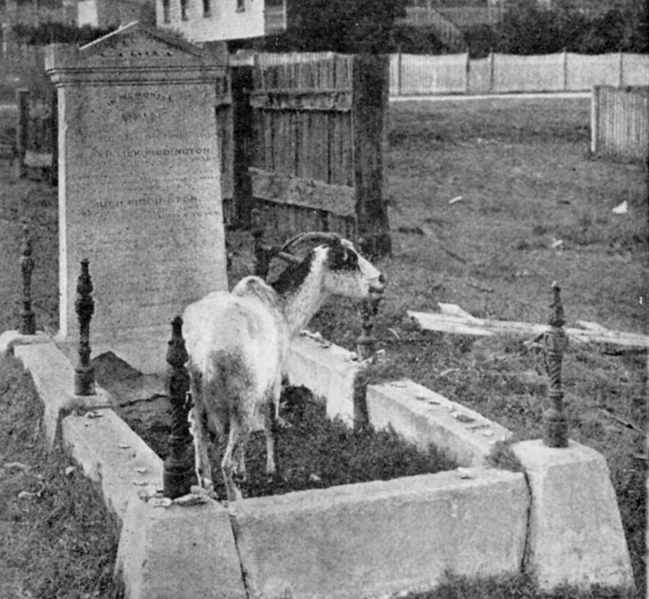
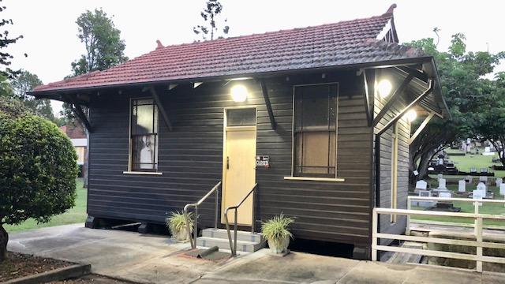

--8<-- "snippets/sem/history.json"

--8<-- "snippets/hide-nav.html"

# Toowong Cemetery History

## Traditional Owners

Prior to 1875, the flat area where the entrance of Toowong Cemetery now stands was an [Aboriginal Corroboree Ground][Corroboree]. "Toowong" is a corruption of "[Tu-wong][tu-wong]", purportedly the aboriginal name for the river bend near the Indooroopilly Bridge, named for a local bird (probably the [Koel](https://ebird.org/species/asikoe3 "See the Pacific Koel entry on eBird")). 

[Corroboree]: https://mappingbrisbanehistory.com.au/history-location/toowong-cemetery-aboriginal-corroboree-ground-232/ 

[tu-wong]: http://www.toowong.org.au/books_for_sale.htm "From 'Aboriginal people of Toowong' by Arthur Beau Palmer,  in 'Toowong: A community's history' by West Toowong Community Association Inc."

## 1866 Toowong Cemetery land reserved

The land for the cemetery was first reserved in 1866. The reserve of 250 acres 1 rood, and an extension of 53 acres were [gazetted][gazette-93], and [Cemetery Trustees appointed][gazette-94] on 7 October 1870.

[gazette-93]: assets/documents/Queensland_Gov_Gazette_8_October_1870_v11_93.pdf "Read the Queensland Government Gazetter No. 93"
[gazette-94]: assets/documents/Queensland_Gov_Gazette_10_October_1870_v11_94.pdf "Read the Queensland Government Gazetter No. 94"

*<small>[City of Brisbane, County of Stanley, showing Toowong Cemetery Reservation; being sheet 1b of a 20 chain grid series. 20 chains to the inch. Survey Office, Brisbane.](https://www.archivessearch.qld.gov.au/items/ITM634480), ca. 1861 — Queensland State Archives. Cropped.*</small>

## 1871 Governor Blackall buried

**[Colonel Samuel Wensley Blackall][Blackall]**, the second Governor of Queensland, was the first person buried in Toowong Cemetery on 3 January 1871. 

[Blackall]: research/samuel-wensley-blackall.md 

## 1875 Toowong Cemetery opened

The Toowong Cemetery, previously known as the Brisbane General Cemetery, is the largest cemetery in Queensland at 44 Hectares and is an important record of the history of Brisbane and Queensland. It was officially opened on 5 July 1875 and over 119,000 people are buried in approximately 46,000 graves.

<!--
<iframe src="https://www.youtube.com/embed/jJ3oK4nwNbA" title="YouTube video player" frameborder="0" allow="accelerometer; clipboard-write; encrypted-media; gyroscope; picture-in-picture" allowfullscreen></iframe>
-->

<iframe src="https://www.youtube.com/embed/jJ3oK4nwNbA" title="YouTube video player" frameborder="0" allow="accelerometer; clipboard-write; encrypted-media; gyroscope; picture-in-picture" allowfullscreen></iframe>

*<small>[Toowong Cemetery: Resting place of Governor Samuel Blackall (One Minute Archive)](https://www.youtube.com/watch?v=jJ3oK4nwNbA) — [Queensland State Archives](https://www.qld.gov.au/recreation/arts/heritage/archives)*</small>

{ width="96%" } 

*<small>[Toowong Cemetery, Brisbane, ca. 1890](http://onesearch.slq.qld.gov.au/permalink/f/1upgmng/slq_alma21272130100002061), — State Library of Queensland. Cropped.</small>*

[![Map and aerial photo of Toowong Cemetery][map-photo]{ width="96%" }][aerial-photo]  

[map-photo]: assets/Toowong-cemetery-map-photo.jpg "Click to view the full aerial photo"
[aerial-photo]: assets/toowong-cemetery-aerial-photo-1946.jpg

*<small>[Brisbane General Cemetery (Toowong) - General Plan, 8 July 1909](https://www.archivessearch.qld.gov.au/items/ITM1624111) — [Queensland State Archives](https://www.qld.gov.au/recreation/arts/heritage/archives).</small>*  
*<small>Series 46 Film BCC2 Frame 34691, 31 May 1946 — Brisbane City Council, via [QImagery](https://qimagery.information.qld.gov.au). Frederick St is the straight road on the right, running top to bottom.</small>*

## 1881 Queensland's oldest surviving headstones

**[The oldest surviving headstone in Queensland](headstones/queenslands-oldest-headstones.md)** is from 15 November 1831. Three children originally interred on the banks of the Brisbane River, were re‑interred at Toowong Cemetery in October 1881. 

{ width="96%" }  

*<small>Pioneer Children's Graves (13-10-4). </small>*

## 1911 Paddington Cemetery Act

The North Brisbane Burial Grounds (also known as [Paddington Cemetery][Paddington Cemetery]) were opened in 1844 and closed in 1875. By 1907 there were calls to turn the neglected into a park and sports field.

In 1911 the Queensland Government passed the *[Paddington Cemetery Act][Paddington Cemetery Act]* allowing them to move the bodies to another location. Some **[Paddington Cemetery remains and headstones were moved to Toowong Cemetery](headstones/moved-paddington-headstones.md)**

[Paddington Cemetery Act]: http://classic.austlii.edu.au/au/legis/qld/hist_act/pcao19112gvn9298/ "Read the 1911 Paddington Cemetery Act"

[Paddington Cemetery]: https://www.brisbane.qld.gov.au/community-and-safety/community-support/cemeteries/historic-cemeteries/paddington-cemetery 

{ width="70%" } 

*<small>[Paddington Cemetery 1910](https://www.flickr.com/photos/queenslandstatearchives/30299711162/in/photolist-2joySJt-NatWv9-KCpMLU) — Queensland State Archives.</small>*

{ width="70%" } 

*<small>Paddington Memorial, Portion 17 Section 1, on the corner of Emma Miller and William Brown Avenues.</small>*

The Paddington Memorial commemorates people originally buried in the North Brisbane Burial Grounds, now interred at Toowong Cemetery. The Paddington Memorial plaque reads:

>***The North Brisbane Burial Grounds at Paddington were opened by 1844 and became the final resting place for thousands of Brisbane's inhabitants over the ensuing decades. Following the opening of the Brisbane General Cemetery of Toowong in 1875, the seven sectarian cemeteries were gradually abandoned. By the end of the 19^th^ century, the site had fallen into a state of disrepair. A decision was made in 1911 to have the Paddington Cemetery converted to public parklands. The memorials were subsequently removed and the opportunity was provided to relatives to relocate the remains and or memorials to other cemeteries including Toowong. Only a few hundred bodies were removed leaving several thousand on the site that became known as Lang Park.***

 

>***Lang Park evolved into an iconic inner-city sports ground, with a major redevelopment of the stadium from 2001 to 2003. This resulted in the necessary excavation of sections of the former burial grounds that would be disturbed by construction. A methodical archaeological investigation was undertaken, and the fragmentary remains of 394 unidentified individuals were exhumed from the Episopalian (Anglican), Roman Catholic, and Presbyterian cemeteries. The remains were interred in this memorial in July 2003.***

## 1921 New Neighbours

Allotments on [Heussler Terrace][Heussler Terrace] (renamed Birdwood Terrace) on the North boundary of the cemetery were sold by auction in 1921. "*Convenient to the Toowong Tram Line*" was a selling point. The Toowong Tram stopped near the main cemetery gates.

(Scroll back to the 1946 aerial photo to see how few allotments were built on 25 years later.)

{ width="96%" }  

*<small>[Chermside Park, second section : Auchenflower](http://onesearch.slq.qld.gov.au/permalink/f/1upgmng/slq_alma21190073930002061), 1921 — [State Library of Queensland](https://www.slq.qld.gov.au). Note in the Inset how the tram stopped at the Toowong Cemetery gates. [Third Avenue was renamed Couldrey St](assets/documents/new-streets-1939.pdf) in 1939 after a [Queensland Miner](https://library-brisbane.ent.sirsidynix.net.au/client/en_AU/BrisbaneImages/search/detailnonmodal/ent:$002f$002fSD_ASSET$002f0$002fSD_ASSET:24525/one?qu=Duplicated+Street+Names+-+Extracts+from+Council+Records+re+Final+Approval+and+ORIGINS+of+names+1938+-+1939&rm=BRISBANEIMAGES0%7C%7C%7C1%7C%7C%7C0%7C%7C%7Ctrue&te=ASSET&lm=ALL_ASSETS). </small>*

{ width="96%" }  

*<small>[Tram passing the Toowong Cemetery with Mt Coot-tha in the distance, Queensland, 1921](http://onesearch.slq.qld.gov.au/permalink/f/fhnkog/slq_digitool542430) — State Library of Queensland. Cropped. </small>*

## 1924 Remembering the Anzacs

With Australia and New Zealand at war with the German Empire, in 1915 **[David Garland](research/david-john-garland.md)** was tasked with providing and coordinating chaplaincy and welfare services at Enoggera Army Base to thousands of fresh recruits. 

In the wake of climbing casualty lists and community grief, he urged legislators to establish a framework to enable the nation to publicly honour the service and sacrifice of Australian and New Zealand troops killed in the Gallipoli Peninsula landings of 25 April 1915. This movement culminated in a public meeting on 10 January 1916 at Brisbane's Exhibition Hall which voted to establish the Anzac Day Commemoration Committee of Queensland, with chaplain Lieutenant-Colonel Garland its secretary. 

Garland's contribution to Anzac Day tradition was to devise ecumenical or secular rituals for public commemoration of those who died in battle and and to comfort the bereaved. Because his format was non-denominational, everyone could participate, regardless of their faith tradition. The minute's silence provided a space for all Australian's and New Zealanders to demonstrate respect for The Fallen of the Great War. 

In 1916 Garland initiated a trust to receive money raised from the sale of silk, lavender-coloured badges embossed with gold leaf with the lion of St Mark and the motto "Their Name Liveth for Evermore". These became the first Anzac Day badges, initially earmarked to pay for the upkeep of soldiers' graves at home and abroad. The appeal eventually helped fund soldier respite hostels and memorials to be established. 

On the morning of Anzac Day 1920, the first since his return from war service, Garland visited "Soldiers' Corner" at Toowong Cemetery and found friends and families of the deceased paying their respects. Noting people of all religions were present, he asked all to observe a minutes' silence rather than offer up prayers during an impromptu commemoration service. 

Under the guidance of Garland the Anzac Day service at Toowong Cemetery grew in size and significance as did the badge-selling campaign which supported the Lady Mayoress's committee. The campaign's success helped fund the establishment of the "Cross of Sacrifice" and "The Stone of Rememberance" which were erected and unveiled in 1924 near the entrance to Toowong Cemetery immediately adjacent to Canon Garland Place. Anzac Day commemorations in Brisbane where held here until the Anzac Memorial - Shrine of Rememberance - in Anzac Square, was completed in 1930.

Garland, aged 75, died at Red Hill on 11 October 1939. His grave is located at Portion 1, Section 50A, Grave 9, overlooking "Soldiers' Corner".

{ width="96%" }  

*<small>[Official unveiling of the Cross of Sacrifice on Anzac Day at Toowong Cemetery, Brisbane, 1924](https://digital.slq.qld.gov.au/delivery/DeliveryManagerServlet?dps_pid=IE1400763&change_lng=) — State Library of Queensland. <!-- The Union Jack flag was placed on the building to mask the fact that it was the amenities. --> </small>*

<!--
{ width="96%" }  

*<small>[Cross of Sacrifice and Stone of Remembrance memorials at Toowong Cemetery, Brisbane, 1924](https://digital.slq.qld.gov.au/delivery/DeliveryManagerServlet?change_lng=en&dps_pid=IE1400772) — State Library of Queensland.</small>*

-->

{ width="96%" }  

*<small>[Small children looking at wreaths laid at the memorial on Anzac Day, Toowong Cemetery, Brisbane, 1924](http://onesearch.slq.qld.gov.au/permalink/f/1upgmng/slq_alma21271931300002061) — State Library of Queensland. Cropped.</small>*

## 1962 Trams Terminated

[Trams in Brisbane](https://en.wikipedia.org/wiki/Trams_in_Brisbane) changed over time. In 1962 the [Paddington Tram Depot was destroyed by fire](https://trove.nla.gov.au/newspaper/article/104296116) and 65 trams were lost. The Rainworth and Toowong [tram services were withdrawn](https://youtu.be/yD8thm6MECU) and replaced with buses.

--8<-- "snippets/toowong-cemetery-tram.md"

The [heritage-listed Paddington Tramways Substation](https://apps.des.qld.gov.au/heritage-register/detail/?id=601198) can still be found at 150 Enoggera Terrace, Paddington. [Trammies Corner Park](https://brismania.com/day-93-paddington-bare/) can be visited at	74 Prince Street, Paddington.

## 1970's "Beautification Scheme"

By April 1975 the Cemetery was full with all plots sold. The Brisbane City Council Health Dept was ordered by the then Mayor to start a project to remove hundreds of family owned headstones and grave surrounds in Toowong, Lutwyche, South Brisbane, Balmoral, and God's Acre Pioneer cemetery. Headstones (most of which just needing weeding) were removed from these cemeteries with the aim to make open parklands.

Mayors, soldiers, politicians all fell victim to the clearance. At Toowong Cemetery, headstones were demolished and buried in the canal. The [Toowong Cemetery heritage listing](https://apps.des.qld.gov.au/heritage-register/detail/?id=601773) suggests, "approximately 1,000 memorials were removed from Toowong". Intervention in 1979 saw an end to the organised vandalism. The Cemetery reopened in 1998 with approximately 450 plots for sale. 

--8<-- "snippets/dilapidated-graves.md"

<!-- Photo of a Council letter? -->

In 1978 construction started on the Toowong Cemetery Roundabout which, when completed, made entry via the main gates difficult.

--8<-- "snippets/toowong-roundabout-construction-1978.md"

## 1988 Mission Impossible

In 1988 the first season of [Mission Impossible](https://en.wikipedia.org/wiki/Mission:_Impossible_(1988_TV_series)) was filmed in Queensland. Some scenes where filmed in Toowong Cemetery.

--8<-- "snippets/mission-impossible.md"

## 1991 The Sexton's office restoration 

The Museum building, located over the open drain, was formerly the Sexton's office and was built at the turn of the century. It is a single storey, single skin timber framed building with terracotta tile roof. The two room structure is located above the floor of an earlier structure identified as the flower shed which was associated with the cultivation and selling of flowers from Portion 10. The internal partition wall was reconstructed, windows replaced and an adjoining store room was demolished as part of the museum conversion project carried out by the Brisbane City Council Heritage Unit in 1991.[^1] 

[^1]: From [Toowong Cemetery](https://apps.des.qld.gov.au/heritage-register/detail/?id=601773) © The State of Queensland, used under a [CC BY 4.0][cc-by] licence.

{ width="98%" }

You can visit the Museum as part of the Friends of Toowong Cemetery **[Guided Tours](guided-tours.md)**

## 1992 Friends of Toowong Cemetery formed 

Cr. Judy Magub was the first President of the Friends of Toowong Cemetery. Judy was the councillor for the Toowong ward since it was formed in 1994 until she retired in 2007.

Learn more about **[Friends of Toowong Cemetery](about/index.md)** - what we do, what we've done, and how to join in. 

## 2001 Federation Pavilion

The **[Federation Pavilion][Federation Pavilion]** commemorates the contribution of the delegates who attended the 1891 Federation that are buried at the Toowong Cemetery. It was officially opened on 3 March 2001.

{ width="96%" }  

Take the **[Federation self-guided walk](stories/federation-walk.md)** to visit the Federation Pavilion and learn how four Queenslanders shaped Australia's Constitution.

[Federation Pavilion]: about/federation-pavilion.md "Read about Federation Pavilion, created by the Friends of Toowong Cemetery"

## 2006 Archaeological Digs

In 2006, in conjunction with the University of Queensland Archaeology Department, Friends of Toowong Cemetery started **[searching for demolished headstones][digs]** buried in the cemetery grounds.

[digs]: headstones/archaeological-digs.md "Read about our archaeological digs"

In 2011, while staff prepared a new grave, the headstone of a John Peel was discovered. Brisbane City Council had no record of John Peel and asked Friends of Toowong Cemetery for help. It was discovered that the headstone was one of **[505 missing headstones](headstones/lost-paddington-headstones.md)** from the North Brisbane Burial Grounds (also known as the Paddington Cemetery). 

In 1913 the headstones had been stored in good order behind Christ Church in Paddington. In 1930 they suddenly disappeared. The Authorities claimed it was rubble, unreadable and used for road-base. This was not entirely true as many headstones have been found our archaeological digs since 2011.

{ width="96%" } 

*<small>[Paddington Cemetery ca. 1900's](https://library-brisbane.ent.sirsidynix.net.au/client/en_AU/search/asset/22186/1) — Brisbane City Council. Cropped.</small>*

{ width="96%" } 

*<small>Toowong Cemetery Archaeological dig finds</small>*

## 2009 Vandalism law changes

In 2009, over 80 gravestones were damaged at Toowong Cemetery. Following a police investigation, four people were charged with wilful damage however at the defendants’ committal hearing in April 2010, the charges were dismissed due to a "loop-hole" in the law. **[Friends of Toowong Cemetery successfully partitioned for changes to be made to the law][Vandalism of Cemeteries]**.

[Vandalism of Cemeteries]: assets/documents/2010-vandalism.pdf "Read the Vandalism of Cemeteries: Criminal Code and Other Legislation Amendment Bill 2010 (Qld)"

## 2011 Governor Blackall's funeral re-enactment

On 24 July 2011, 140 years after Governor Blackall was buried, a **[re-enactment of the funeral][re-enactment]** was performed.

[re-enactment]: about/140-commemoration.md "Read about our awarding winning event."

{ width="96%" }  

## Today

Today, the Friends of Toowong Cemetery and the Brisbane City Council work together to maintain and improve Toowong Cemetery. Together we have delivered improvements including:

- The **[Federation Pavilion](about/federation-pavilion.md)**
- **[Renaming the Cemetery Roads](/#maps)** after notable people buried nearby
- Reusing the old Sexton's office as the **[Toowong Cemetery Museum](guided-tours.md)**
- The Paddington Memorial and **[Headstone Symbology](headstones/symbols.md)** display

<!--
- The **[Toowong Cemetery Remembrance Walk](https://vimeo.com/540501732)** that allows you to explore the lives of Queensland's volunteer troops and learn about the Anzac Legend
-->

**Toowong Cemetery is enjoyed by those who come to remember loved ones, exercise, walk their dog, or discover the history and stories inside.**

## Learn more about Toowong Cemetery's history

- **[Stories of the people remembered at Toowong Cemetery](stories/index.md)**
- **[Research Resources](research/index.md)** to discover new stories
- **[Toowong Cemetery heritage listing](https://apps.des.qld.gov.au/heritage-register/results/?q=Toowong+Cemetery)** in the Queensland Heritage Register.
- **[Toowong Cemetery citation](https://www.ww2places.qld.gov.au/place?id=2064)** on Queensland WWII Historic Places website.
- **[Graveyard Games – Lang Park Cemetery](https://blogs.archives.qld.gov.au/2021/11/24/graveyard-games-lang-park-cemetery/)** by the Queensland State Archives
- Watch **[Dying Out](https://youtu.be/r8b_DA_BkNs)** shown in 1986 on the ABC's Weekend Magazine
- Watch Hilda MacLean, our second President, discuss Toowong Cemetery on **[Between the Lines](https://vimeo.com/7935322)**
- Watch Darcy Maddock, our current President, **[Talk History](https://www.youtube.com/playlist?list=PLv0V6xrruq2kcliEjK1Kus3O4gFPthNKz)**

<!-- Links -->

[cc-by]: https://creativecommons.org/licenses/by/4.0/  "Creative Commons Attribution 4.0 Licence"

*[Birdwood Terrace]: Field Marshal William Riddell Birdwood commanded the Australian Corps for much of the First World War. 

[Heussler Terrace]: research/johann-christian-heussler.md "Read the story of Johann (John) Christian Heussler (1820–1907)"
