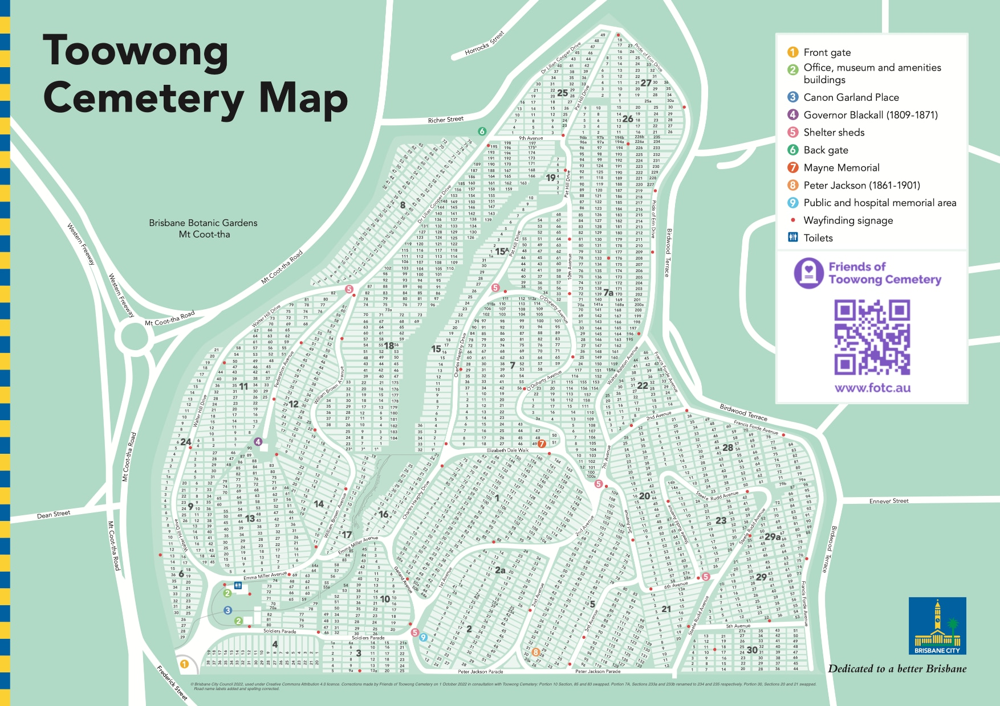

--8<-- "snippets/sem/home.json"

# Friends of Toowong Cemetery

**Friends of Toowong Cemetery is a volunteer group that discover and share the history and stories of Toowong Cemetery.**

![Toowong Cemetery main entrance][image1]{ width="32.33%" .off-glb } ![Canon Garland Place][image2]{ width="32.33%" .off-glb } ![Headstone Symbolism Display][image3]{ width="32.33%" .off-glb }

[image1]: assets/main-entrance.jpg "The main entrance to Toowong Cemetery"
[image2]: assets/flag-pole.jpg "Canon Garland Place"
[image3]: assets/symbolism-display.jpg "Headstone Symbolism Display"

Heritage‑listed Toowong Cemetery is the largest cemetery in Queensland. The first burial was of **[Governor Samuel Blackall](research/samuel-wensley-blackall.md)** on 3 January 1871. Read his and hundreds of other stories about the people who shaped Brisbane, Queensland, and Australia's history.

On this site you'll find information about:

- **[Toowong cemetery's history](history.md)** and the **[stories](stories/)** of people remembered here.
- **[how to find graves in Toowong Cemetery](research/find-a-grave.md)** and a **[Toowong Cemetery map](index.md#toowong-cemetery-map)** 
- **[headstones](headstones/)** including **[Queensland's oldest headstones](headstones/queenslands-oldest-headstones.md)**, and our **[archaeological digs](headstones/archaeological-digs.md)**.
- **[research resources](research/index.md)** including an **[index of people in our stories](research/find-a-story.md)**.
- **[Friends of Toowong Cemetery](about/)** - what we do, what we've done, and how to join in.
 
The cemetery is maintained by the **[Brisbane City Council](https://www.brisbane.qld.gov.au/community-and-safety/community-support/cemeteries/toowong-cemetery)**.

## Things to do at Toowong Cemetery

At Toowong Cemetery you can:

- take a **[self-guided walk](stories/)** and explore the stories of people who shaped our local history.
- join us on one of our regular **[guided heritage tours](guided-tours.md)**.
- discover the meaning of **[headstone symbols](headstones/symbols.md)** at the Symbolism display.

## Visit Toowong Cemetery

 

### Driving

Toowong Cemetery has two entrances:

- The main entrance at **[Frederick Street, Toowong](https://www.google.com/maps/place/Toowong+Cemetery/@-27.4772749,152.9818283,17z/data=!3m1!4b1!4m5!3m4!1s0x6b9150c2f0f2e23f:0xf02a35bd720a310!8m2!3d-27.4772714!4d152.9839608)**,  can only be entered via a slip road beside the Toowong roundabout, approaching from the west.
- The back entrance, **[opposite 26 Richer Street, Toowong](https://www.google.com/maps/place/25+Richer+St,+Toowong+QLD+4066/@-27.4737507,152.9767263,17z/data=!3m1!4b1!4m5!3m4!1s0x6b9150dd31b12cc5:0xc3a1deb2fe09484!8m2!3d-27.4737555!4d152.978915)** is much easier to access.

Parking is available inside the cemetery.

### Walking

If you're walking to Toowong Cemetery, in addition to the entries above, you can enter via:

- the pedestrian ramp from Mt Coot-tha Road, opposite the Mt Coot-tha Botanic Gardens. Turn right at the top of the ramp and walk downhill to go to Canon Garland Place.
- Frederick Street gate (opposite Sleath Street) that leads onto Steel Rudd Avenue (previously 4^th^ Avenue).
- the many informal entries off Birdwood Terrace.

*<small>Toowong Cemetery Pedestrian Entrance off Mt Coot-tha Road. <b>[Bus stop 17, Mt Coot-tha Rd](https://jp.translink.com.au/plan-your-journey/stops/001403/timetable/)</b> is nearby.</small>*

### Public Transport

If you're using public transport to get here, use the **[TransLink Journey Planner](https://jp.translink.com.au/plan-your-journey/journey-planner)** to plan your trip. Be aware some results tell you to walk across the road at the Toowong roundabout - this is not safe and you may need to walk a long way to find a safe place to cross Milton Road or the Western Freeway. Options are: 

- cross Milton Road at its intersection with Morley Street.
- cross the Western Freeway using the **[Canon Garland Overpass](https://garlandmemorial.com/2022/06/03/canon-garland-overpass/)**, a bike and walking bridge accessed from Anzac Park.
- choose a bus that avoids the need to cross major roads (e.g. Routes **[471](https://jp.translink.com.au/plan-your-journey/timetables/bus/t/471/outbound/)**, **[598](https://jp.translink.com.au/plan-your-journey/timetables/bus/t/598)**, **[599](https://jp.translink.com.au/plan-your-journey/timetables/bus/t/599)**).

### When you arrive

If you enter the main entrance, you'll find: 

- **Canon Garland Place** named after **[Canon David John Garland][Garland]**. The Flagpole here is the departure point for our **[guided heritage tours](guided-tours.md)**.
- a **Museum** operated by the Friends of Toowong Cemetery, and opened before and after our guided heritage tours
- the **[Office](https://www.brisbane.qld.gov.au/community-and-safety/community-support/cemeteries/toowong-cemetery#officehours)**, where Brisbane City Council staff can answer your enquiries and help locate graves and memorial sites.
- **Toilets** - the only ones available in the cemetery.

*<small>The Stone of Remembrance, Cross of Sacrifice, and Flagpole in Canon Garland Place</small>*

If you enter via the Richer Street back gate, to get to Canon Garland Place:

- turn right into Dr. Lilian Cooper Drive (previously Boundary Road) and continue to the Shelter Shed.
- veer left at the Shelter Shed down the one‑way William Brown Avenue (previously 14^th^ Avenue).
- at the end, turn right into Emma Miller Avenue (previously 8^th^ Avenue) to arrive behind Canon Garland Place, where you can park on the right side of the road.

## Toowong Cemetery Map

### Toowong Cemetery Portion Map

There are 34 Portions in Toowong Cemetery, numbered 1 to 30 and also 2A, 7A, 15A, 29A. Portions contain many sectons. Each section can contain up to 80 graves. The graves in a section are usually in two rows.

[Print the Toowong Cemetery Map :fontawesome-solid-map:](assets/documents/toowong-cemetery-map-2022-10-01.pdf "Print a high resolution version of the map. 2.1 Mb."){ .md-button .md-button--primary }

<figure markdown>
{ width="100%" data-title="Toowong Cemetery Map" data-description="Portion numbers are the large numbers. Section numbers are the small numbers inside the light green rectangles. Grave numbers are not shown."}
  <figcaption markdown>Toowong Cemetery Map showing Portions, Sections and key features. [Toowong Cemetery Area Map](https://www.brisbane.qld.gov.au/sites/default/files/documents/2022-09/20220906-Toowong-Cemetery-Map-2022.pdf)  © [Brisbane City Council](https://www.brisbane.qld.gov.au) 2022, used under [Creative Commons Attribution 4.0 Licence](https://creativecommons.org/licenses/by/4.0/). Corrected on 1 October 2022 in consultation with Toowong Cemetery: Portion 10 Section, 85 and 83 swapped. Portion 7A, Sections 233a and 233b renamed to 234 and 235 respectively. Portion 30, swapped Sections 20 and 21. Road name labels added and spelling corrected.</figcaption>
</figure>

### Toowong Cemetery Road Map 

<iframe src="https://www.google.com/maps/embed?pb=!1m10!1m8!1m3!1d3943.6078757500636!2d152.9825477508893!3d-27.474338574253586!3m2!1i1024!2i768!4f13.1!5e0!3m2!1sen!2sau!4v1642488281276!5m2!1sen!2sau" width="100%" height="450" style="border:0;" allowfullscreen="" loading="lazy"></iframe>

!!! warning "Cemetery Road Warnings"

    - **Walter Hill Drive is one way** uphill from Emma Miller Avenue to Dr. Lilian Cooper Drive. 
    - **William Brown Avenue is one way** downhill from Dr. Lilian Cooper Drive to Emma Miller Avenue.
    - **5^th^ Avenue is very steep** from Steele Rudd Avenue up to Francis Forde Avenue near the corner of Frederick St and Birdwood Tce. 5^th^ Avenue is not shown on Google Maps.

### Road Name Changes

Some cemetery road names have recently been changed to the names of notable people buried nearby. Not all maps and signs in the cemetery have been updated to reflect these changes: 

| New Road Name                              | Old Road Name | Notes                                                                |
| :----------                                | :--------     | :---------                                                           |
| **[Walter Hill][Walter Hill]** Drive       | Boundary Road | running parallel to Mt Coot-tha Road                                 |
| **[Dr Lilian Cooper][Cooper]** Drive       | Boundary Road | running parallel to Richer Street                                    |
| Pride of Erin Drive                        | Boundary Road | running parallel to Birdwood Terrace                                 |
| Francis Forde Avenue              | Boundary Road | running parallel to Birdwood Terrace  closest to Frederick Street |
| **[Peter Jackson][Jackson]** Parade        | Boundary Road | running parallel to Frederick Street  furthest from the main entrance |
| Soldiers Parade                            | Boundary Road | running parallel to Frederick Street  closest to the main entrance    |
| Steele Rudd Avenue                 | 4^th^ Avenue  |                                                                      |
| Walter Ralston Avenue         | 7^th^ Avenue  |                                                                      |
| **[Emma Miller][Miller]** Avenue           | 8^th^ Avenue  | behind Canon Garland Place                                           |
| **[Charles Heaphy][Heaphy]** Drive         | 8^th^ Avenue  | from the Shelter Shed to Emma Miller Avenue                          |
| **[Pat Hill][Pat Hill]** Drive             | 8^th^ Avenue  | from the Richer Street end to the Shelter Shed                       |
| **[O'Doherty][O'Doherty]** Avenue          | 11^th^ Avenue |                                                                      |
| **[Elizabeth Dale][Dale]** Walk            | 12^th^ Avenue |                                                                      |
| **[Garland][Garland]** Avenue              | 13^th^ Avenue |                                                                      |
| **[William Brown][Brown]** Avenue          | 14^th^ Avenue |                                                                      |
| Federation Avenue                          | 15^th^ Avenue |                                                                      |

<!-- Read about [local streets named after people buried in Toowong Cemetery](stories/toowong-street-name-origins.md).

!!! question "Volunteer - report a damaged sign"

    Unfortunately signs are often vandalised in the cemetery. Please **[report damaged signs to the Brisbane City Council](https://ofpm.brisbane.qld.gov.au/site/wss/form/report-it-traffic-signs).**
-->

## Find a grave

**[Find a grave in Toowong Cemetery](research/find-a-grave.md)** in 5 steps:

1. Search for a grave using the Brisbane City Council Grave location search.
2. Locate the grave on the Toowong Cemetery Map.
3. Plan your visit to Toowong Cemetery.
4. Ask Friends of Toowong Cemetery to help you locate the grave on-site or take a digital photo.
5. Ask the staff at the Toowong Cemetery to help you locate the grave on-site.

## Attractions nearby

Combine your visit to Toowong Cemetery with a visit to other nearby attractions: 

- [Mt Coot-tha Botanic Gardens](https://www.brisbane.qld.gov.au/things-to-see-and-do/council-venues-and-precincts/parks/botanic-gardens-in-brisbane/brisbane-botanic-gardens-mt-coot-tha) is a 15 minute walk from the cemetery. Our favourite attractions include:
    - [National Australia Remembers Freedom Wall](https://www.brisbane.qld.gov.au/things-to-see-and-do/council-venues-and-precincts/parks/botanic-gardens-in-brisbane/brisbane-botanic-gardens-mt-coot-tha/attractions/national-freedom-wall).
    - [Japanese Garden](https://www.brisbane.qld.gov.au/things-to-see-and-do/council-venues-and-precincts/parks/botanic-gardens-in-brisbane/brisbane-botanic-gardens-mt-coot-tha/attractions/japanese-garden).
    - [Sir Thomas Brisbane Planetarium](https://www.brisbane.qld.gov.au/things-to-see-and-do/council-venues-and-precincts/sir-thomas-brisbane-planetarium). 
    - [Australian Plant Communities](https://www.brisbane.qld.gov.au/things-to-see-and-do/council-venues-and-precincts/parks/brisbane-botanic-gardens-mt-coot-tha/attractions/australian-plant-communities).
- [Mt Coot-tha Lookout](https://www.brisbane.qld.gov.au/things-to-see-and-do/council-venues-and-precincts/mt-coot-tha-precinct/mt-coot-tha-attractions/mt-coot-tha-lookout) - catch the [471 bus](https://jp.translink.com.au/plan-your-journey/timetables/bus/t/471/outbound/) from the Mt Coot-tha Botanic Gardens.
- [Anzac Park](https://www.brisbane.qld.gov.au/things-to-see-and-do/council-venues-and-precincts/parks/parks-by-suburb/toowong-parks) a long walk via the Mt Coot-tha Botanic Gardens, then across [Canon Garland Overpass](https://garlandmemorial.com/2022/06/03/canon-garland-overpass/) into Anzac Park.
- [Mt Coot-tha Reserve](https://www.brisbane.qld.gov.au/things-to-see-and-do/council-venues-and-precincts/mt-coot-tha-precinct/mt-coot-tha-reserve) - drive to picnic areas, bush walks, or mountain bike riding. J. C. Slaughter Falls and Simpson Falls are our favourites.
- [Mt Coot-tha Events](https://www.brisbane.qld.gov.au/things-to-see-and-do/council-venues-and-precincts/mt-coot-tha-precinct/mt-coot-tha-precinct-events) - there's always something happening around Mt Coot-tha.

*<small>[Their Royal Highnesses, the Duke and Duchess of York enjoy a morning at Mt. Coot-tha, April 1927](http://onesearch.slq.qld.gov.au/permalink/f/1upgmng/slq_alma21218197470002061) - State Library of Queensland. The Duke of York was later King George VI, and the Duchess of York was later Queen Elizabeth the Queen Mother.</small>*

<!--

<iframe width="560" height="315" src="https://www.youtube.com/embed/41fWB0IvDKU?controls=0" title="YouTube video player" frameborder="0" allow="accelerometer;  clipboard-write; encrypted-media; gyroscope; picture-in-picture" allowfullscreen></iframe>

  

*<small>[Toowong Cemetery, Brisbane - DJI Mavic aerial](https://youtu.be/41fWB0IvDKU) by Drone Runner. </small>* **<small>[Visit Toowong Cemetery](cemetery/visit.md)</small>**. 
-->

<!-- Links -->

[main-entrance]: assets/main-entrance.jpg "Toowong Cemetery Main Entrance"
[Walter Hill]: research/walter-hill.md 
[Cooper]: research/lilian-cooper.md 
<!-- [Forde]: research/francis-forde.md "Read Francis' story" -->
[Forde]: https://adb.anu.edu.au/biography/forde-francis-michael-frank-12504 
[Jackson]: research/peter-jackson.md 
<!-- [Rudd]: research/arthur-hoey-davis.md "Read Steel Rudd's (Arthur Hoey Davis) story" -->
[Rudd]: https://adb.anu.edu.au/biography/davis-arthur-hoey-5911 
<!-- [Ralston]: research/walter-ralston.md "Read Walter's story" -->
[Ralston]: https://adb.anu.edu.au/biography/ralston-walter-vardon-834
[Miller]: research/emma-miller.md 
[Heaphy]: research/charles-heaphy.md 
[Pat Hill]: research/pat-hill.md 
[Dale]: research/elizabeth-dale.md 
[Garland]: research/david-john-garland.md 
[O'Doherty]: research/kevin-izod-odoherty.md
[Brown]: research/william-walter-brown.md

<!-- include site-wide abbreviations -->

--8<-- "snippets/abbreviations.md"
