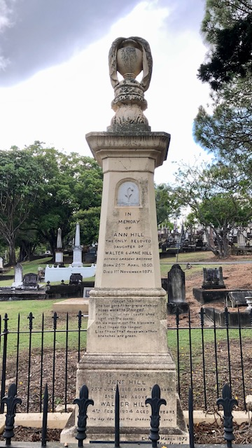

---
hide:
  - toc
  - navigation
description: She has gone to her grave when our hopes were the Strongest
  
---

# Ann Hill

**25 April 1850 — 1 November 1871**

--8<-- "snippets/ann-hill.md"

### Headstone 

{ width="32%" } { width="32%" } 

{ width="64.4%" } 

### Inscription

>
Forget her not  
She has gone to her grave when our   
hopes were the Strongest   
For the sun of her beauty shed   
light o'er the scene   
Oh we mourn not the blossoms  
that linger the longest  
Like thise that decay while their  
branches are green
>
