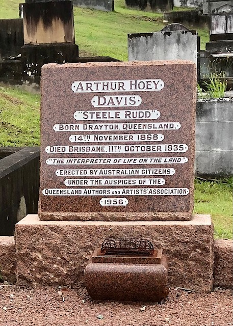

---
hide:
  - toc
  - navigation 
---

# Arthur Hoey Davis

**14 November 1868 — 11 October 1935**

--8<-- "snippets/arthur-hoey-davis.md"

<figure markdown>
  { width="55%" }
  <figcaption markdown>
  [Arthur Hoey Davis - Steele Rudd, Charles Lilley and Emma Miller statues located in King George Square in Brisbane, Australia. Artist: Artbusters Materials: Bronze Installation date: 1993](https://en.wikipedia.org/wiki/File:A._Davis,_C._Lilley_and_E._Miller_statues_in_Brisbane_01.JPG) by [Kgbo](https://commons.wikimedia.org/wiki/User:Kgbo), used under [CC BY-SA 4.0][cc-by-sa].  
  </figcaption>
</figure>

[cc-by-sa]: https://creativecommons.org/licenses/by-sa/4.0/  "Creative Commons Attribution ShareAlike 4.0 Licence"

### Headstone

{ width="30%" }

### Inscription

>Arthur Hoey  
>Davis  
>"Steele Rudd"  
>Born Drayton, Queensland.  
>14^th^ November 1868  
>Died Brisbane 11^th^ October 1935  
>"The Interpreter of Life on the Land"  
>Erected by Australian Citizens  
>Under the auspices of  
>Queensland Authors and Artists' Association  
>1956  

### Learn more 

- [Monument to "Steele Rudd"](https://trove.nla.gov.au/newspaper/article/50031781) — The Courier-Mail, 20 Nov 1950
- [Davis, Arthur Hoey (1868–1935)](https://adb.anu.edu.au/biography/davis-arthur-hoey-5911) — Australian Dictionary of Biography

--8<-- "snippets/add-to-this-story.md"