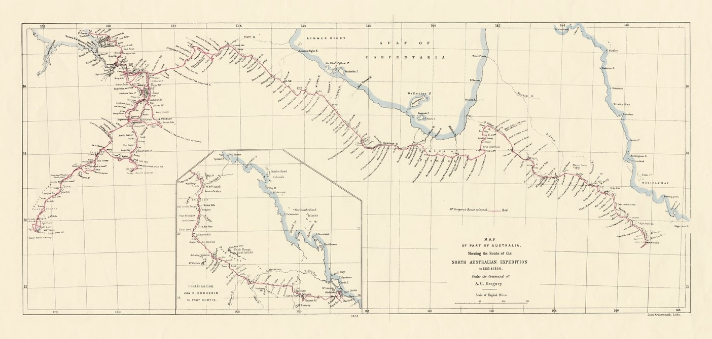

# Augustus Charles Gregory

**1 August 1819 — 25 June 1905**

--8<-- "snippets/augustus-charles-gregory.md"

<!--
<figure markdown>
  { width="70%" }  
  <figcaption markdown>[Map of part of Australia, shewing the route of the north Australian expedition in 1855 & 1856, under the command of A. C. Gregory](https://onesearch.slq.qld.gov.au/permalink/61SLQ_INST/dls06p/alma991856994702061) — State Library of Queensland.</figcaption>
</figure>
-->

--8<-- "snippets/add-to-this-story.md"