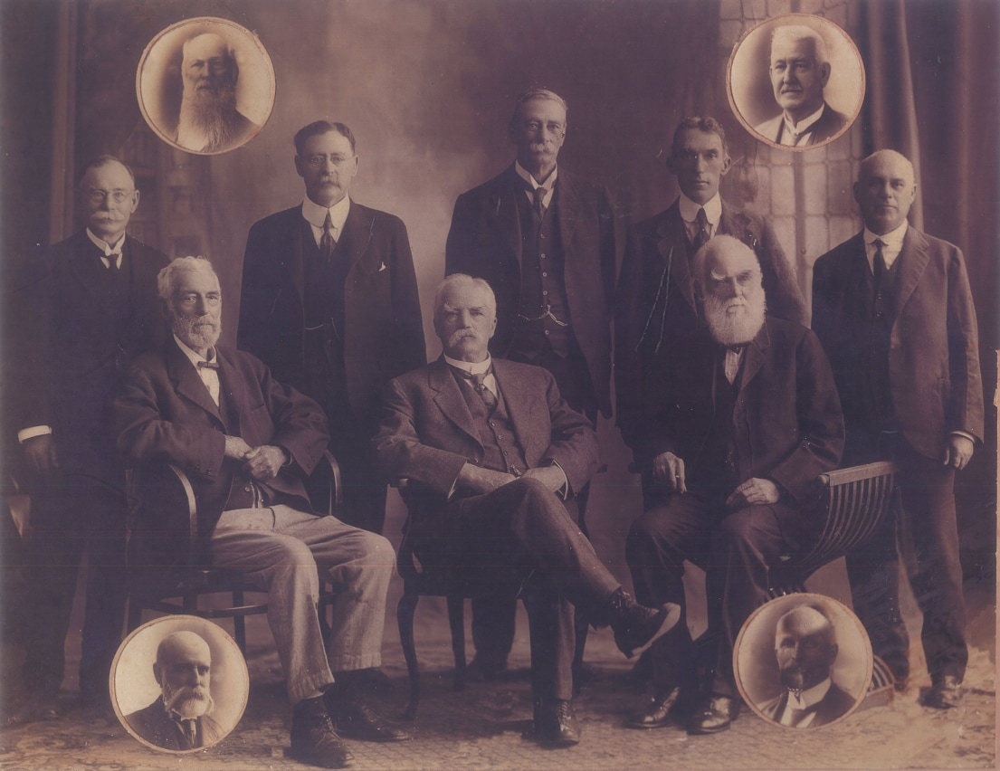
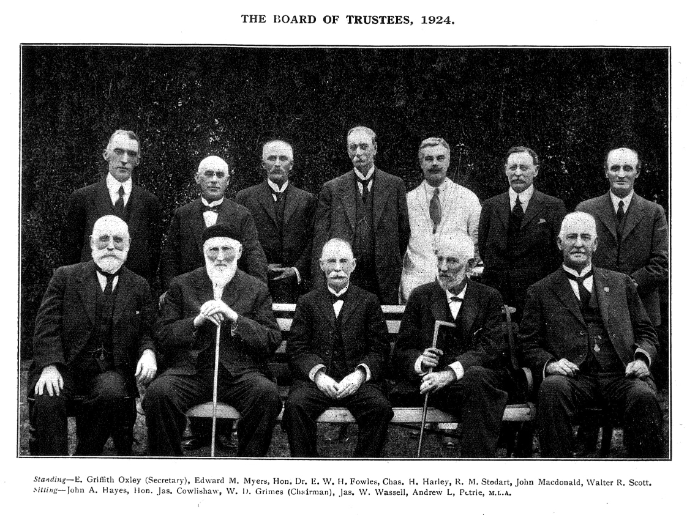

--8<-- "snippets/sem/stories/brisbane-general-cemetery-trustees.json"

# Brisbane General Cemetery Trustees

The Brisbane General Cemetery Trust commenced when [the first Trustees were appointed on 7 October 1870][gazette-94]. New Trustees were appointed as others retired or died. Successors were often members of the same family or community group.

[gazette-94]: ../assets/documents/Queensland_Gov_Gazette_10_October_1870_v11_94.pdf "Read the appointments Queensland Government Gazetter No. 94"

The Brisbane General Cemetery Trust [ended on 1 August 1930](https://trove.nla.gov.au/newspaper/article/188264449), when the Brisbane City Council took over management of all cemeteries within the municipality.

## Trustees

--8<-- "snippets/trustees.html"

### Board of Trustees ca. 1920-1922

{ width="70%" } 

*<small>
Brisbane General Cemetery Board of Trustees, ca. 1920 - 1922  
Top insets: James Cowlishaw, Andrew L. Petrie  
Standing:  W. D. Grimes, John McDonald, Charles H. Harley, E. Griffith Oxley, Edward M. Myers  
Seated: James William Wassell, James Stodart, George Frederick Scott  
Bottom insets: J. A. Hayes, E. W. H. Fowles </small>*

### Board of Trustees 1924

{ width="70%" }

<!--
J. G. Cribb https://trove.nla.gov.au/newspaper/article/181815751 
-->

### Download the Trustee data

The [Brisbane General Cemetery Trustees](brisbane-general-cemetery-trustees.md) by [Friends of Toowong Cemetery Association Inc.](../index.md), is licensed under [CC BY 4.0](https://creativecommons.org/licenses/by/4.0/). You must provide attribution if you reuse this work.

Download the Brisbane General Cemetery Trustees as a Comma Separated Value file (.csv)

[Download the data][data]{ .md-button .md-button--primary download}

[data]: ../../assets/data/brisbane-general-cemetery-trustees.csv

## Secretaries

- Arthur Rawlin 1 October 1870 to 1 July 1875
- [Henry J. Oxley](https://trove.nla.gov.au/newspaper/article/20100152) 1 July 1875 to 30 July 1916 (41 years)
- [E. Griffith Oxley](https://trove.nla.gov.au/newspaper/article/219019639?searchTerm=%22Brisbane%20general%20cemetery%22%20trustee), acting secretary from 11 March 1907 and [appointed 19 September 1910](https://trove.nla.gov.au/newspaper/article/178416098) until the dissolution of the Trust.

## Overseers

- John Melville, [1 January 1874](https://trove.nla.gov.au/newspaper/article/182983867) to 8 March 1912 
- T. H. Brown 22 April 1912 to 25 May 1916
- J. L. Melville 20 June 1916 to 1 August 1930, successor to his father

