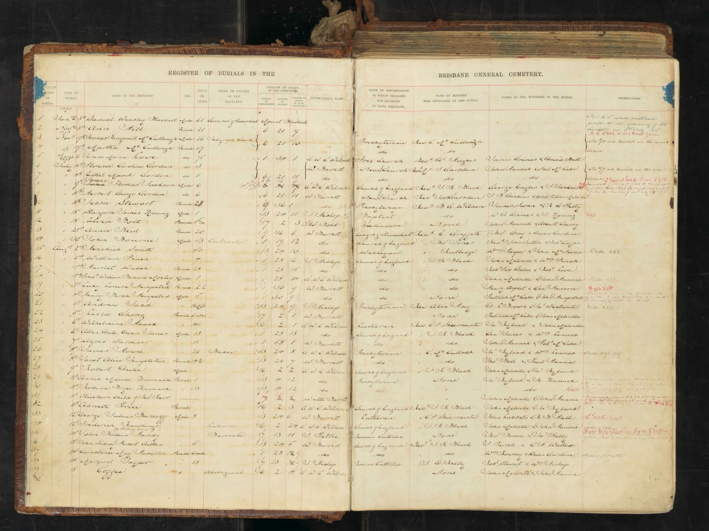

# Burial Registers

Queensland State Archives have published digital versions of the **[Burial Registers of the Brisbane General Cemetery](https://www.archivessearch.qld.gov.au/search?f[]=keywords&ff[]=resource_id&fl[]=Burial%20Registers%20-%20Brisbane%20General%20Cemetery%20%2F%20Toowong%20Cemetery%20%2F%20Brisbane%20General%20Cemetery%20Trust%20%2F%20Brisbane%20City%20Council%20II&fv[]=resource%3A6829&has_digital=false&op[]=AND&open=false&q[]=&sf[]=resource_id&sort=relevance)** (later Toowong Cemetery). 

*<small>Queensland State Archives, Item ID ITM867348</small>*

The Burial Registers contain details including: 

- Register number of burial (Grave Marker number)
- Date of burial
- Name of the deceased
- Sex
- Adult or Child (Age)
- Trade or Calling of the deceased 
- Position of grave in the cemetery
  - Number of compartment (Portion)
  - Number of section (Section)
  - Number of grave in such section (Grave)
- Undertaker's name
- Name of denomination to which deceased was reported to belonged
- Name of Minister who officated at the burial
- Names of two witnesses to the burial
- Observations

Burial dates overlap across some Burial Registers.

## Burials 3/1/1871 - 30/12/1891

[Queensland State Archives, Item ID ITM867348](https://www.archivessearch.qld.gov.au/items/ITM867348 "View the archive record")

- **Part 1: [3/1/1871 - 22/6/1880](https://www.archivessearch.qld.gov.au/api/download_file/DR142399 "Download the file" )** - *Queensland State Archives, Item Representation ID DR142399*
- **Part 2: [26/6/1880 - 9/1/1885](https://www.archivessearch.qld.gov.au/api/download_file/DR142400 "Download the file" )** - *Queensland State Archives, Item Representation ID DR142400*
- **Part 3: [10/1/1885 - 4/7/1888](https://www.archivessearch.qld.gov.au/api/download_file/DR142401 "Download the file" )** - *Queensland State Archives, Item Representation ID DR142401*
- **Part 4: [4/7/1888 - 30/12/1891](https://www.archivessearch.qld.gov.au/api/download_file/DR142402 "Download the file" )** - *Queensland State Archives, Item Representation ID DR142402*

## Burials 17/11/1884 - 8/4/1903

[Queensland State Archives, Item ID ITM867349](https://www.archivessearch.qld.gov.au/items/ITM867349 "View the archive record"). The archive record states an end date of 10/12/1886 which is the date on the last page but later dates appear on earlier pages.

- **Part 1: [17/11/1884 - 9/2/1888](https://www.archivessearch.qld.gov.au/api/download_file/DR142403 "Download the file" )** - Queensland State Archives, Item Representation ID DR142403
- **Part 2: [31/1/1888 - 31/7/1891](https://www.archivessearch.qld.gov.au/api/download_file/DR142404 "Download the file" )** - Queensland State Archives, Item Representation ID DR142404
- **Part 3: [1/8/1891 - 2/10/1895](https://www.archivessearch.qld.gov.au/api/download_file/DR142405  "Download the file" )** - Queensland State Archives, Item Representation ID DR142405
- **Part 4: [3/10/1895 - 12/8/1899](https://www.archivessearch.qld.gov.au/api/download_file/DR142406  "Download the file" )** - Queensland State Archives, Item Representation ID DR142406
- **Part 5: [12/8/1899 - 8/4/1903 and 27/11/1886 - 10/12/1886](https://www.archivessearch.qld.gov.au/api/download_file/DR142407  "Download the file" )** - Queensland State Archives, Item Representation ID DR142407

## Burials 1/1/1892 - 31/12/1907

[Queensland State Archives, Item ID ITM867350](https://www.archivessearch.qld.gov.au/items/ITM867350 "View the archive record")

- **Part 1: [1/1/1892 - 31/12/1895](https://www.archivessearch.qld.gov.au/api/download_file/DR142408 "Download the file" )** - Queensland State Archives, Item Representation ID DR142408
- **Part 2: [1/1/1896 - 30/12/1899](https://www.archivessearch.qld.gov.au/api/download_file/DR142409  "Download the file" )** - Queensland State Archives, Item Representation ID DR142409
- **Part 3: [1/1/1900 - 15/12/1903](https://www.archivessearch.qld.gov.au/api/download_file/DR142410  "Download the file" )** - Queensland State Archives, Item Representation ID DR142410
- **Part 4: [16/12/1903 - 31/12/1907](https://www.archivessearch.qld.gov.au/api/download_file/DR142411  "Download the file" )** - Queensland State Archives, Item Representation ID DR142411

## Burials 1/1/1908 - 31/12/1919

[Queensland State Archives, Item ID ITM867351](https://www.archivessearch.qld.gov.au/items/ITM867351 "View the archive record")

- **Part 1: [1/1/1908 - 27/8/1911](https://www.archivessearch.qld.gov.au/api/download_file/DR142412  "Download the file" )** - Queensland State Archives, Item Representation ID DR142412
- **Part 2: [28/8/1911 - 12/9/1914](https://www.archivessearch.qld.gov.au/api/download_file/DR142413  "Download the file" )** - Queensland State Archives, Item Representation ID DR142413
- **Part 3: [12/9/1914 - 31/7/1917](https://www.archivessearch.qld.gov.au/api/download_file/DR142414  "Download the file" )** - Queensland State Archives, Item Representation ID DR142414
- **Part 4: [31/7/1917 - 31/12/1919](https://www.archivessearch.qld.gov.au/api/download_file/DR142415  "Download the file" )** - Queensland State Archives, Item Representation ID DR142415

## Burials 2/1/1920 - 31/12/1928

[Queensland State Archives, Item ID ITM867352](https://www.archivessearch.qld.gov.au/items/ITM867352 "View the archive record")

- **Part 1: [2/1/1920 - 15/6/1922](https://www.archivessearch.qld.gov.au/api/download_file/DR142416  "Download the file" )** - Queensland State Archives, Item Representation ID DR142416
- **Part 2: [15/6/1922 - 22/10/1924](https://www.archivessearch.qld.gov.au/api/download_file/DR142417  "Download the file" )** - Queensland State Archives, Item Representation ID DR142417
- **Part 3: [22/10/1924 - 20/12/1926](https://www.archivessearch.qld.gov.au/api/download_file/DR142418  "Download the file" )** - Queensland State Archives, Item Representation ID DR142418
- **Part 4: [20/12/1926 - 31/12/1928](https://www.archivessearch.qld.gov.au/api/download_file/DR142419  "Download the file" )** - Queensland State Archives, Item Representation ID DR142419

## Burials 2/1/1929 - 7/8/1937

[Queensland State Archives, Item ID ITM867353](https://www.archivessearch.qld.gov.au/items/ITM867353 "View the archive record")

- **Part 1: [2/1/1929 - 10/11/1931](https://www.archivessearch.qld.gov.au/api/download_file/DR142420  "Download the file" )** - Queensland State Archives, Item Representation ID DR142420
- **Part 2: [10/11/1931 - 11/10/1934](https://www.archivessearch.qld.gov.au/api/download_file/DR142421  "Download the file" )** - Queensland State Archives, Item Representation ID DR142421
- **Part 3: [12/10/1934 - 7/8/1937](https://www.archivessearch.qld.gov.au/api/download_file/DR142422  "Download the file" )** - Queensland State Archives, Item Representation ID DR142422

## Burials 7/8/1937 - 21/8/1940

[Queensland State Archives, Item ID ITM867354](https://www.archivessearch.qld.gov.au/items/ITM867354 "View the archive record")

- **Part 1: [7/8/1937 - 27/2/1939](https://www.archivessearch.qld.gov.au/api/download_file/DR142423  "Download the file" )** - Queensland State Archives, Item Representation ID DR142423
- **Part 2: [28/2/1939 - 21/8/1940](https://www.archivessearch.qld.gov.au/api/download_file/DR142424  "Download the file" )** - Queensland State Archives, Item Representation ID DR142424

## Burials 20/5/1936 - 5/6/1957 

[Queensland State Archives, Item ID ITM867355](https://www.archivessearch.qld.gov.au/items/ITM867355 "View the archive record")

- **Burial register - Toowong Cemetery Trust (partly copied into item 6)** - Not digitised.

## Burials 28/7/1954 - 3/1/1989 

[Queensland State Archives, Item ID ITM867367](https://www.archivessearch.qld.gov.au/items/ITM867367 "View the archive record")

- **Burial register - Toowong Cemetery, Volume 12 [microfilm]** - Not digitised.
