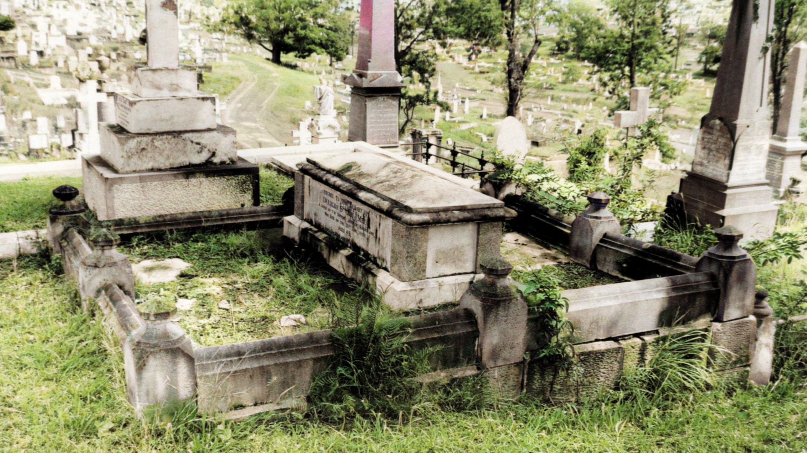

# Charles Stuart Mein

**14 June 1841 — 30 June 1890**

--8<-- "snippets/charles-stuart-mein.md"

### Headstone

Charles Stuart Mein's headstone was demolished in the 1970's as part of the Brisbane City Council's "Beautification Scheme". The Federation Pavillion now covers a small part of the grave.

<!--
{ width="70%" }
-->

### Inscription

>Sacred to the memory of  
>Charles Stuart Mein  
>A Judge of the Supreme Court of Queensland   
>Who died on the 30^th^ June 1890  
>Aged 49

--8<-- "snippets/add-to-this-story.md"