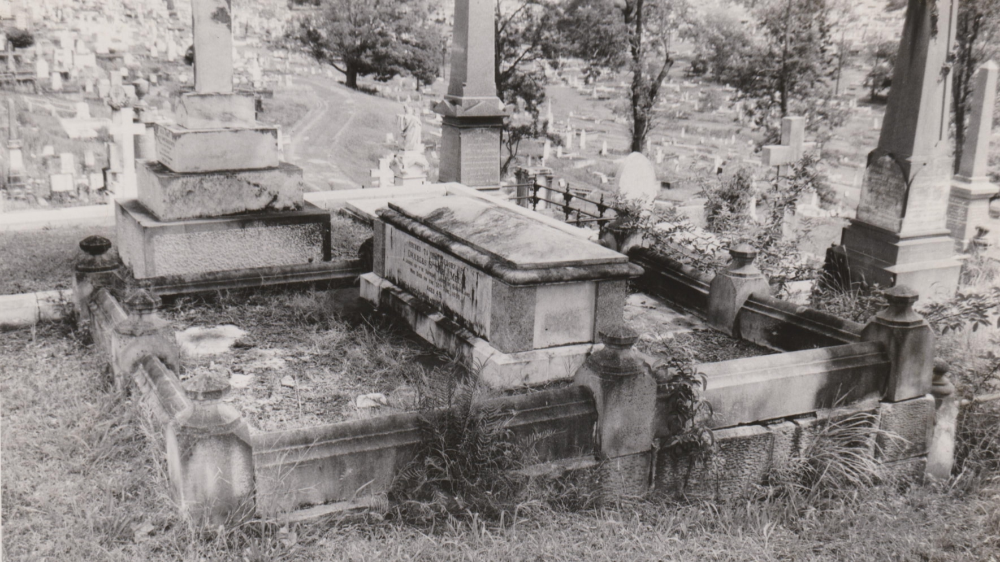

# Charles Stuart Mein

**14 June 1841 — 30 June 1890**

--8<-- "snippets/charles-stuart-mein.md"

### Headstone

Charles Stuart Mein's headstone was demolished in the 1970's as part of the Brisbane City Council's "Beautification Scheme". It was behind the grave of Sir Samuel Walker Griffin. The Federation Pavilion covers a small part of the grave.

{ width="70%" }

### Inscription

>Sacred to the memory of  
>Charles Stuart Mein  
>A Judge of the Supreme Court of Queensland   
>Who died on the 30^th^ June 1890  
>Aged 49

### Grave Marker

M 507

<!--
### Learn More

- [Unsightly/Dangerous Grave Report](../../assets/demolished-toowong-headstones/12-11-13-mein/12-11-13-mein-report.jpg)

-->

--8<-- "snippets/add-to-this-story.md"