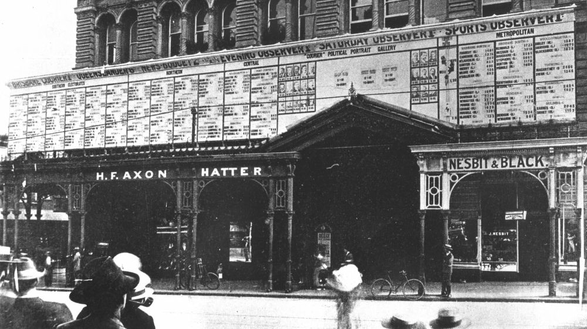

#  Data

**We publish our data with an open licence to help others discover and share the history and stories of Toowong Cemetery.**

## Our Data 

Friends of Toowong Cemetery have published data, including: 

- an **[index to individual stories ](../research/find-a-story.md)** we've written
- a list of **[headstones moved from Paddington Cemetery](../headstones/moved-paddington-headstones.md)** to Toowong Cemetery in the 1910's
- a list of **[headstones lost from Paddington Cemetery](../headstones/lost-paddington-headstones.md)** in the 1930's, some which have been rediscovered in Toowong Cemetery 

<!-- **Headstones** (images, inscriptions, movements, and location) -->
<!-- **Walks** (a route from grave to grave, linked to people, headstones, and stories) -->
<!-- Location of information signs -->
<!-- List of restored headstones  -->

The **[data is available on GitHub](https://github.com/1871fotc/tree/main/docs/assets/data)** :fontawesome-brands-github: and via links on this site.

## Other Data

Where practical, we link to authoritative data sources, rather than duplicate data. We encourage other data owners to publish their data as easily accessible open data. Other data we would like to reuse includes: 

### Brisbane City Council data

- **[Graves and Human Remains](https://graves.brisbane.qld.gov.au)** - who is buried in which grave and associated dates
- **Cemetery Location data**:
    - [Cemetery boundary](https://www.spatial-data.brisbane.qld.gov.au/datasets/d9879ce7dce842ce8d5d3b50e3b702bf_0/explore?location=-27.476664%2C152.985658%2C16.53) is available as open open data
    - Portion and Section boundaries 
    - Cemetery Road casements - [centrelines](https://www.spatial-data.brisbane.qld.gov.au/datasets/46bbc7521e7949f68ef4b69d87e89ebc_0/explore?location=-27.475228%2C152.985532%2C15.84) are available as open open data
    - Toowong Cemetery Pedestrian Entrance off Mt Coot-tha Road.
    - Toowong Cemetery Main, Richer Street, and Frederick Street gates
    - Surrounding Road casements - including roads running off the surrounding road to aid orientation 
    - Cemetery Building outlines - Amenities, Workshop, Office, Museum and Shelter Sheds 
    - [Waterways](https://www.spatial-data.brisbane.qld.gov.au/datasets/e0839d26d85a429c8f64669ba69cfae7_0/explore?location=-27.475527%2C152.983328%2C17.22) - Langsville Creek and [Flood risk](https://www.data.brisbane.qld.gov.au/data/dataset/flood_awareness_overland_flow) are available as open open data
    - Governor Blackall and the Soldiers Memorial monument outlines
    - [Contour lines](https://www.data.brisbane.qld.gov.au/data/dataset/contours-2002) - are available as open data. <!-- These will help create a mobility map -->

<!--
- Bridges, Culverts and open Drains (polygon)

### Other location data 
      
- Features of Interest (polygon or point) - Symbology display, honour board
- Information Signs (point) - grave-side, walks, general information
- Trees (point) - especially weed trees and those destroying graves
- Historic Dam (polygon) - if exact [location](http://www.oncewasacreek.org/2014/08/up-hill-and-down-dale-where-did-elizabeth-drown/) is known
- [Local Bus stops](https://www.data.qld.gov.au/dataset/general-transit-feed-specification-gtfs-seq) 

### Other data providers 
        
- State Library of Queensland - catalogue metadata, digital images
- Queensland State Archives - catalogue metadata, documents and digital images
- Trove - catalogue metadata and articles
- DBpedia - entries

-->

## Data Formats 

Our data is published as Comma Separated Value (.csv) data files. 

<!--
- Comma Separated Value (.csv) data files 
- [Tabular Data Packages](https://specs.frictionlessdata.io/tabular-data-package/) following the [Frictionless Data](https://frictionlessdata.io) specification. This is a .zip file that includes: 

    - the Comma Separated Value data file 
    - a JSON [Table Schema](https://specs.frictionlessdata.io/table-schema/) file describing the structure of the data 
    - a [Markdown](https://commonmark.org/help/) file describing the provenance of the data
-->

We plan to experiment publishing our data as [Linked Data](https://en.wikipedia.org/wiki/Linked_data) to enable semantic queries and visualisations. We are considering using the following specifications: 

- [Bio vocabulary](https://vocab.org/bio/) [:fontawesome-brands-github:](https://github.com/iand/vocab-bio)
- [Graves ontology](https://rdf.muninn-project.org/ontologies/graves-en.html)  [:fontawesome-brands-github:](https://github.com/muninn/graves) 

<!--
Geographic locations should be described as latitude, longitude coordinates in the [WGS84 datum](https://www.spatial.nsw.gov.au/__data/assets/pdf_file/0008/224396/WGS84_and_Australias_misaligned_web-maps_Information_Sheet.pdf) to aid integration and presentation on the web. Alternatively all data should be supplied in a common Datum, ideally [GDA2020](https://www.icsm.gov.au/gda2020), or  the dated GDA94.
--> 

<!-- 
## Data Publishing 

We strive to follow the W3C [Data on the Web Best Practices](https://www.w3.org/TR/dwbp/).

We use [Data Curator](https://www.qcif.edu.au/news/data-curator-now-in-app-stores/) to package our data into a Tabular Data Package. 

We are exploring tools to convert CSV data (the master) into Markdown tables for inclusion in this website:

- [OpenRefine](https://openrefine.org)  
- An [Atom package](https://github.com/takezoe/atom-csv-markdown) 

We have not decided on a Linked Data publishing toolset yet, but are aware of: 

- [Swirrl](https://www.swirrl.com)
- [Ontotext GraphDB](https://www.ontotext.com/products/graphdb/)
- [OntoRefine](https://graphdb.ontotext.com/documentation/free/loading-data-using-ontorefine.html)
- [dBpedia](https://www.dbpedia.org) which runs on [Virtuoso](https://virtuoso.openlinksw.com)
- [CSV for the Web tools](https://www.w3.org/TR/tabular-data-primer/)

When we work things out, we'll look to follow the W3C [Best Practices for Publishing Linked Data](https://www.w3.org/TR/ld-bp/)

--> 

## Data Visualisation

Static Visualisations we are considering include: 

- A Mobility map to provide accessibility information to cemetery visitors
- Grave locations and images <!-- https://vega.github.io/vega-lite/examples/geo_layer.html -->
- Timelines for an individual, family, or group of related people <!-- https://bl.ocks.org/jakevdp/1643ebb6853e76c32e47a969f415f3ea -->

<!--
We are considering [Vega-Lite](https://vega.github.io/vega-lite/) to specify our own visualisations. These may be represented as static images on the website as the data does not change often but we are also exploring [tools for embedding vega-lite visualizations](https://vega.github.io/vega-lite/ecosystem.html#tools-for-embedding-vega-lite-visualizations).
-->

Dynamic visualisations we are considering include:

- A biography explorer, traversing links from Person to Events, Organisations, and other People. This would traverse Linked Data stored using the Bio ontology. 
- A cemetery explorer, traversing links from Person to their Remains, Grave and Headstone. This would traverse Linked Data stored using the Graves ontology.

We are inspired by the works of others who share and create with open data, including:

- [Visualising linked data from 'A biographical record of Queensland women', 1939](https://www.slq.qld.gov.au/blog/visualising-linked-data-biographical-record-queensland-women-1939) by the State Library of Queensland. This was our initial inspiration for exploring linked data.
- [Loud Numbers](https://anchor.fm/loudnumbers/episodes/The-End-of-the-Road-e131bnl) and [Sonic Pi](https://sonic-pi.net). What could Toowong Cemetery sound like?
- [Family Tree Timeline](https://blog.myheritage.com/2022/03/introducing-the-family-tree-timeline/) by MyHeritage.com
<!-- [Auckland Museum](https://www.aucklandmuseum.com/discover/collections-online/our-data) who publish the collection data in many different ways -->
<!-- LeanIX https://youtu.be/av5FL6gJBu4?t=126 -->

## Data Consumers

Our end goal for publishing and linking our data is to enable Friends of Toowong Cemetery and others to discover and share new stories and historical insights about Toowong Cemetery.

We encourage you to reuse our data but please follow the terms of the licence and provide attribution. 

<!-- 
We may encourage reuse of our data by participating in hack-a-thons (such as [GovHack](https://govhack.org)), and experiments with other organisations. 
-->

*<small>[Posting of the election results on the outside of the Courier building, 1907](http://onesearch.slq.qld.gov.au/permalink/f/1upgmng/slq_alma21298100600002061) - State Library of Queensland. Cropped</small>*
