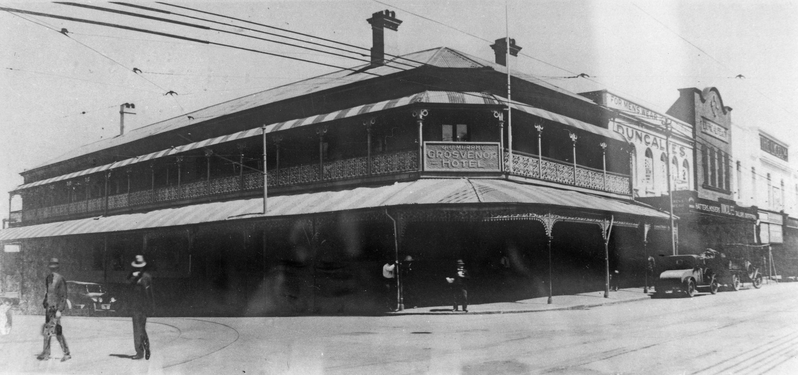

---
hide:
  - toc
  - navigation 
---

# Edward McGregor

**Died 3 December 1939**

--8<-- "snippets/edward-mcgregor.md"

<figure markdown>
  { width="70%" }
  <figcaption markdown>[Grosvenor Hotel, Brisbane, ca. 1929](https://onesearch.slq.qld.gov.au/permalink/61SLQ_INST/dls06p/alma99183512819002061). The Grosvenor Hotel was built ca. 1882 for Alfred Alberton, on the western corner of George and Ann Streets, Brisbane. Previously a hotel existed on this site, which was known as the Volunteers Arms, and later as the Supreme Court. The Lyceum Theatre can be seen on the right of the photograph. — State Library of Queensland</figcaption>
</figure>

--8<-- "snippets/add-to-this-story.md"