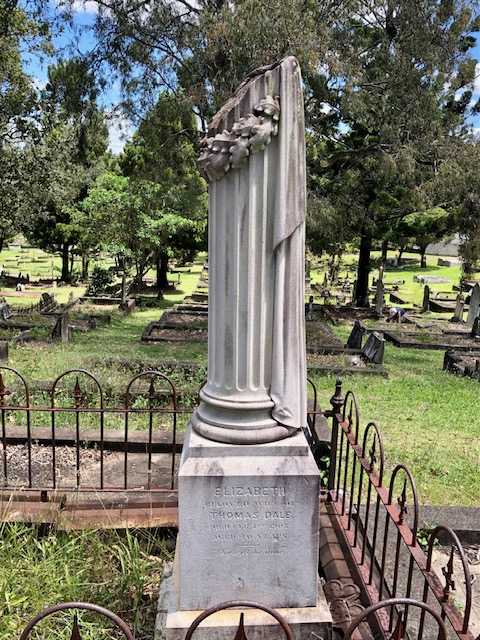

---
hide:
  - toc
  - navigation 
---

# Elizabeth Dale

**1865 — 1 February 1905**

--8<-- "snippets/elizabeth-dale.md"

### Headstone

{ width="32%" }

### Inscription

> Elizabeth  
> beloved wife of  
> Thomas Dale  
> died Feb. 1^st^ 1905  
> aged 40 years  
> Thy will be done  

### Learn more

- Learn how Elizabeth's brother, Henry Harris Dodd, was [murdered by mistake](https://www.slq.qld.gov.au/blog/murder-st-helena-penal-establishment). Henry is buried in grave 11‑2‑28.
- Map showing the [dam at Toowong Cemetery](../assets/historic-maps/portion-16-17-1912.jpg)
  

<!-- 
- [Flowers being grown in Portion 10](https://onesearch.slq.qld.gov.au/permalink/61SLQ_INST/dls06p/alma99183906300102061)

http://www.oncewasacreek.org/2014/05/uncovering-langsville-creek-part-4-something-to-do-with-death/#gravestones
https://www.familyhistory.bdm.qld.gov.au/details/d853a55fa3992ef6483f1a99dd5511c146a30ef6ae88c6a979cca274ed272ebb

-->

### Copyright

This story is from *Toowong Cemetery*, by [Hilda Maclean](https://www.linkedin.com/in/dr-hilda-maclean-4819a711/) and Prue Firth, in *[Toowong: A community's history](https://www.toowong.au/books/)* by [West Toowong Community Association Inc.](https://www.toowong.au). Used with permission. Links added.

