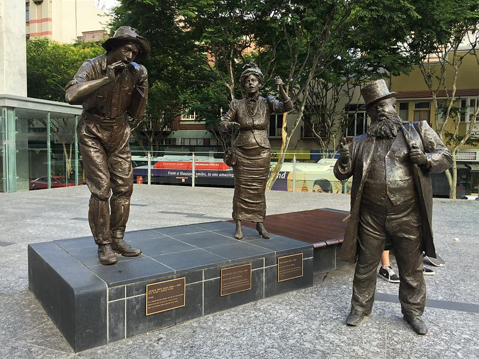

---
hide:
  - toc
  - navigation
description: Mother of the Australian Labor Party
---

# Emma Miller

**26 June 1839 — 22 January 1917**

--8<-- "snippets/emma-miller.md"

{ width="28.85%" }  { width="25.75%" }

*<small>[Portrait of Mrs. Emma Miller](http://onesearch.slq.qld.gov.au/permalink/f/1c7c5vg/slq_alma21220238260002061) - State Library of Queensland. </small>*  
*<small>[Marble Bust of Emma Miller held at Queensland Council of Unions by sculptor James Laurence Watts](https://en.wikipedia.org/wiki/File:Marble_Bust_of_Emma_Miller_held_at_Queensland_Council_of_Unions.jpg) by Alphi123, used under [CC BY-SA 4.0](https://creativecommons.org/licenses/by-sa/4.0/).  </small>*

{ width="55%" }

*<small>[Arthur Hoey Davis - Steele Rudd, Charles Lilley and Emma Miller statues located in King George Square in Brisbane, Australia. Artist: Artbusters Materials: Bronze Installation date: 1993](https://en.wikipedia.org/wiki/File:A._Davis,_C._Lilley_and_E._Miller_statues_in_Brisbane_01.JPG) by [Kgbo](https://commons.wikimedia.org/wiki/User:Kgbo), used under [CC BY-SA 4.0][cc-by-sa].  </small>*

<iframe width="560" height="315" src="https://www.youtube.com/embed/clY9640s02Y" title="YouTube video player" frameborder="0" allow="accelerometer; autoplay; clipboard-write; encrypted-media; gyroscope; picture-in-picture" allowfullscreen></iframe>

*<small>[Black Friday: When Brisbane Police Beat and Suppressed Demonstrators](https://youtu.be/clY9640s02Y) - Queensland State Archives</small>*

--8<-- "snippets/headstones/emma-miller.md"
