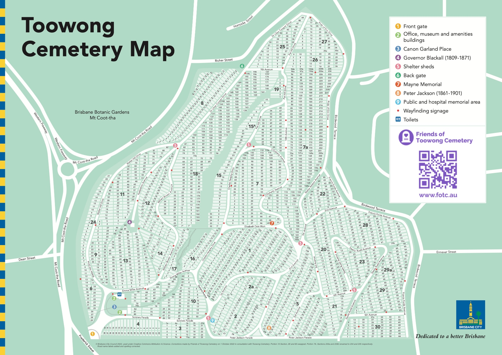

--8<-- "snippets/sem/research/find-a-grave.json"

# How to find a grave in Toowong Cemetery

Heritage‑listed Toowong Cemetery is the largest cemetery in Queensland. It can be difficult to find a grave as some graves are unmarked and some headstones have been destroyed.

## Search for a person's grave

Use the Brisbane City Council **[Grave location search](https://www.brisbane.qld.gov.au/community-and-safety/community-support/cemeteries/grave-location-search)** to look up a person's name and find their location in Toowong Cemetery.

Note the location which will be 3 numbers in the format, *Portion*-*Section*-*Grave*. For example, Peter Jackson's grave is located at Portion 5, Section 28, Grave 1, or 5-28-1.

<figure markdown>
  { width="100%" data-title="BCC Grave Location Search result for Peter Jackson" data-description="Go to https://graves.brisbane.qld.gov.au; Choose Toowong Cemetery as the Cemetery Name, Enter the other details you know; Click the Details link and the grave location is displayed."}
  <figcaption markdown>BCC Grave Location Search result for Peter Jackson</figcaption>
</figure>

## Locate the grave on the map

Use the Toowong Cemetery Map to locate the Portion and Section where the person is buried.

[Print the Toowong Cemetery Map :fontawesome-solid-map:](../assets/documents/toowong-cemetery-map.pdf "Print a high resolution version of the map. 2.1 Mb."){ .md-button .md-button--primary }

Can you locate Peter Jackson's grave (5-28-1) using the Portion and Section numbers in the map below?

<figure markdown>
  { width="100%" data-title="Toowong Cemetery Map" data-description="Portion numbers are the large numbers. Section numbers are the small numbers inside the light green rectangles. Grave numbers are not shown."}
  <figcaption markdown>Toowong Cemetery Map showing Portions (the large numbers) and Sections (the numbers inside the light green rectangles). [Toowong Cemetery Area Map](https://www.brisbane.qld.gov.au/sites/default/files/documents/2022-09/20220906-Toowong-Cemetery-Map-2022.pdf)  © [Brisbane City Council](https://www.brisbane.qld.gov.au) 2022, used under [Creative Commons Attribution 4.0 Licence](https://creativecommons.org/licenses/by/4.0/). Corrected on 1 October 2022 in consultation with Toowong Cemetery: Portion 10 Section, 85 and 83 swapped. Portion 7A, Sections 233a and 233b renamed to 234 and 235 respectively. Road name labels added and spelling corrected.</figcaption>
</figure>

There are 34 Portions in the cemetery, numbered 1 to 30 and also 2A, 7A, 15A, 29A. Each Section can contain up to 80 graves and the graves are usually in two rows within the section. 

Portion numbers are shown on signs throughout the cemetery. Section numbers are painted on the road.

<figure markdown>
  { width="100%" data-title="Portion 10 Sign" data-description="Portion numbers are shown on signs throughout the cemetery."}
  <figcaption markdown>Portion 10 sign post.</figcaption>
</figure>

## Plan your visit

Plan your visit to Toowong Cemetery.

  - **[Check Office opening hours](https://www.brisbane.qld.gov.au/community-and-safety/community-support/cemeteries/toowong-cemetery#officehours)**. 
  - **[Decide how you'll travel to Toowong Cemetery](../index.md#visit-toowong-cemetery)**

## Ask for help 

**[Ask Friends of Toowong Cemetery for help](../contact.md)**:

  - If you're visiting outside of office hours, we can mark the side of the road with the section number to help you locate the grave.
  - If the grave is unmarked, we can outline the grave using a surface spray. The spray does no harm and two mowings later it will disappear.
  - If you're unable to visit, we can to take a digital photograph of a grave and email it to you.

## Visit the grave

  - **[Travel to Toowong Cemetery](../../#visit-toowong-cemetery)**.
  - When you arrive, **[ask the Toowong Cemetery Office to help find the grave](https://www.brisbane.qld.gov.au/community-and-safety/community-support/cemeteries/toowong-cemetery#locatinggravesandashesmemorialsites)**.

## Grave Markers

Markers can be seen on, or embedded into, graves. A Marker represents a person buried in the grave. Historic Burial and Portion Registers link some people to markers and their grave. Unfortunately many markers are missing or have been moved.

<figure markdown>
  { width="100%" data-title="Markers embedded into a grave" data-description="A Marker represents a person buried in the grave." } 
  <figcaption>Grave markers embedded into a grave surround.</figcaption>
</figure>

<figure markdown>
  { width="100%" data-title="Grave markers found on the grass, separated from their graves" data-description="Unfortunately many markers are missing or have been moved." }
  <figcaption>Grave markers found on the grass, separated from their graves.</figcaption>
</figure>

<!-- seek permission to publish image

To map a marker to a grave, you need to look up old portion books. For example, Portion 1, Section 1, Grave 38 in the Portion Book page below, maps to Marker ZI 735, which is annotated with the name *"Gale"*. 

Searching for *"Gale"* in the Brisbane City Council **[Grave location search](https://www.brisbane.qld.gov.au/community-and-safety/community-support/cemeteries/grave-location-search)** you find, by looking at each entry for *"Gale"*, Ruby Mary Gale, who was buried in 1-1-38 on 24 November 1924. You'll also find Ada Florence Morgan buried in 1-1-38 on 11 November 1878 - perhaps this is the B 663 crossed out in the Portion Book. 

Only the surname is recorded in the Portion Book so you can't link a marker to a specific person, although you may be able to imply a link by the order the markers are recorded and the date of each person's death. 

{ width="100%" }

*<small>Sample Portion Book page. © Brisbane City Council</small>*

-->

## Unmarked Graves

There are many unmarked graves in Toowong Cemetery. Take care when you walk across the grass as unmarked graves can leave hidden hollows that are a trip hazard.

<figure markdown>
  { width="100%" data-title="Unmarked graves can be clearly seen after rain" data-description="There are many unmarked graves in Toowong Cemetery."}
  <figcaption markdown>Unmarked graves can be clearly seen after rain.</figcaption>
</figure>