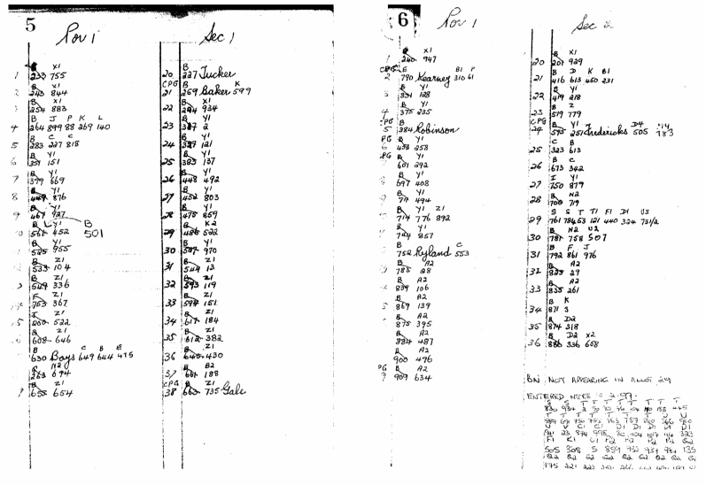

# Find a Grave in Toowong Cemetery

## Search for a grave

Use the Brisbane City Council **[Grave location search](https://www.brisbane.qld.gov.au/community-and-safety/community-support/cemeteries/grave-location-search)** to look up a person's name and find the grave location and other details. 

You can request an update to the official burial records from the same web page.

## Find a grave

### Portions, Sections, and Graves

Graves are located using 3 numbers, *Portion*-*Section*-*Grave*. For example, Peter Jackson's grave is located at Portion 5, Section 28, Grave 1 or (5-28-1). 

See if you can locate Peter Jackson's grave using the Portion and Section numbers in the map below.

<!-- Map -->
[{ width="100%" }][map]

*<small>Toowong Cemetery Map showing Portions (the large numbers) and Sections (the numbers inside the white rectangles).</small>*

<!-- Map links -->
[map]: ../assets/toowong-cemetery-map-alt.jpg 

There are 34 Portions in the cemetery, numbered 1 to 30 and also 2A, 7A, 15A, 29A. Each Section can contain up to 80 graves and the graves are usually in two rows within the section. 

Portion numbers are shown on signs throughout the cemetery.

{ width="100%" }

*<small>Portion 10 sign post.</small>*

!!! question "Volunteer - report a damaged sign"

    Unfortunately Portion signs are often vandalised in the cemetery. **[Report damaged signs to the Brisbane City Council](https://ofpm.brisbane.qld.gov.au/site/wss/form/report-it-traffic-signs)** by sharing a photo of the damage.

### Markers

Markers can be seen on, or embedded into, graves. They represent a person buried in the grave. There is no simple way to link a marker, the person it represents, and the grave location. A historic Portion Book maps some markers to people and their grave.

{ width="100%" }

*<small>Grave markers embedded into a grave surround.</small>*

{ width="100%" }

*<small>Grave markers found on the grass, separated from their graves.</small>*

<!-- seek permission to publish image

To map a marker to a grave, you need to look up old portion books. For example, Portion 1, Section 1, Grave 38 in the Portion Book page below, maps to Marker ZI 735, which is annotated with the name *"Gale"*. 

Searching for *"Gale"* in the Brisbane City Council **[Grave location search](https://www.brisbane.qld.gov.au/community-and-safety/community-support/cemeteries/grave-location-search)** you find, by looking at each entry for *"Gale"*, Ruby Mary Gale, who was buried in 1-1-38 on 24 November 1924. You'll also find 	Ada Florence Morgan buried in 1-1-38 on 11 November 1878 - perhaps this is the B 663 crossed out in the Portion Book. 

Only the surname is recorded in the Portion Book so you can't link a marker to a specific person, although you may be able to imply a link by the order the markers are recorded and the date of each person's death. 

{ width="100%" }

*<small>Sample Portion Book page. © Brisbane City Council</small>*

-->

## Need help finding a grave? 

You can **[ask the Toowong Cemetery Office to help find a grave](https://www.brisbane.qld.gov.au/community-and-safety/community-support/cemeteries/toowong-cemetery#locating-graves-and-ashes-memorial-sites)**.

Friends of Toowong Cemetery can help you find a grave. We can:

  - mark the side of the road with the section number to help you to find it easily when you visit.
  - outline an unmarked grave using a surface spray. The spray does no harm and two mowings later it will disappear. 
  - take a digital photograph of a grave and email it to you.
  
**[Ask us to help find a grave](../contact.md)**. 

{ width="100%" }

*<small>Unmarked graves can be clearly seen after rain.</small>*
