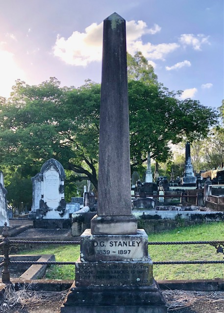

# Francis Drummond Grenville Stanley

**1 January 1839 — 26 May 1897**

--8<-- "snippets/francis-drummond-grenville-stanley.md"

### Headstone 

{ width="30%" }

--8<-- "snippets/add-to-this-story.md"