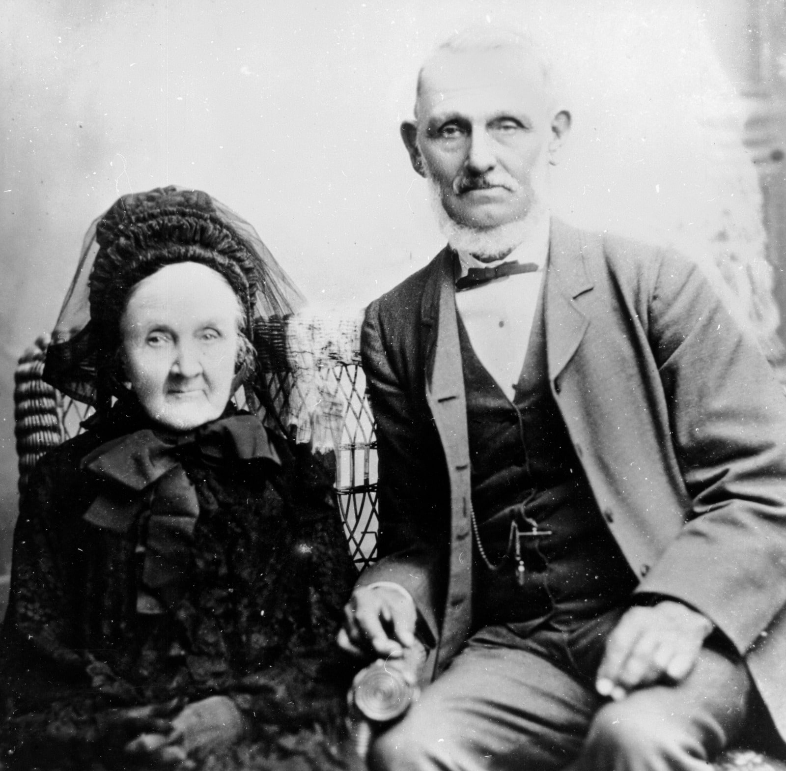

# George Prentice

**ca.1820 - 28 February 1890**

--8<-- "snippets/george-prentice.md"

<figure markdown>
  { class="full-width" width="60%"}
  <figcaption markdown>[George and Mrs. Prentice](https://onesearch.slq.qld.gov.au/permalink/61SLQ_INST/60a0pp/alma99183513698202061) - State Library of Queensland</figcaption>
</figure>

--8<-- "snippets/add-to-this-story.md"
