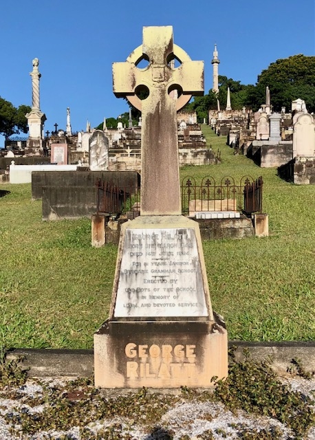

# George Rilatt

**31 March 1844 - 14 June 1924**

<!-- From graveside information sign -->

--8<-- "snippets/george-rilatt.md"

### Headstone

{ width="30%" }  

### Inscription

>George Rilatt  
>Born 31^st^ March 1844  
>Died 14^th^ June 1924  
>For 51 years Janitor  
>Brisbane Grammar School  
>Erected by  
>Old Boys of the School  
>In memory of  
>Loyal and devoted service  

<!--
https://trove.nla.gov.au/newspaper/article/181933526
https://onesearch.slq.qld.gov.au/permalink/61SLQ_INST/dls06p/alma99183507292102061 - Panoramic view of Brisbane from Wickham Terrace, showing the first Brisbane Grammar School, ca. 1874
https://trove.nla.gov.au/newspaper/article/181933260?searchTerm=RILATT
-->

--8<-- "snippets/add-to-this-story.md"