# Toowong Cemetery Historic Maps

On this page you'll find historic maps of Toowong Cemetery that may help your research. To see the detail such as grave numbers within a section, you'll probably need to download the high resolution version of the map.

There are 34 portions in Toowong Cemetery, numbered 1 to 30 and also 2A, 7A, 15A, 29A. Not all portions have a historic map:

- Maps of portions 20, 21, 22, 28, and 29 have not been digitised by [Queensland State Archives](https://www.archivessearch.qld.gov.au/search?f[]=keywords&ff[]=resource_id&fl[]=Portion%20Plans%20-%20Brisbane%20City%20Council%20II%20%2F%20Brisbane%20General%20Cemetery%20Trust&fv[]=resource%3A6633&has_digital=false&op[]=AND&open=false&q[]=&sf[]=resource_id&sort=title_asc).
- There are no map records for portions 4, 19, 23, 25, 26, 27, or 29a at Queensland State Archives.

## Brisbane General Cemetery, 1909

<figure markdown>
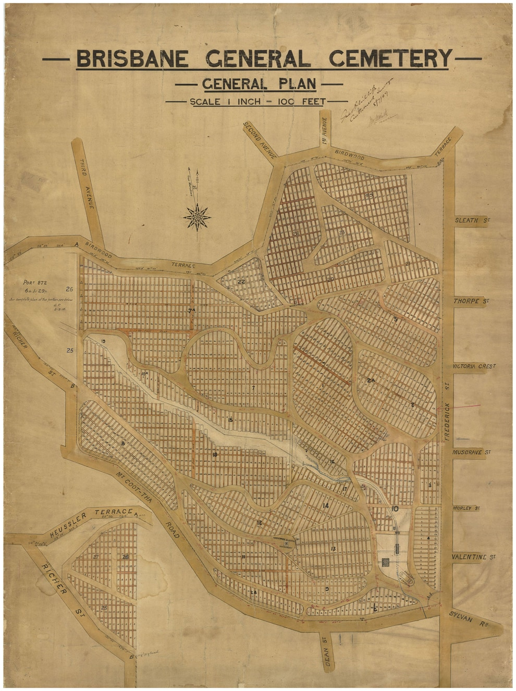{ width="70%" class="full-width" } 
  <figcaption markdown>[Brisbane General Cemetery - General Plan](https://www.archivessearch.qld.gov.au/items/ITM1624111), 8 July 1909 — Queensland State Archives, Item ID ITM1624111. [Download a high resolution version](https://www.archivessearch.qld.gov.au/api/download_file/DR21355)</figcaption>
</figure>

## Portion 1, 1909

<figure markdown>
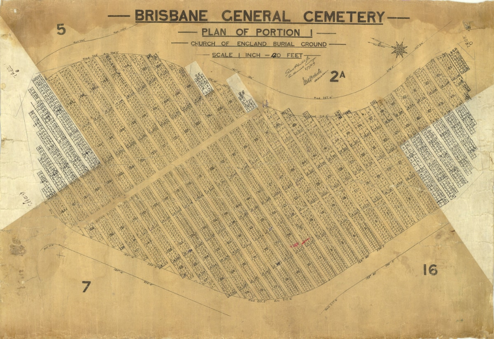{ width="70%" class="full-width" } 
  <figcaption markdown>[Brisbane General Cemetery Plan of Portion 1 - Church of England Burial Ground](https://www.archivessearch.qld.gov.au/items/ITM1432135), 8 July 1909 — Queensland State Archives, Item ID ITM1432135. [Download a high resolution version](https://www.archivessearch.qld.gov.au/api/download_file/DR95983)</figcaption>
</figure>

## Portion 2 and 2a, 1909

<figure markdown>
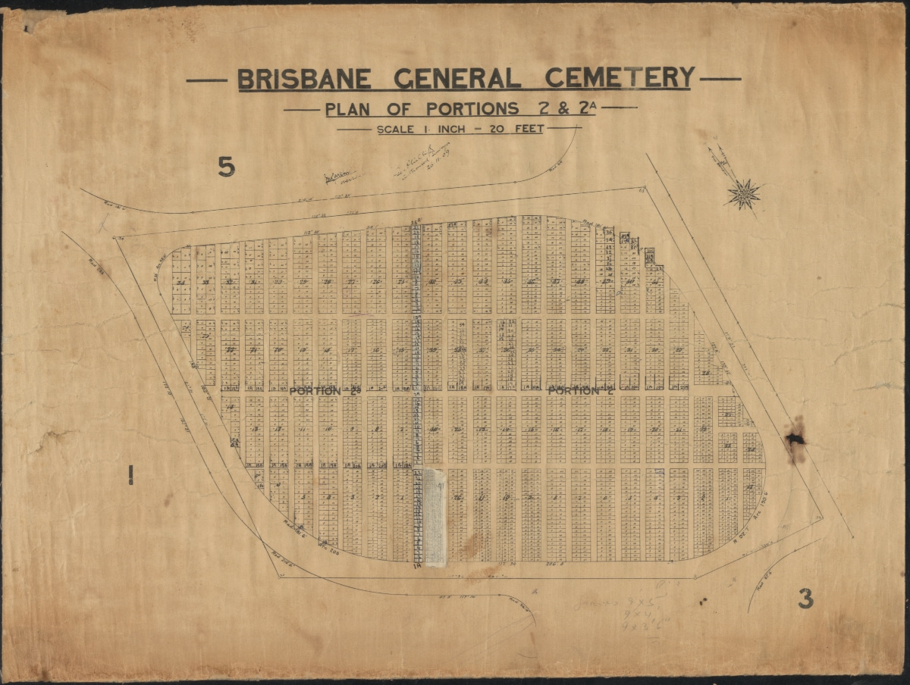{ width="70%" } 
  <figcaption markdown>[Brisbane General Cemetery - Portion 2 and 2A plan.](https://www.archivessearch.qld.gov.au/items/ITM1624114), 26 November 1909 — Queensland State Archives, Item ID ITM1624114. [Download a high resolution version](https://www.archivessearch.qld.gov.au/api/download_file/DR140858)</figcaption>
</figure>

 
## Portion 3, 1910

<figure markdown>
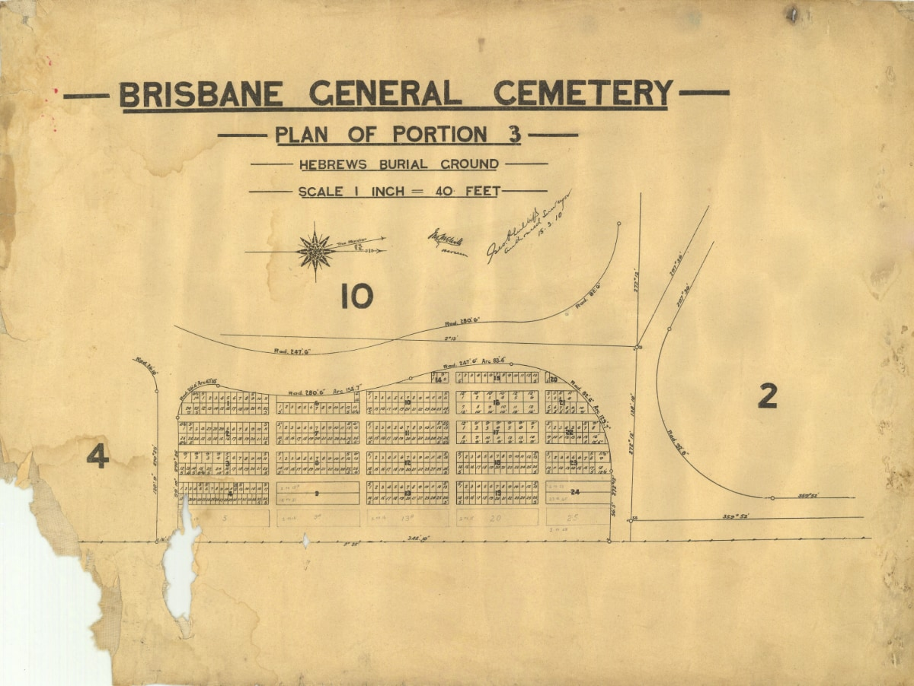{ width="70%" class="full-width" } 
  <figcaption markdown>[Brisbane General Cemetery - Plan of Portion 3 - Hebrews Burial Ground](https://www.archivessearch.qld.gov.au/items/ITM1432136), 15 March 1910 — Queensland State Archives, Item ID ITM1432136. [Download a high resolution version](https://www.archivessearch.qld.gov.au/api/download_file/DR95984)</figcaption>
</figure>

<!-- not archived
## Portion 4 map

<figure markdown>
{ width="70%" } 
  <figcaption markdown>[Brisbane General Cemetery - Portion 4](), dd mmmm yyyy — Queensland State Archives, Item Representation ID ####. [Download a high resolution version](../assets/historic-maps/portion-4-yyyy-hi-res.jpeg)</figcaption>
</figure>
-->

## Portion 5 South, 1909

<figure markdown>
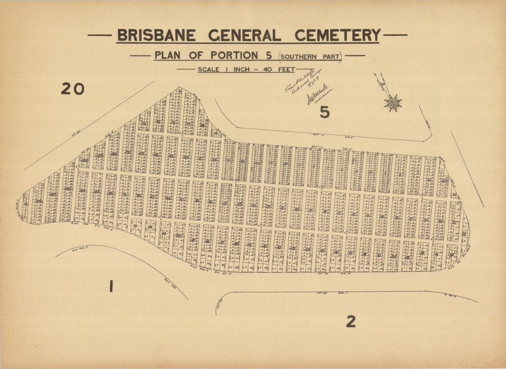{ width="70%" class="full-width" } 
  <figcaption markdown>[Brisbane General Cemetery - Plan of Portion 5 (Southern Part)](https://www.archivessearch.qld.gov.au/items/ITM1250570), 8 July 1909 — Queensland State Archives, Item ID ITM1250570. [Download a high resolution version](https://www.archivessearch.qld.gov.au/api/download_file/DR95976)</figcaption>
</figure>

## Portion 5 North, 1909

<figure markdown>
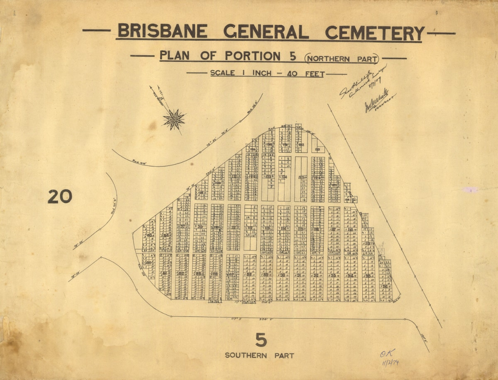{ width="70%"  class="full-width" } 
  <figcaption markdown>[Brisbane General Cemetery - Plan of Portion 5 (Northern Part)](https://www.archivessearch.qld.gov.au/items/ITM1432137), 8 July 1909 — Queensland State Archives, Item ID ITM1432137. [Download a high resolution version](https://www.archivessearch.qld.gov.au/api/download_file/DR95985)</figcaption>
</figure>

## Portion 6, 1910

<figure markdown>
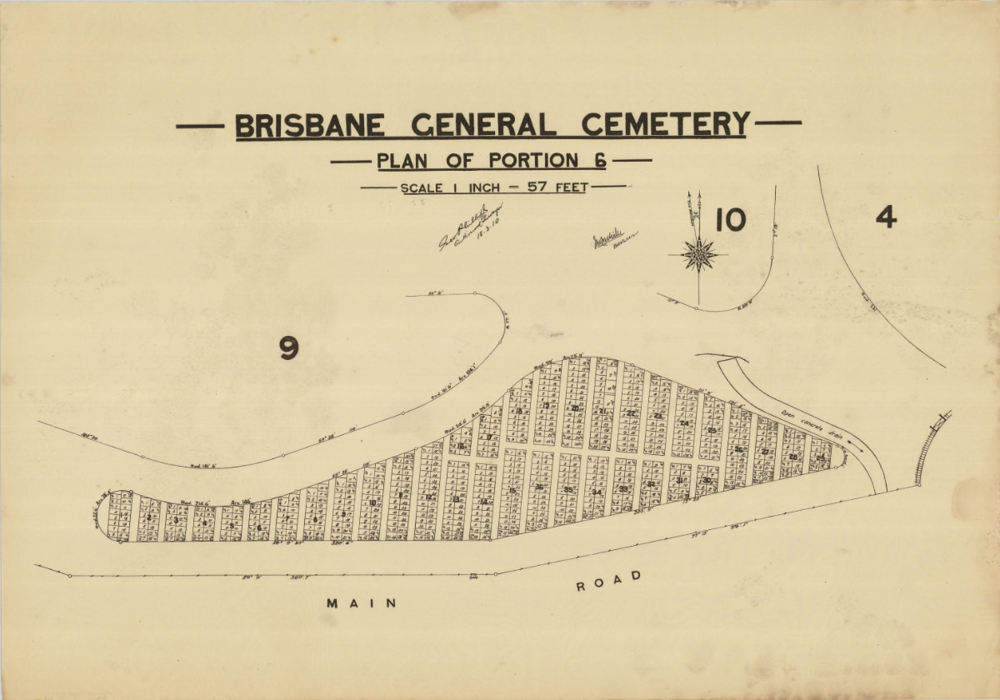{ width="70%"  class="full-width" } 
  <figcaption markdown>[Brisbane General Cemetery - Plan of Portion 6](https://www.archivessearch.qld.gov.au/items/ITM1250571), 18 March 1910 — Queensland State Archives, Item ID ITM1250571. [Download a high resolution version](https://www.archivessearch.qld.gov.au/api/download_file/DR95977)</figcaption>
</figure>

## Portion 7, 1909

<figure markdown>
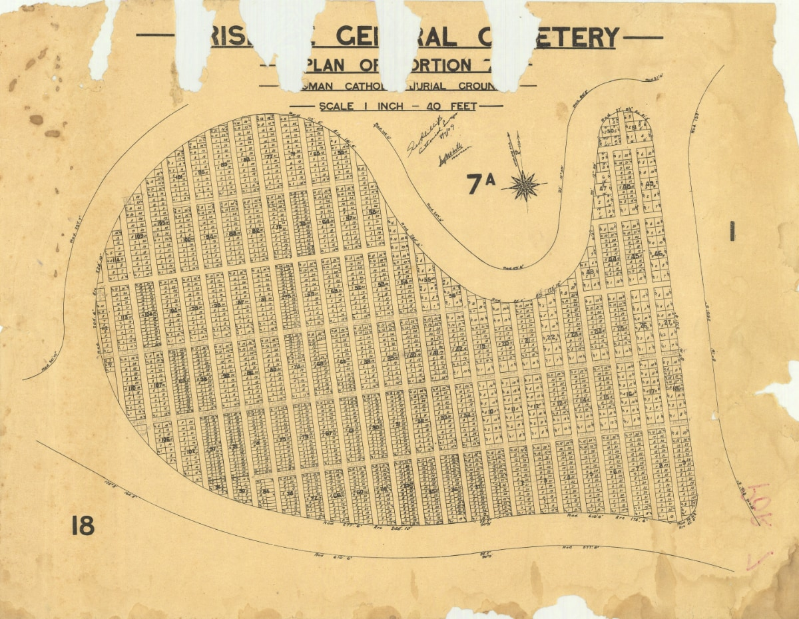{ width="70%" class="full-width" } 
  <figcaption markdown>[Brisbane General Cemetery - Plan of Portion 7 - Roman Catholic Burial Ground](https://www.archivessearch.qld.gov.au/items/ITM1432140), 8 July 1909 — Queensland State Archives, Item ID ITM1432140. [Download a high resolution version](https://www.archivessearch.qld.gov.au/api/download_file/DR95988)</figcaption>
</figure>

## Portion 7a North West, ca. 1909

<figure markdown>
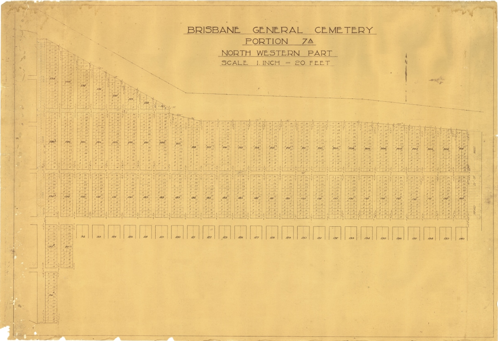{ width="70%" class="full-width" } 
  <figcaption markdown>[Brisbane General Cemetery - Portion 7A (North-Western Part)](https://www.archivessearch.qld.gov.au/items/ITM1432141), ca. 1909 — Queensland State Archives, Item ID ITM1432141. [Download a high resolution version](https://www.archivessearch.qld.gov.au/api/download_file/DR95990)</figcaption>
</figure>

## Portion 8, 1911

<figure markdown>
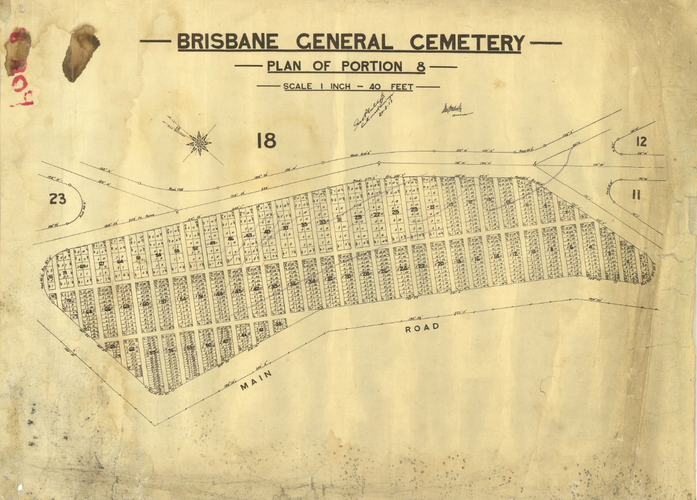{ width="70%" class="full-width" } 
  <figcaption markdown>[Brisbane General Cemetery - Plan of Portion 8](https://www.archivessearch.qld.gov.au/items/ITM1432141), 20 February 1911 — Queensland State Archives, Item ID ITM1432141. [Download a high resolution version](https://www.archivessearch.qld.gov.au/api/download_file/DR95991)</figcaption>
</figure>

## Portion 9, 1909

<figure markdown>
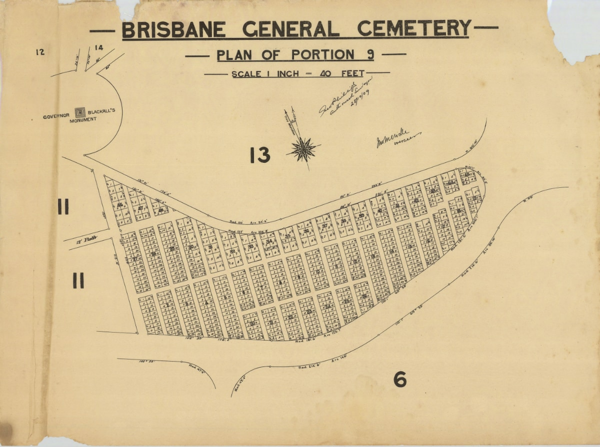{ width="70%" class="full-width" } 
  <figcaption markdown>[Brisbane General Cemetery - Plan of Portion 9](https://www.archivessearch.qld.gov.au/items/ITM1250572), 28 October 1909 — Queensland State Archives, Item ID ITM1250572. [Download a high resolution version](https://www.archivessearch.qld.gov.au/api/download_file/DR95978)</figcaption>
</figure>

<figure markdown>
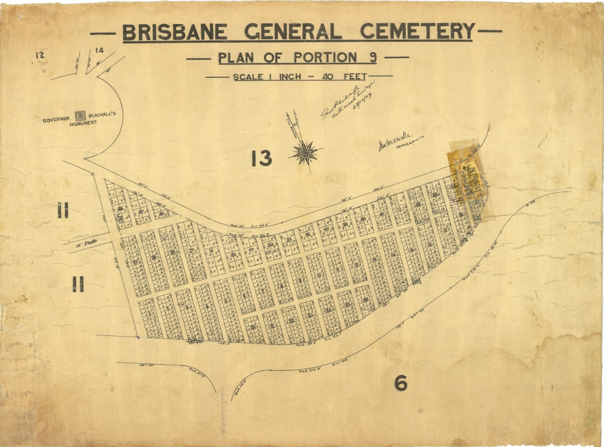{ width="70%" class="full-width" } 
  <figcaption markdown>[Brisbane General Cemetery - Plan of Portion 9 (Annotated)](https://www.archivessearch.qld.gov.au/items/ITM1432143), 28 October 1909 — Queensland State Archives, Item ID ITM1432143. [Download a high resolution version](https://www.archivessearch.qld.gov.au/api/download_file/DR95992)</figcaption>
</figure>

## Portion 10 map, ca. 1909

<figure markdown>
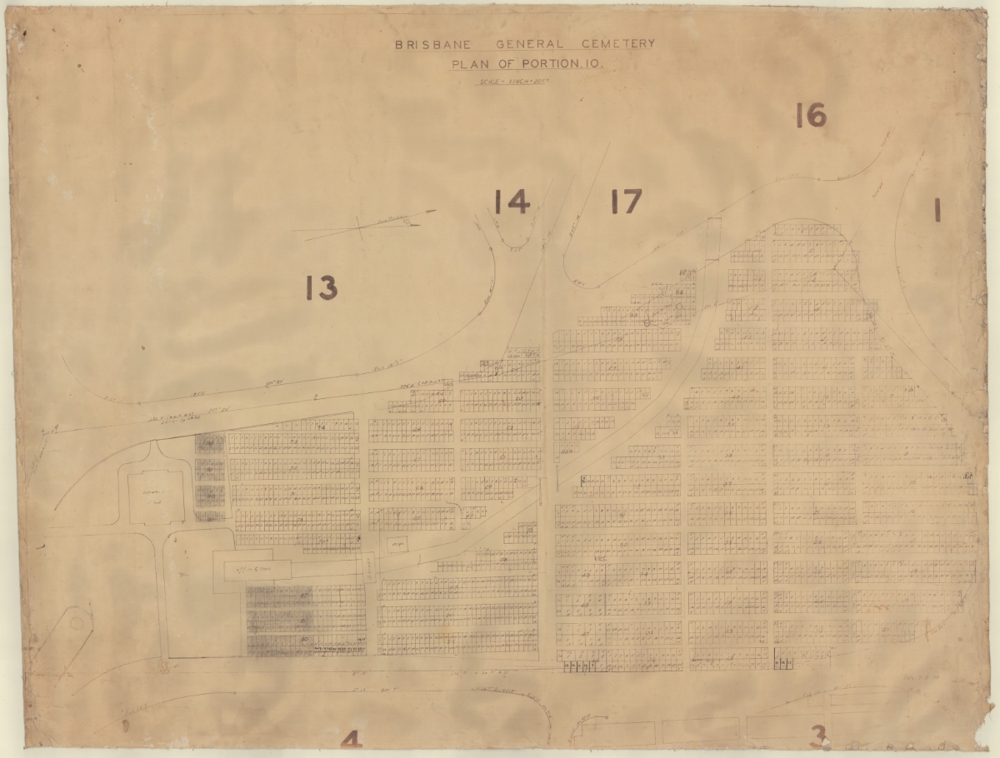{ width="70%" } 
  <figcaption markdown>[Brisbane General Cemetery - Portion 10](https://www.archivessearch.qld.gov.au/items/ITM1624112), ca. 1909 — Queensland State Archives, Item ID ITM1624112. [Download a high resolution version](../assets/historic-maps/portion-10-1909-hi-res.jpg) </figcaption> <!-- change this link to QSA when they publish the digital representation -->
</figure>

## Portion 11, ca. 1909

<figure markdown>
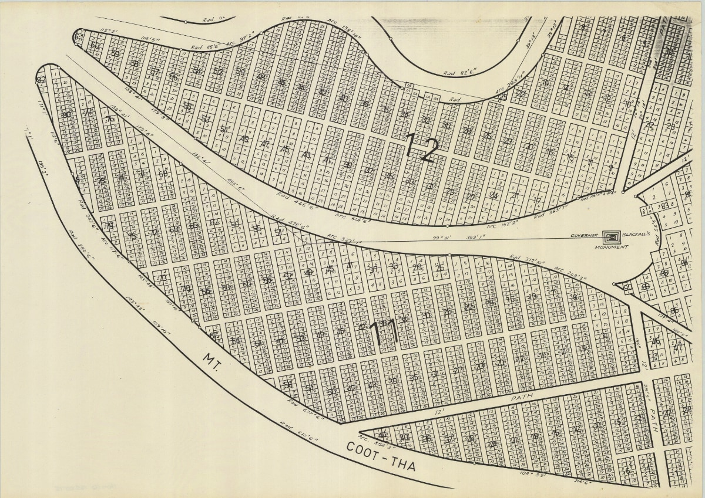{ width="70%" class="full-width" } 
  <figcaption markdown>[Brisbane General Cemetery - Shows area near Governor Blackall's Monument](https://www.archivessearch.qld.gov.au/items/ITM1250575), ca. 1909 — Queensland State Archives, Item ID ITM1250575. [Download a high resolution version](https://www.archivessearch.qld.gov.au/api/download_file/DR95981)</figcaption>
</figure>

## Portion 12, 1909

<figure markdown>
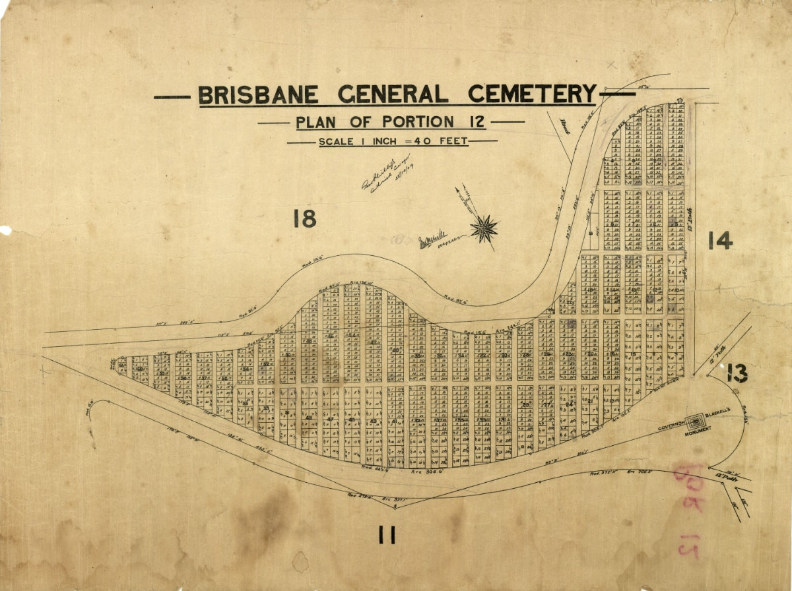{ width="70%" class="full-width" } 
  <figcaption markdown>[Brisbane General Cemetery - Plan of Portion 12](https://www.archivessearch.qld.gov.au/items/ITM1432144), 28 October 1909 — Queensland State Archives, Item ID ITM1432144. [Download a high resolution version](https://www.archivessearch.qld.gov.au/api/download_file/DR95993)</figcaption>
</figure>

<figure markdown>
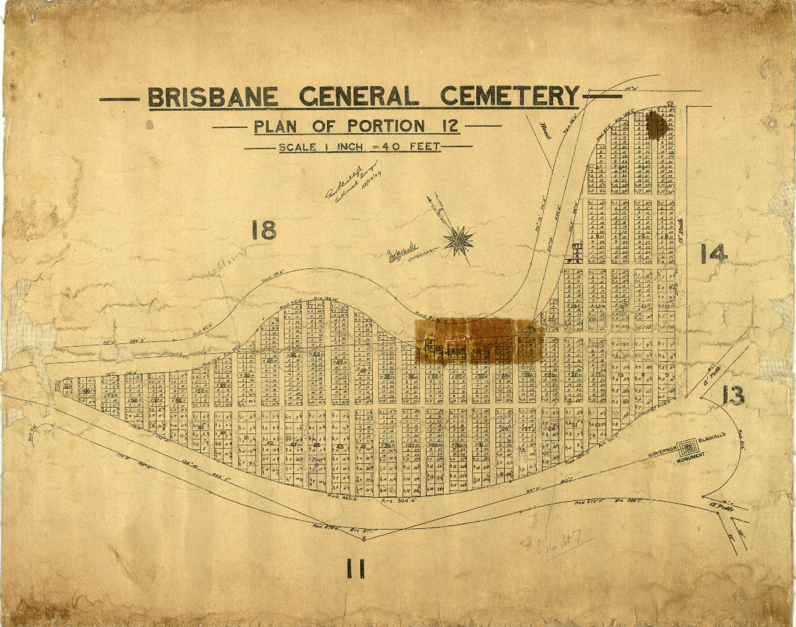{ width="70%" class="full-width" } 
  <figcaption markdown>[Brisbane General Cemetery - Plan of Portion 12 (Annotated)](https://www.archivessearch.qld.gov.au/items/ITM1432144), 28 October 1909 — Queensland State Archives, Item ID ITM1432144. [Download a high resolution version](https://www.archivessearch.qld.gov.au/api/download_file/DR95993)</figcaption>
</figure>

<figure markdown>
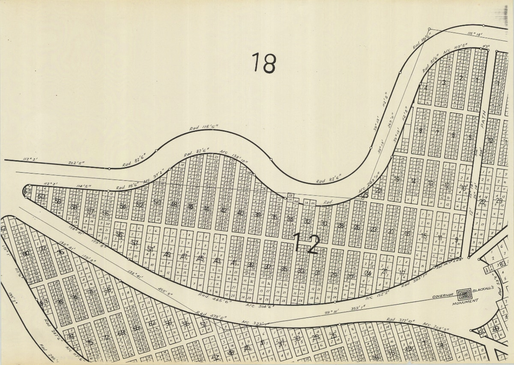{ width="70%" class="full-width" } 
  <figcaption markdown>[Brisbane General Cemetery - Shows area near Governor Blackall's Monument](https://www.archivessearch.qld.gov.au/items/ITM1250576), 28 October 1909 — Queensland State Archives, Item ID ITM1250576. [Download a high resolution version](https://www.archivessearch.qld.gov.au/api/download_file/DR95982)</figcaption>
</figure>

## Portion 13, 1909

<figure markdown>
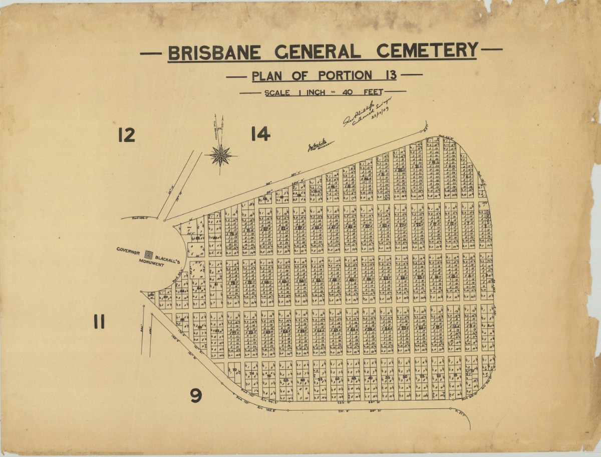{ width="70%" class="full-width" } 
  <figcaption markdown>[Brisbane General Cemetery - Plan of Portion 13](https://www.archivessearch.qld.gov.au/items/ITM1250573), 25 October 1909 — Queensland State Archives, Item ID ITM1250573. [Download a high resolution version](https://www.archivessearch.qld.gov.au/api/download_file/DR95979)</figcaption>
</figure>

## Portion 14, 1909

<figure markdown>
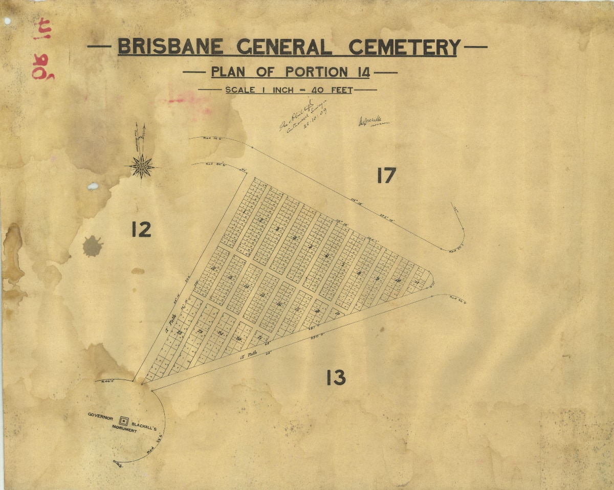{ width="70%" class="full-width" } 
  <figcaption markdown>[Brisbane General Cemetery - Plan of Portion 14](https://www.archivessearch.qld.gov.au/items/ITM1432145), 25 October 1909 — Queensland State Archives, Item ID ITM1432145. [Download a high resolution version](https://www.archivessearch.qld.gov.au/api/download_file/DR95995)</figcaption>
</figure>

## Portion 15, 1910

<figure markdown>
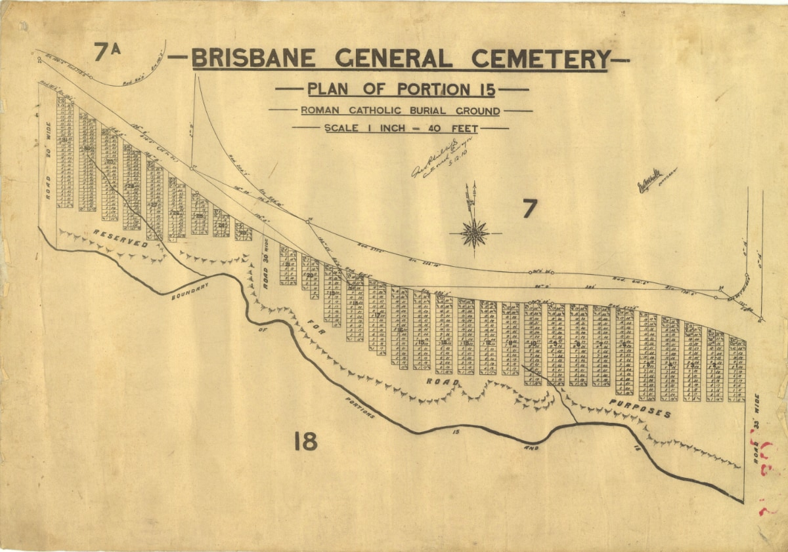{ width="70%" class="full-width" } 
  <figcaption markdown>[Brisbane General Cemetery - Plan of Portion 15 - Roman Catholic Burial Ground](https://www.archivessearch.qld.gov.au/items/ITM1432146), 5 December 1910 — Queensland State Archives, Item ID ITM1432146. [Download a high resolution version](https://www.archivessearch.qld.gov.au/api/download_file/DR95997)</figcaption>
</figure>

## Portion 15a, ca. 1909

<figure markdown>
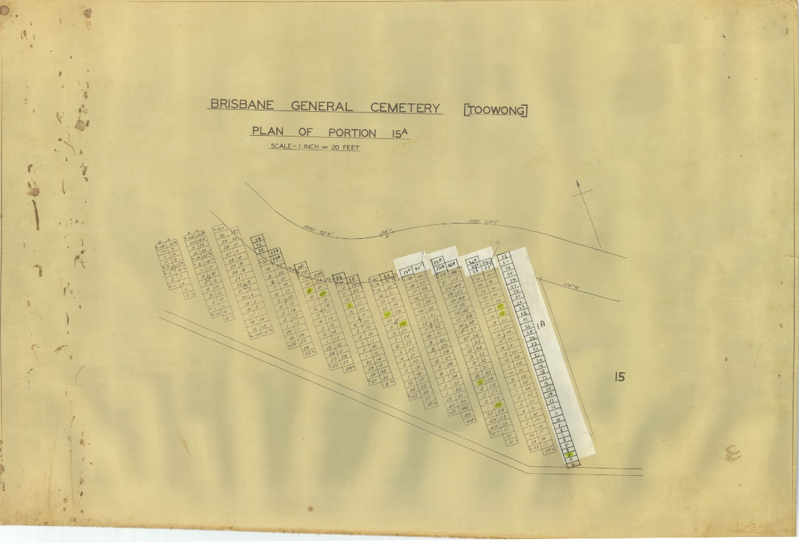{ width="70%" class="full-width" } 
  <figcaption markdown>[Brisbane General Cemetery - Plan of Portion 15a](https://www.archivessearch.qld.gov.au/items/ITM1432147), ca. 1909 — Queensland State Archives, Item ID ITM1432147. [Download a high resolution version](https://www.archivessearch.qld.gov.au/api/download_file/DR95998)</figcaption>
</figure>

## Portions 16 and 17, 1912

<figure markdown>
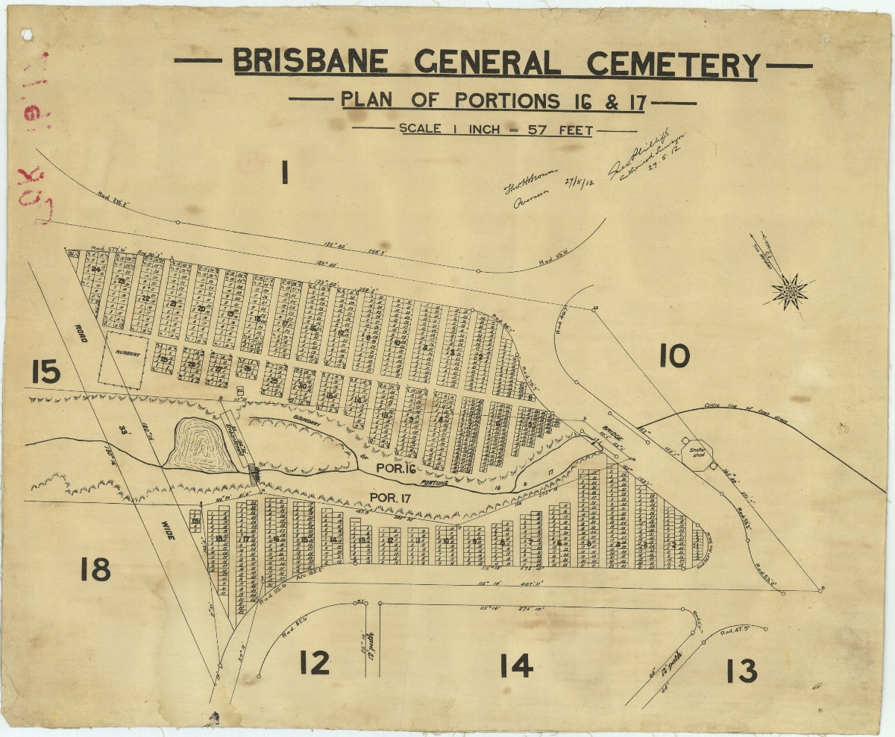{ width="70%" class="full-width" } 
  <figcaption markdown>[Brisbane General Cemetery - Plan of Portions 16 & 17](https://www.archivessearch.qld.gov.au/items/ITM1432148), 27 May 1912 — Queensland State Archives, Item ID ITM1432148. [Download a high resolution version](https://www.archivessearch.qld.gov.au/api/download_file/DR95999)</figcaption>
</figure>

## Portion 18, ca. 1909

<figure markdown>
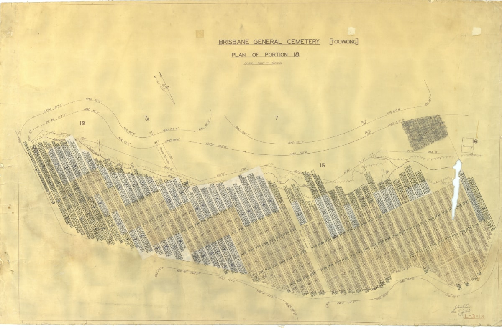{ width="70%" class="full-width" } 
  <figcaption markdown>[Brisbane General Cemetery - Plan of Portion 18](https://www.archivessearch.qld.gov.au/items/ITM1432149), ca. 1909 — Queensland State Archives, Item ID ITM1432149. [Download a high resolution version](https://www.archivessearch.qld.gov.au/api/download_file/DR96001)</figcaption>
</figure>

<!-- not archived
## Portion 19 map, 19##

<figure markdown>
{ width="70%" } 
  <figcaption markdown>[Brisbane General Cemetery - Portion #](), dd mmmm yyyy — Queensland State Archives, Item Representation ID ####. [Download a high resolution version](../assets/historic-maps/portion-#-yyyy-hi-res.jpeg)</figcaption>
</figure>
-->

<!-- not digitised 
## Portion 20 map, ca. 1909

<figure markdown>
{ width="70%" } 
  <figcaption markdown>[Brisbane General Cemetery - Portion 20](https://www.archivessearch.qld.gov.au/items/ITM1624117), ca. 1909 — Queensland State Archives, Item ID ITM1624117. [Download a high resolution version](../assets/historic-maps/portion-20-1909-hi-res.pdf)</figcaption>
</figure>
-->

<!-- not digitised 
## Portion 21 map, 1930

<figure markdown>
{ width="70%" } 
  <figcaption markdown>[Brisbane General Cemetery - Portion 21](https://www.archivessearch.qld.gov.au/items/ITM1624118), 5 November 1930 — QQueensland State Archives, Item ID ITM1624118. [Download a high resolution version](../assets/historic-maps/portion-21-1930-hi-res.jpeg)</figcaption>
</figure>
-->

<!-- not digitised 
## Portion 22 map, ca. 1909

<figure markdown>
{ width="70%" } 
  <figcaption markdown>[Brisbane General Cemetery - Portion 22](https://www.archivessearch.qld.gov.au/items/ITM1432150), ca. 1909 — Queensland State Archives, Item ID ITM1432150. [Download a high resolution version](../assets/historic-maps/portion-22-1909-hi-res.jpeg)</figcaption>
</figure>
-->

<!-- Portion 23 not archived --> 

## Portion 24, ca. 1909

<figure markdown>
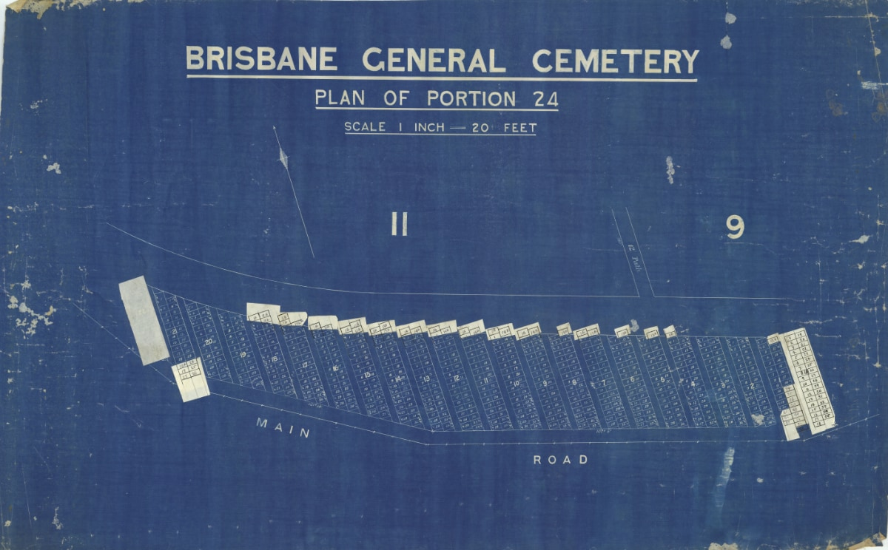{ width="70%" class="full-width" } 
  <figcaption markdown>[Brisbane General Cemetery - Plan of Portion 24](https://www.archivessearch.qld.gov.au/items/ITM1432151), ca. 1909 — Queensland State Archives, Item ID ITM1432151. [Download a high resolution version](https://www.archivessearch.qld.gov.au/api/download_file/DR96005)</figcaption>
</figure>

<!-- Portion 25, 26, 27 not archived --> 

<!-- not digitised 
## Portion 28 map, ca. 1909

<figure markdown>
{ width="70%" } 
  <figcaption markdown>[Brisbane General Cemetery - Portion 28](https://www.archivessearch.qld.gov.au/items/ITM1624119), ca. 1909 — Queensland State Archives, Item ID ITM1624119. [Download a high resolution version](../assets/historic-maps/portion-28-1909-hi-res.jpeg)</figcaption>
</figure>
-->

<!-- not digitised 
## Portion 29 map, ca. 1909

<figure markdown>
{ width="70%" } 
  <figcaption markdown>[Brisbane General Cemetery - Portion 29](https://www.archivessearch.qld.gov.au/items/ITM1624120), ca. 1909 — Queensland State Archives, Item ID ITM1624120. [Download a high resolution version](../assets/historic-maps/portion-29-1909-hi-res.jpeg)</figcaption>
</figure>
-->

<!-- Portion 29a not archived --> 

## Portion 30, 1938

<figure markdown>
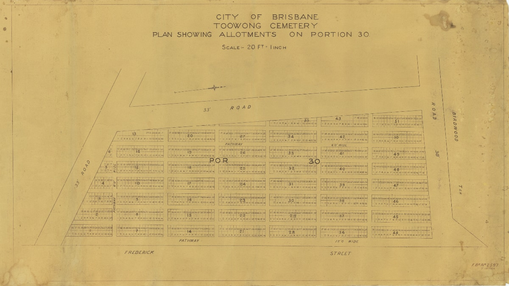{ width="70%" class="full-width" } 
  <figcaption markdown>[Toowong Cemetery - Plan showing Allotments on Portion 30](https://www.archivessearch.qld.gov.au/items/ITM1432152), 7 December 1938 — Queensland State Archives, Item ID ITM1432152. [Download a high resolution version](https://www.archivessearch.qld.gov.au/api/download_file/DR96006)</figcaption>
</figure>
