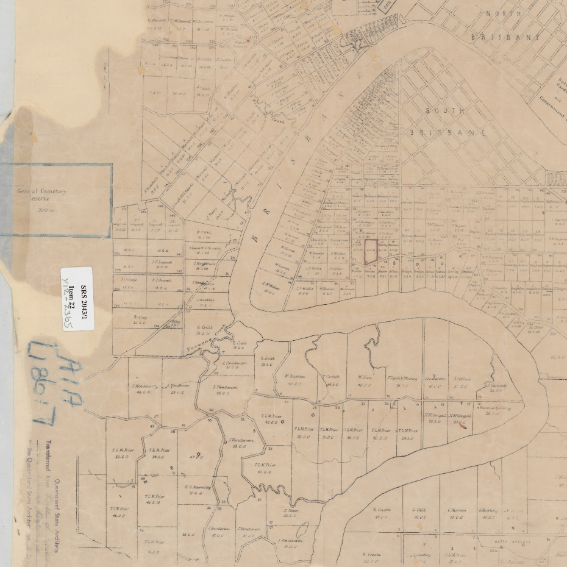
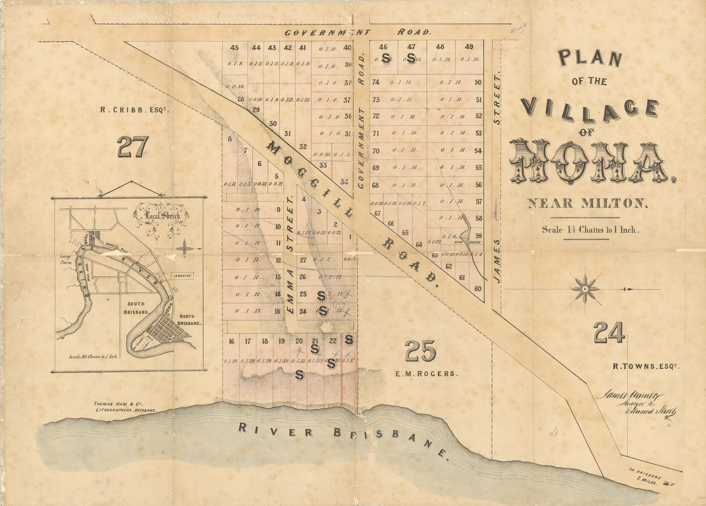
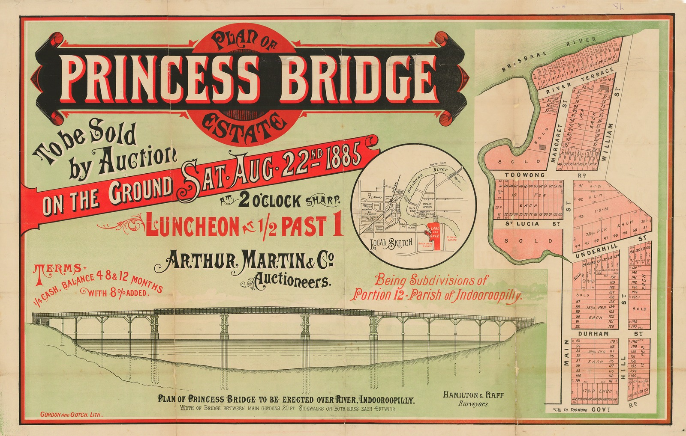
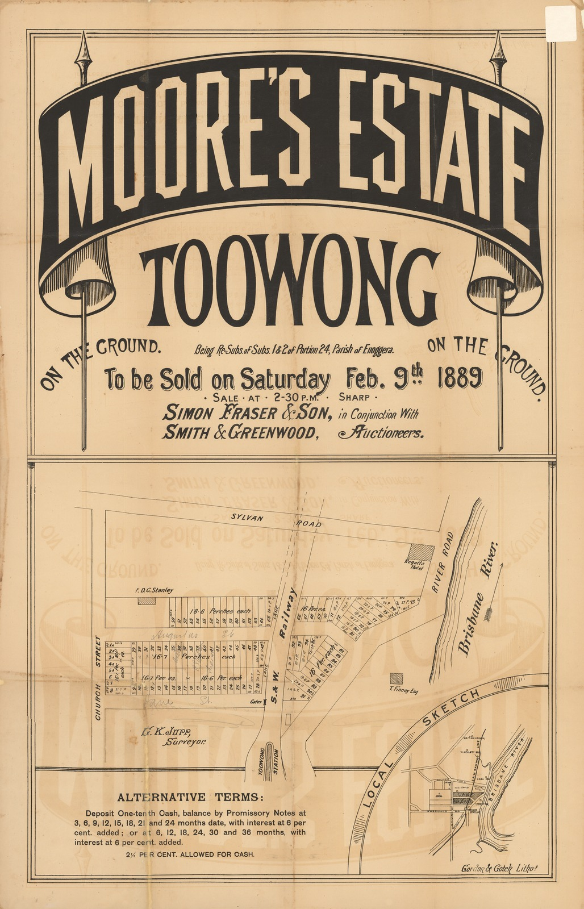

# Historic Real-Estate Maps of Toowong

The maps of Toowong and surrounding areas below are from 1861 to 1936. Some maps show *Government Road* - this is a placeholder name for the road.

In the 1930s the Council decided to rename many streets in Brisbane to make their names unique. The names listed below are the names shown on the maps and may not be the street names in use today. For example:

- *Church Street* was renamed *Jephson Street*, after [Letitia Jephson](../research/letitia-jephson.md).
- *Heussler Terrace*, named after [Johann Christian Heussler](../research/johann-christian-heussler.md), was renamed *Birdwood Terrace*.
- *Third Avenue* off Birdwood Terrace was renamed *Couldrey Street*.
- *River Road* was renamed *Coronation Drive* in honor of the coronation of King George VI.
- *St. Lucia Road* was renamed *Sir Fred Schonell Drive* after the vice-chancellor of the University of Queensland from 1960 to 1969.

For more information, see: 

- [A Guide - History of Street Naming in Brisbane](https://library-brisbane.ent.sirsidynix.net.au/client/en_AU/search/asset/24510/0) - A guide detailing the process for street naming by Council and a guide to using the street naming records held by the City Archives. [Brisbane City Council Archives]((https://library-brisbane.ent.sirsidynix.net.au/client/en_AU/eLibCat/search/detailnonmodal/ent:$002f$002fSD_ASSET$002f0$002fSD_ASSET:24510/one?qu=A+Guide+-+History+of+Street+Naming+in+Brisbane)).
- [Duplicate Street Names - Extracts from Committee Reports with reasons 1938 - 1939](../assets/documents/street-renaming-extracts-from-council-records+re+origin+of+names.pdf) - Extracts from Minutes of Works Committee meetings where street renames were approved. Includes derivation of name. [Brisbane City Council Archives](https://library-brisbane.ent.sirsidynix.net.au/client/en_AU/BrisbaneImages/search/detailnonmodal/ent:$002f$002fSD_ASSET$002f0$002fSD_ASSET:24525/one?qu=Duplicated+Street+Names+-+Extracts+from+Council+Records+re+Final+Approval+and+ORIGINS+of+names+1938+-+1939&rm=BRISBANEIMAGES0%7C%7C%7C1%7C%7C%7C0%7C%7C%7Ctrue&te=ASSET&lm=ALL_ASSETS).
- [Duplicated Street names - List Assigned New Street Names May 1939 arranged by NEW street Name](https://library-brisbane.ent.sirsidynix.net.au/client/en_AU/search/asset/24528/0) - Final Schedule published by Council of duplicated streets approved to rename to May 1939. Entries arranged alphabetically by new name with reference to former name. [Brisbane City Council Archives](https://library-brisbane.ent.sirsidynix.net.au/client/en_AU/BrisbaneImages/search/detailnonmodal/ent:$002f$002fSD_ASSET$002f0$002fSD_ASSET:24528/one?qu=Duplicated+Street+names+-+List+Assigned+New+Street+Names+May+1939+arranged+by+NEW+street+Name&rm=BRISBANEIMAGES0%7C%7C%7C1%7C%7C%7C0%7C%7C%7Ctrue&te=ASSET&lm=ALL_ASSETS).

## Toowong Cemetery Reservation c1861

Map showing the Toowong Cemetery Reservation.

{ width="90%" }

<small>*[City of Brisbane, County of Stanley, showing Toowong Cemetery Reservation; being sheet 1b of a 20 chain grid series. 20 chains to the inch. Survey Office, Brisbane.](https://www.archivessearch.qld.gov.au/items/ITM634480), ca. 1861 — Queensland State Archives. Cropped.*</small>

## Village of Nona c1865

The Village of Nona map shows: *Moggill Road*, *Emma Street*, and *James Street*. 

{ width="90%" }

<small>*Source unknown*</small>

## Kensington 1874

Kensington, near Toowong Railway Station shows: *Kensington Terrace*, *Moggill Road*, *Gore Place*, and *Holland Street*.

{ width="90%" }

<small>*[Plan of Kensington, Parish of Enoggera, to be sold by auction by John Cameron at his mart, on Monday, 28th September, 1874.](http://onesearch.slq.qld.gov.au/permalink/f/1upgmng/slq_alma21112702950002061) State Library of Queensland*</small>

## The Terraces Estate 1874

[Advertised on page 4 in *The Telegraph*](http://nla.gov.au/nla.news-article169516190), 12 September 1874.

{ width="90%" loading=lazy }

<small>*[The Terraces [Estate], Toowong near the Toowong railway station / John Cameron, Auctioneer.](http://onesearch.slq.qld.gov.au/permalink/f/1upgmng/slq_alma21105015830002061) 1870-1900, State Library of Queensland*</small>

## Parish of Enoggera, 1876

Showing land owners and *Brisbane General Cemetery* and *Toowong Station*.

{ width="90%" }

<small>*[Plan of portions no.s 830b, 865, 866, 866a, 867, 867a & 868 to 872, Parish of Enoggera, County of Stanley, District of Moreton](https://onesearch.slq.qld.gov.au/permalink/61SLQ_INST/dls06p/alma997041034702061) State Library of Queensland. Cropped.*</small>

<!--

## Taringa ca. 1880

taringa-ca1880.jpg

Estate map for the town of Taringa, Brisbane, ca. 1880

Town of Taringa, parish of Indooroopilly. Auctioneer: John W. Todd.

SLQ no longer in online catalogue

-->

## Sylvan Grove Estate, 1880

Sylvan Grove Estate, next to *Lang Farm*, included *Wilson street* <!-- Now Burns? --> and *Elizabeth street*. <!-- Now MacDonnell? -->

Mr. John W. Todd reported the sale of allotment 6 in the *[The Brisbane Courier](http://nla.gov.au/nla.news-article901222
) on 3 July 1880.

![Plan of the Sylvan Grove Estate, Toowong, being subdivisions 1 to 28 part of portion 256, Enoggera John W. Todd [auctioneer]](../assets/real-estate-maps/sylvan-grove-estate.jpg){ width="90%" loading=lazy }

<small>*[Plan of the Sylvan Grove Estate, Toowong, being subdivisions 1 to 28 part of portion 256, Enoggera John W. Todd [auctioneer]](https://onesearch.slq.qld.gov.au/permalink/61SLQ_INST/1dejkfd/alma997060464702061), State Library of Queensland*</small>

## Lang Farm Estate ca.1881

The Lang Farm Estate map shows: the *Toowong Railway Station*, *Moggill Road*, *Emma Street*, and a *Ferry Landing* on the Brisbane River.

An advertisement for sub-divisions of the Lang Farm Estate appeared in [*The Brisbane Courier*](http://nla.gov.au/nla.news-article920412) on 2 November 1881. 

{ width="45%" loading=lazy }

<small>*[Plan of subdivisions on the Lang Farm Estate adjoining the Toowong Railway Station. 188-](http://onesearch.slq.qld.gov.au/permalink/f/1upgmng/slq_alma21126303460002061), State Library of Queensland*</small>

<!-- 

http://nla.gov.au/nla.news-article892019

ACCIDENT TO THE S.S. QUEENSLAND (1878, January 19). The Telegraph (Brisbane, Qld. : 1872 - 1947), p. 2. Retrieved January 13, 2025, from http://nla.gov.au/nla.news-article169685763
-->

## Ivy Estate 1884 

The Ivy Estate map shows: *Ivy Street*, *Ivy Lodge House*, *Lodge Street*, *Mount Street*, *Bent Street*, *Orchard Street*, *Peel Street* and *Soudan Street*.

{ width="90%" }

<small>*[Ivy Estate, Toowong being subdivisions 1 to 172 of portion 294, and part of 293 : Parish of Enoggera.](http://onesearch.slq.qld.gov.au/permalink/f/1upgmng/slq_alma21112757610002061) 1884, State Library of Queensland*</small>

## South Toowong 1884 

Map shows area near *Ellerslie Crescent* *Oxford Terrace*, *Wilson Street* and *Belle Vue Parade*, near *Perrin Park* in what is now Taringa.

{ width="90%" }

<small>*[South Toowong : being 173 subdivisions of portion 36, Indooroopilly
](https://onesearch.slq.qld.gov.au/permalink/61SLQ_INST/1dejkfd/alma99183461219002061) 1884, State Library of Queensland*</small>

## Ironside Estate 1885 

The Ironside Estate map shows: *Sherwood Road*, *Sherwood Grove*, *Union Athletic Club*, *High Street*, *Kensington Terrace*, *Ashton Street*, and *Justling Street*.

{ width="45%" }

<small>*[Ironside Estate, Toowong, 1885](http://onesearch.slq.qld.gov.au/permalink/f/1upgmng/slq_alma21212460300002061).  State Library of Queensland*</small>

## Middenbury Estate 1885 

Map shows allotments for sale in an area between the railway station on *High Street* and the Brisbane River in Toowong.

{ width="45%" }

<small>*[Middenbury Estate](https://onesearch.slq.qld.gov.au/permalink/61SLQ_INST/1dejkfd/alma99183481520102061), Toowong, 1885. State Library of Queensland*</small>

## Baroona Estate 1885 
<!-- error -->
Map shows allotments for sale near today's Rosalie Village and Government House.

{ width="45%" }

<small>*[The Baroona Estate To be sold by auction on the ground Saturday, Nov. 28, at two o'clock sharp.](https://onesearch.slq.qld.gov.au/permalink/61SLQ_INST/1dejkfd/alma997586814702061), 1885. State Library of Queensland*</small>

## St. Lucia Estate 1885 

Map shows an area in St Lucia with a river frontage opposite *Boundary Road*, West End, now part of the campus of the *University of Queensland*.

{ width="90%" } 

{ width="45%" }

<small>*[St. Lucia Estate](https://onesearch.slq.qld.gov.au/permalink/61SLQ_INST/1dejkfd/alma99183469021102061), 1885. State Library of Queensland*</small>

## Princess Bridge Estate 1885

Map showing allotments for sale at St.Lucia near where the University of Queensland is now located. None of the roads shown seem to exist today. The map also shows a plan of the proposed Princess Bridge that was to be erected across the Brisbane River to meet Boundary St, West End. [Floods in 1887 and 1890](http://nla.gov.au/nla.news-article3511579) probably deterred construction.

{ width="90%" }

<small>*[Plan of Princess Bridge Estate To be sold by auction on the ground Sat. Aug. 22nd 1885](https://onesearch.slq.qld.gov.au/permalink/61SLQ_INST/tqqf2h/alma997587054702061). State Library of Queensland*</small>

<!--

Not built - BOUNDARY-STREET, SOUTH BRISBANE. (1886, August 3). The Brisbane Courier (Qld. : 1864 - 1933), p. 6. Retrieved January 18, 2025, from http://nla.gov.au/nla.news-article4483629

Floods in 1887 and 1890

FLOODS AND GALES. (1890, March 11). The Brisbane Courier (Qld. : 1864 - 1933), p. 5. Retrieved January 18, 2025, from http://nla.gov.au/nla.news-article3511579
-->

## Belgrave and Riverview Estate 

The Belgrave and Riverview Estate is near the intersection of *Swann Road* and *Indooroopilly Road*.

{ width="45%" loading=lazy }

<small>*[Belgrave and Riverview Estate, South Toowong John W. Todd, Auctioneer ; Hamilton & Raff, surveyors.](http://onesearch.slq.qld.gov.au/permalink/f/1upgmng/slq_alma21104756680002061) no date, State Library of Queensland*</small>

## Millard Estate 1888

The Millard Estate map shows: *Sylvan Road*, *Moggill Road*, the *Toowong and Milton Railway Stations*, and the *Ferry crossing* between Toowong and South Brisbane.

{ width="45%" loading=lazy }  

<small>*[Millard Estate, Toowong A.M. McNish Fraser, Auctioneer ; J.J. Jeays, Surveyor.](http://onesearch.slq.qld.gov.au/permalink/f/1upgmng/slq_alma21104933540002061) 1888, State Library of Queensland*</small>

## Ascog Estate 1889

The Ascog Estate map shows: *Ascog Terrace* and *Church Street*.

{ width="45%" loading=lazy }  

<small>*[Advertising poster for the sale of land at Ascog Estate, Toowong.](http://onesearch.slq.qld.gov.au/permalink/f/1upgmng/slq_alma21218355090002061) 1889 Brisbane John Oxley Library, State Library of Queensland*</small>

## Moore's Estate 1889

The Moore's Estate map shows: *Sylvan Road*, *Church Street*, the *Toowong Railway Station*, the *Regatta Hotel*, and marked in pencil *Augustus Street* and *Jane Street*.

{ width="45%" loading=lazy }

<small>*[Moore's Estate, Toowong being re-subs 1 & 2 of portion 24 Parish of Enoggera.](http://onesearch.slq.qld.gov.au/permalink/f/1upgmng/slq_alma21104837280002061) 1889, State Library of Queensland*</small>

## Sylvan Road Estate 1890

The Sylvan Road Estate map shows: *Sylvan Road*, *Milton Road*, *Weinholt Street*, and the *Toowong and Auchenflower Railway Stations*.

{ width="45%" } { width="45%" }

<small>*[Sylvan Road Estate, Toowong.](http://onesearch.slq.qld.gov.au/permalink/f/1upgmng/slq_alma21198544550002061) 1890, State Library of Queensland*</small>

<!--

Real estate map for South Toowong, Brisbane, for the unsold subdivisions of Portion 36. And Sub. 2 of Portion 37, ca. 1890

http://bishop.slq.qld.gov.au/view/action/singleViewer.do?dvs=1737149160225~263&locale=en_AU&metadata_object_ratio=14&show_metadata=true&VIEWER_URL=/view/action/singleViewer.do?&DELIVERY_RULE_ID=10&frameId=1&usePid1=true&usePid2=true

-->

## Pugh's Map of Brisbane 1892

{ width="45%" loading=lazy }

<small>*[Map Brisbane and Suburbs Indexed with Street Name List - Pugh's 1892.](https://library-brisbane.ent.sirsidynix.net.au/client/en_AU/search/asset/40569/0) 1892, Brisbane City Council Archives*</small>

## McKellar's official map of Brisbane & suburbs 1895

This map from the Surveyor-General’s Office shows many of the Estate names on the other maps on this page.

{ width="90%" loading=lazy }

<small>*[McKellar's official map of Brisbane & suburbs](https://onesearch.slq.qld.gov.au/permalink/61SLQ_INST/1dejkfd/alma993671964702061)  (Sheet 7), 1895. State Library of Queensland.*</small>

## Dunmore Estate Cribb's Paddock 1899

The Dunmore Estate map shows: *Auchenflower Railway Station*, *River Road*, *Dunmore Terrace*, *Eagle Terrace*, *Lang Parade*, *Chasley Street*, *Lima Street*, *Fortitude Street*, *Kingford Street*, *John Street*, *Ridley Street*, *Grimes Street*, *Aldridge Street*, *Hobbs Street*, *Challinor Street*, and *Milton Road*.

<!-- John Street now Roy Street-->

{ width="90%" loading=lazy }

<small>*[Dunmore Estate Cribb's Paddock, Milton / Isles, Love Land Agents ; D. F. Maclean, Surveryor.](http://onesearch.slq.qld.gov.au/permalink/f/1upgmng/slq_alma21104796330002061) 1899, State Library of Queensland*</small>

<!--

The St Lucia Estate : comprising 269 charming building sites.
https://onesearch.slq.qld.gov.au/permalink/61SLQ_INST/1dejkfd/alma99183458220302061
190-?

-->

## Brisbane Land Owners c1900

{ width="90%" loading=lazy }

<small>*[Brisbane Parish Map showing landowners c1900.](https://library-brisbane.ent.sirsidynix.net.au/client/en_AU/search/asset/24597/0) Brisbane City Council Archives. Cropped.*</small>

## Goldicott 1902

The Goldicott Estate map shows: *Sherwood Road*, *Kensington Terrace*, and *Grove Street*.

{ width="45%"  loading=lazy }

<small>*[Goldicott Toowong being re-subs. 1 to 29 of subs. and re-subs. of portions 250 to 253, Parish of Enoggera.](http://onesearch.slq.qld.gov.au/permalink/f/1upgmng/slq_alma21119893540002061) 1902, State Library of Queensland*</small>

## Stanley Terrace Estate 1904

The Stanley Terrace Estate map shows: *Stanley Terrace*, *Miskin Road*, and *Union Street*.

{ width="90%" loading=lazy }

<small>*[Stanley Terrace Estate Toowong : being 42 re subdivisions of Portion 257, Parish of Enoggera.](http://onesearch.slq.qld.gov.au/permalink/f/1upgmng/slq_alma21186734930002061) 1904, State Library of Queensland.*</small> 

## Brisbane Street Map 1904

{ width="90%" loading=lazy }

<small>*[Brisbane and suburbs, street and road map, with boundaries of local authorities](https://www.archivessearch.qld.gov.au/api/download_file/DR96381) Queensland State Archives, Item ID ITM634549. Cropped.*</small> 

## Parish of Enoggera 

{ width="45%" loading=lazy }

<small>*[Plan of re-subdivision 61 of subdivision 12 of portion 26 and re-subdivisions 1 to 125 of subdivisions 4 and 2 of portions 27 and 28 Parish of Enoggera R. Gailey, Architect and Surveyor.](http://onesearch.slq.qld.gov.au/permalink/f/1upgmng/slq_alma21105013940002061) No date, State Library of Queensland*</small>

## Rathdonnell Estate 1911

The Rathdonnell Estate map shows: *Heussler Terrace*, *Weinholt Street*, *Irving Street*, *Agnes Street*, *Payne Street*, and *Milton Road*.

{ width="45%" loading=lazy }

<small>*[Rathdonnell Estate, Toowong, near Auchenflower station.](http://onesearch.slq.qld.gov.au/permalink/f/1upgmng/slq_alma21105029750002061) 1911, State Library of Queensland*</small>

<!--
1911 Contour Survey Maps

his survey was undertaken between April 26 1910 and 28 March 1911. It is the first survey undertaken in connection with the designing of a sewerage scheme for Brisbane

https://library-brisbane.ent.sirsidynix.net.au/client/en_AU/BrisbaneImages/?rm=1911+CONTOUR+S0%7C%7C%7C1%7C%7C%7C0%7C%7C%7Ctrue&dt=list

https://library-brisbane.ent.sirsidynix.net.au/client/en_AU/search/asset/27819/0

-->

## Ardencraig Estate 1916

The Ardencraig Estate map shows: *Church Street*, *Augustus Street*, *Golding St*, and *Earle Street*.

{ width="45%" loading=lazy }

*Ardencraig Estate, Toowong 1916. Provided by Marilyn England*</small>

## Chermside Park 1921

Allotments on [*Heussler Terrace*][Heussler Terrace] (renamed *Birdwood Terrace*) on the North boundary of the cemetery were sold by auction in 1921. "*Convenient to the Toowong Tram Line*" was a selling point. The Toowong Tram stopped near the main cemetery gates.

[Heussler Terrace]: ../research/johann-christian-heussler.md "Read the story of Johann (John) Christian Heussler (1820–1907)"

[*Third Avenue* was renamed *Couldrey St*](../assets/documents/new-streets-1939.pdf) in 1939 after a [Queensland Miner](https://library-brisbane.ent.sirsidynix.net.au/client/en_AU/BrisbaneImages/search/detailnonmodal/ent:$002f$002fSD_ASSET$002f0$002fSD_ASSET:24525/one?qu=Duplicated+Street+Names+-+Extracts+from+Council+Records+re+Final+Approval+and+ORIGINS+of+names+1938+-+1939&rm=BRISBANEIMAGES0%7C%7C%7C1%7C%7C%7C0%7C%7C%7Ctrue&te=ASSET&lm=ALL_ASSETS).

{ width="96%" loading=lazy }  

*<small>[Chermside Park, second section : Auchenflower](http://onesearch.slq.qld.gov.au/permalink/f/1upgmng/slq_alma21190073930002061), 1921 — [State Library of Queensland](https://www.slq.qld.gov.au). Note in the Inset how the tram stopped at the Toowong Cemetery gates.  </small>*

## Curragh Bawn 1922

The Curragh Bawn map shows: *Sylvan Road*, *River Road*, *Bennett Street*, *Theresa Street*, *Landsbourough Terrace*, and the *Toowong Railway Station*.

{ width="45%" }

<small>*[Curragh Bawn, Toowong.](http://onesearch.slq.qld.gov.au/permalink/f/1upgmng/slq_alma21190066110002061) 1922, State Library of Queensland*</small>

## Glen Olive Garden Estate 1924

The Glen Olive Garden Estate map shows: *Glen Olive Drive*, *St. Lucia Road*, and *Gailey River Road*.

{ width="45%" loading=lazy }

<small>*[Glen Olive Garden Estate on the river bank Toowong.](http://onesearch.slq.qld.gov.au/permalink/f/1upgmng/slq_alma21119287420002061) 1924, State Library of Queensland*</small>

## Dean's Highlands Estate 1929

Dean's Highlands Estate map shows: *Miskin Street*, *Union Street*, and *Stanley Terrace*. 

{ width="45%" loading=lazy }

<small>*[Dean's Highlands Estate between Toowong and Taringa, 1929](http://onesearch.slq.qld.gov.au/permalink/f/1upgmng/slq_alma21104761260002061) 1929, State Library of Queensland*</small>

## Brisbane Flood levels 1931

Map with hand-coloured areas in red showing extent of flooding in 1931.

{ width="45%" loading=lazy }

<small>*[Map - Brisbane 1931 Flood Levels](https://library-brisbane.ent.sirsidynix.net.au/client/en_AU/search/asset/24538/0), Brisbane City Council. May be reproduced for non-commercial purposes with acknowledgement.*</small>

## Eskmount Estate 1936

The Eskmount Estate map shows: *Burns Road*, *Aston Street*, *High Street*, *Curlew Street* and *MacDonnel Street*.

{ width="45%" loading=lazy }

<small>*[Eskmount Estate, Toowong A.S. Phillips & Sons, Auctioneers ; C.F. Bennett, Surveyor.](http://onesearch.slq.qld.gov.au/permalink/f/1upgmng/slq_alma21104796820002061) 1936, State Library of Queensland*</small>

## Toowong today 

Compare a historic map with the present day.

<iframe src="https://www.google.com/maps/embed?pb=!1m18!1m12!1m3!1d14158.208648783415!2d152.98069143639623!3d-27.483198343400108!2m3!1f0!2f0!3f0!3m2!1i1024!2i768!4f13.1!3m3!1m2!1s0x6b9150c0e176822d%3A0x502a35af3de9b80!2sToowong%20QLD%204066!5e0!3m2!1sen!2sau!4v1663987631439!5m2!1sen!2sau" width="600" height="450" style="border:0;" allowfullscreen="" loading="lazy" referrerpolicy="no-referrer-when-downgrade"></iframe>
