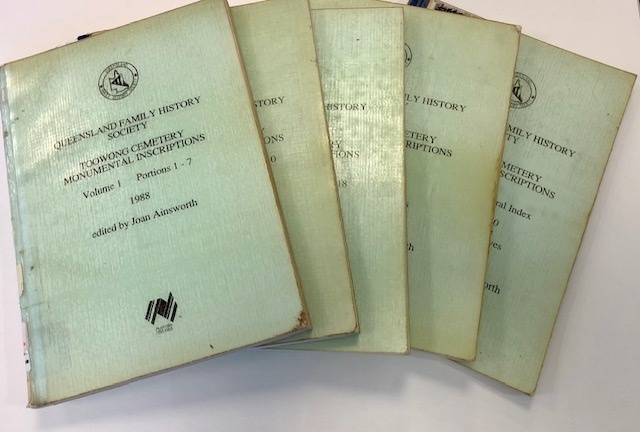
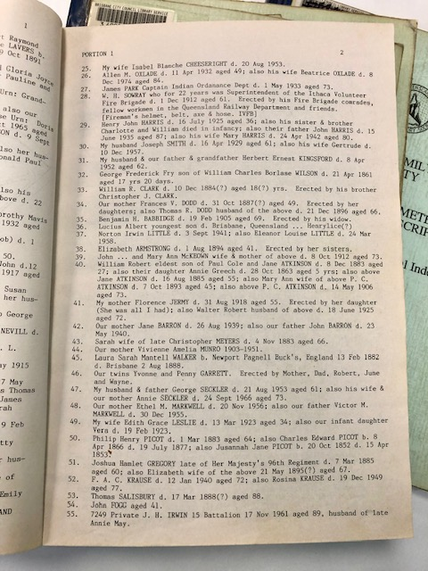

# Research Resources

Free tools to help you research family and local history:

- **[Find a grave](find-a-grave.md)** in Toowong Cemetery
- **[Find an individual story](find-a-story.md)** in the index of the 550+ stories we've written
- **[Toowong Cemetery historic maps](historic-maps.md)** from Queensland State Archives
- **[Download our data](data.md)**

## Trove

Search **[Trove](https://trove.nla.gov.au)** to read obituaries and other newspaper articles about people interred in Toowong Cemetery. Obituaries have been extracted from the newspaper holdings of the National Library of Australia. 

Each list item will give you a direct link to the newspaper article as well as the grave number.

- **[Obituaries A - E](https://trove.nla.gov.au/list?id=4457)**
- **[Obituaries F - J](https://trove.nla.gov.au/list?id=4461)**
- **[Obituaries K - N](https://trove.nla.gov.au/list?id=4454)**
- **[Obituaries O - R](https://trove.nla.gov.au/list?id=4453)**
- **[Obituaries S - Z](https://trove.nla.gov.au/list?id=4430)**

## Australian Dictionary of Biography

The **[Australian Dictionary of Biography](https://adb.anu.edu.au/)** is Australia's pre-eminent dictionary of national biography. In it you will find concise, informative and fascinating descriptions of the lives of significant and representative persons in Australian history.

**[Search for "Toowong Cemetery"](https://adb.anu.edu.au/biographies/search/?scope=all&query=Toowong+Cemetery+&x=55&y=11&rs=)** for the biographies of 190 of the most prominent people buried at Toowong Cemetery.

## Obituaries Australia

**[Obituaries Australia](https://oa.anu.edu.au)** is a digital repository of obituaries published in newspapers, journals, magazines and bulletins. **[View Obituaries of people interred at Toowong Cemetery](https://oa.anu.edu.au/obituaries/search/?scope=all&query=Toowong+Cemetery+&x=85&y=18&rs=)**

## Toowong Cemetery Monumental Inscriptions

In 1988, as a Bicentennial project, the [Queensland Family History Society](https://www.qfhs.org.au) published five volumes of Toowong Cemetery Monumental Inscriptions. They can be found in the Local History Reference section at the Toowong Library and is [available on CD](https://www.qfhs.org.au/shop/shop-catalogue/society-publications/cemeteries/qfhscd030/).

{ width="62%" } { width="31.4%" }

## Other Resources

- [Grave search and family history](https://www.brisbane.qld.gov.au/community-and-safety/community-support/cemeteries/grave-location-search) - Brisbane City Council
- [Family History Research](https://www.familyhistory.bdm.qld.gov.au), Births, Deaths and Marriages - The State of Queensland
- [Family History](https://www.slq.qld.gov.au/research-collections/family-history) resources from the State Library of Queensland 
- [Online History and Genealogy](https://library-brisbane.ent.sirsidynix.net.au/client/en_AU/eLibCat/?rm=ONLINE+RESOURC0%7C%7C%7C1%7C%7C%7C0%7C%7C%7Ctrue&dt=list#History) resources available at Brisbane City Council Libraries
- [Books about Toowong Cemetery](https://library-brisbane.ent.sirsidynix.net.au/client/en_AU/eLibCat/search/results?qu=Toowong+Cemetery&qf=-ITYPE%09Item+Type%091%3AARCHIVES%09City+Archives+Collection&ac=ITYPE%09Item+Type%091%3ALOC-ST-REF%09Local+Studies+Reference+%7C%7C+1%3AREFERENCE%09Reference+Collection+%7C%7C+1%3ALOCSTUDIES%09Local+Studies+%7C%7C+1%3AARCHIVES%09City+Archives+Collection+%7C%7C+1%3ANONFICTION%09Non-Fiction&ac=ITYPE%09Item+Type%091%3ALOC-ST-REF%09Local+Studies+Reference+%7C%7C+1%3AREFERENCE%09Reference+Collection+%7C%7C+1%3ALOCSTUDIES%09Local+Studies+%7C%7C+1%3AARCHIVES%09City+Archives+Collection+%7C%7C+1%3ANONFICTION%09Non-Fiction) in Brisbane City Council Libraries
- [Toowong History Group](https://www.facebook.com/toowonghistorygroup/) preserve the history of Toowong through historical photographs, village maps, street names and stories of pioneers of the district. [:fontawesome-brands-facebook:](https://www.facebook.com/toowonghistorygroup/)
- [Toowong and District Historical Society Inc.](https://toowonghistory.org.au) researches, collects and records the history of the suburbs of Toowong, Milton and Auchenflower, and also part of Mt Coot‑tha. <!-- [:fontawesome-brands-facebook:](https://www.facebook.com/groups/202090111610987/) -->
- [Brisbane Living Heritage](https://brisbanelivingheritage.org) represents more than 90 organisations: museums, galleries, heritage sites, historic houses & gardens, and historical societies. 
- [Brisbane History West](https://brisbanehistorywest.wordpress.com/) is a collaborative resource set up to provide an internet presence for the history groups in the inner south western suburbs that don’t have their own dedicated website.
- [Brisbane City Archives](https://www.brisbane.qld.gov.au/things-to-see-and-do/council-venues-and-precincts/libraries/facilities-services/brisbane-city-archives)
- [Queensland State Archives](https://www.qld.gov.au/recreation/arts/heritage/archives) - historic items about [Brisbane General Cemetery](https://www.archivessearch.qld.gov.au/search?f[]=keywords&has_digital=false&op[]=AND&open=false&q[]=%22Brisbane%20general%20cemetery%22&sort=relevance) and [Toowong Cemetery](https://www.archivessearch.qld.gov.au/search?f[]=keywords&has_digital=false&op[]=AND&open=false&q[]=%22Toowong%20cemetery%22&sort=relevance)
- [Useful websites for family historians](https://www.slq.qld.gov.au/research-collections/family-history/useful-websites-family-historians) - State Library of Queensland
- [Cemetrees](https://cemetrees.wordpress.com), a blog by professional genealogist and local historian Dr Hilda Maclean to promote the innovative use of death and cemetery records in family and local history. 
- [Queensland Police Museum](https://www.police.qld.gov.au/museum)
- [Friends of Queensland Police Museum](https://www.friendsqpmuseum.com.au) who have restored many police graves in Toowong Cemetery and across the State
- [Research Guide to cemetery records at Queensland State Archives](https://www.publications.qld.gov.au/ckan-publications-attachments-prod/resources/3b2f93a8-3229-4739-bae5-a130fb199cf9/research-guide-to-cemetery-records.pdf)
- [Baptist Church Archives Queensland](https://www.bhsq.org/barq/)
- [Virtual War Memorial Australia](https://vwma.org.au/explore/cemeteries/1788)

<!--
- The [Under the Lino](http://www.underthelino.com.au) community have a [catalogue of research resources](http://www.underthelino.com.au/resources/)
-->