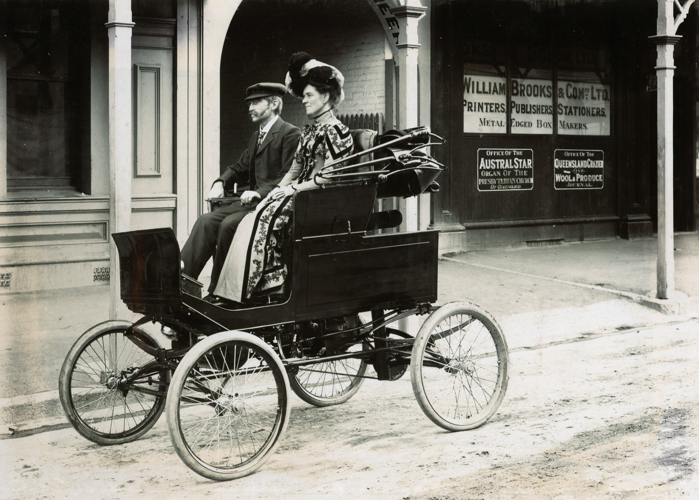
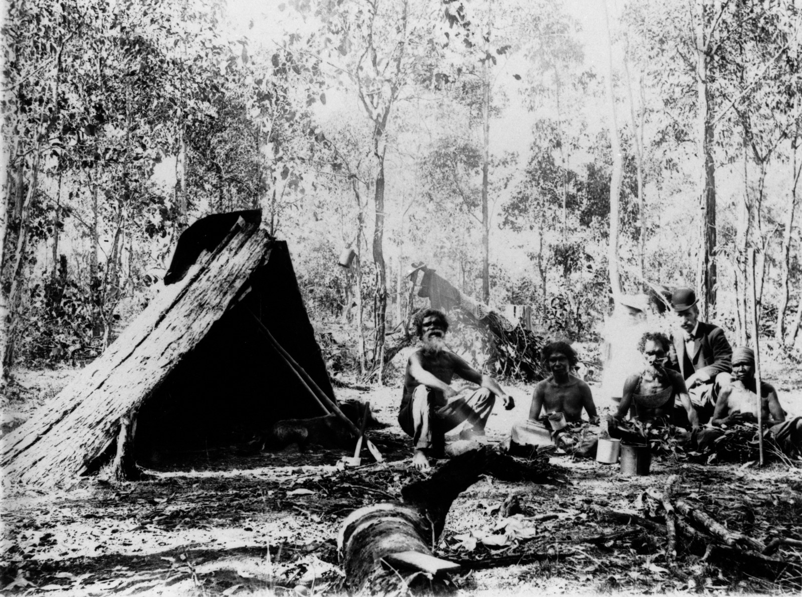
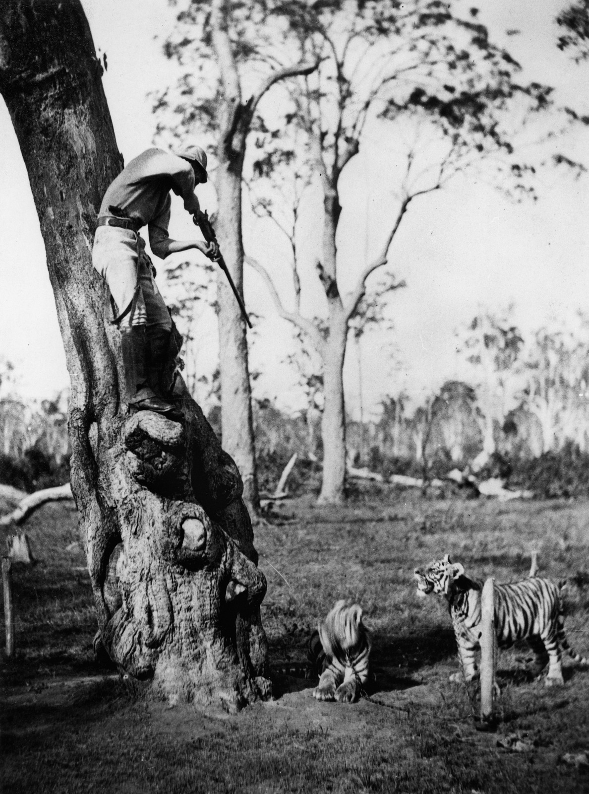
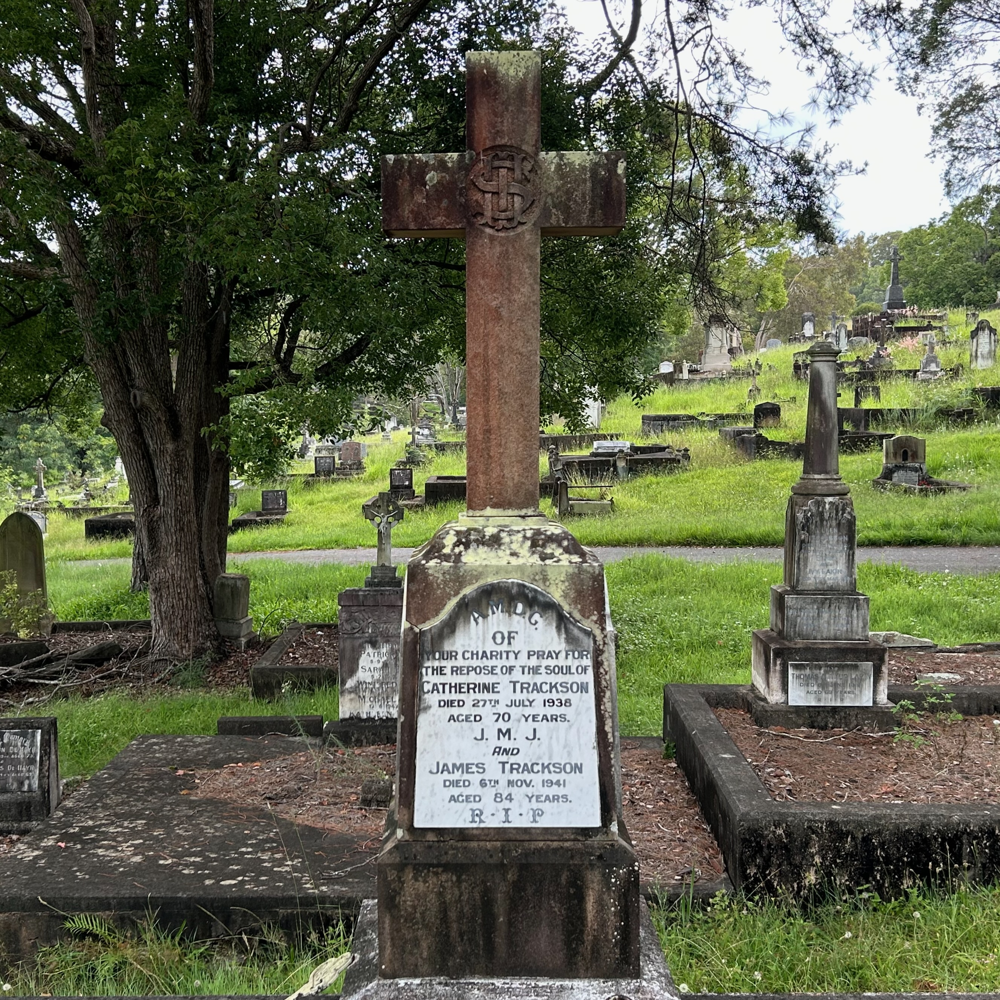

---
hide:
  - toc
  - navigation 
---

# James Trackson 

**1857 — 6 November 1941**

--8<-- "snippets/james-trackson.md"

<figure markdown>
  { width="70%" class="full-width" }
  <figcaption markdown>[Mr & Mrs Trackson in the steam Locomobile.](https://onesearch.slq.qld.gov.au/permalink/61SLQ_INST/1dejkfd/alma99183853678302061) — State Library of Queensland.</figcaption>
</figure>

<figure markdown>
  { width="70%" class="full-width" }
  <figcaption markdown>[James and Marie Trackson with others near the Alderley Train Station, 1900.](https://onesearch.slq.qld.gov.au/permalink/61SLQ_INST/1dejkfd/alma99183784908002061) — State Library of Queensland.</figcaption>
</figure>

<figure markdown>
  { width="%" class="full-width" }
  <figcaption markdown>[James Trackson aiming a gun at tigers at Toombul, 1884.](https://onesearch.slq.qld.gov.au/permalink/61SLQ_INST/dls06p/alma99183784907702061) — State Library of Queensland.</figcaption>
</figure>

<figure markdown>
  { width="30%" class="full-width" }
  <figcaption markdown>James Trackson's headstone in Toowong Cemetery.</figcaption>
</figure>

--8<-- "snippets/add-to-this-story.md"