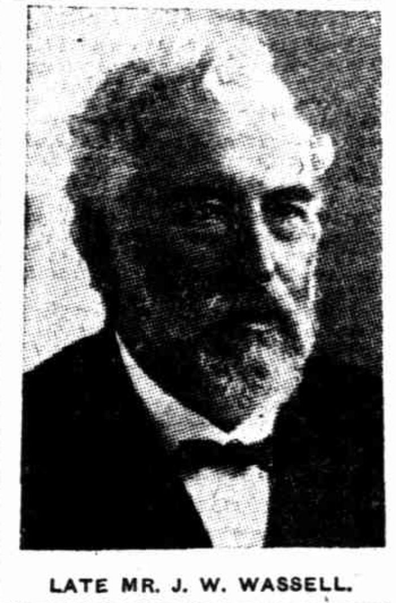

<!-- From graveside information sign -->

# James William Wassell

**10 February 1841 — 12 January 1926**

## James William Wassell <small>(13‑65‑10)</small>

James W. Wassell arrived in Queensland in 1864 and immediately joined the Water Police in Brisbane. For many years he was in charge of the prison hulk *Proserpine* and the boys Reformatory at Lytton. He assisted in founding the Boy's Home at Enoggera, the Hospital for Sick Children, the Lady Lamington Hospital, and the Institute of Social Service. Wassell was also a staunch supporter of the Creche and Kindergarten movements, and a Trustee of Toowong Cemetery.

<figure markdown>
  { width="30%" }
  <figcaption markdown>[J. W. Wassell](https://trove.nla.gov.au/newspaper/article/181447533) - The Week, 15 January 1926</figcaption>
</figure>

### Learn more

- [Obituary Mr. J. W. Wassell](https://trove.nla.gov.au/newspaper/article/181447533) - The Week, 15 January 1926

--8<-- "snippets/add-to-this-story.md"