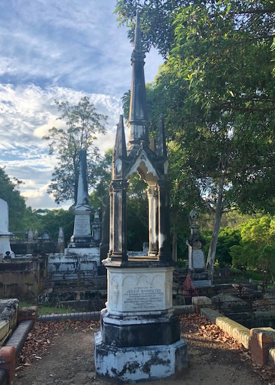

# Jessie Philp

**ca. 1856 — 21 November 1890**

--8<-- "snippets/jessie-philp-2.md"

### Headstone

{ width="30%" }

### Sources

4: Kindly provided by descendants.

--8<-- "snippets/add-to-this-story.md"