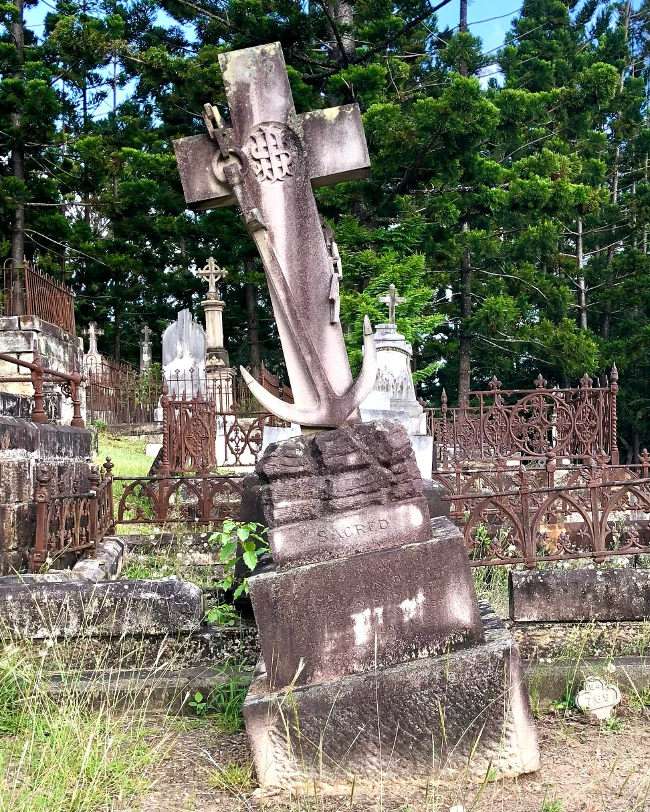

# John Burke

**1842 — 3 June 1919**

--8<-- "snippets/john-burke.md"

# Headstone

{ width="33%" } 

*<small>John Burke's headstone</small>* 

### Learn more 

- [Burke's flaming ocean - coastal shipping in Queensland](https://www.slq.qld.gov.au/blog/burkes-flaming-ocean-coastal-shipping-queensland) - State Library Of Queensland.
  
<!--

### Inscription

> Sacred to the memory of  
> Captain John Burke ???  
> ??? John Burke Limited  
> Born Cork Ireland 1888  
> Died 3^rd^ June 1919  
> ??? 

-->
--8<-- "snippets/add-to-this-story.md"