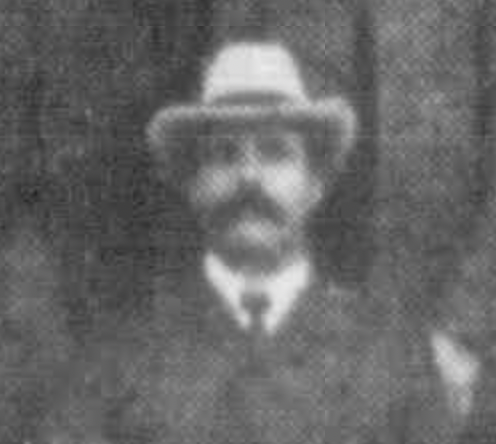

---
hide:
  - toc
  - navigation
---

# John Gordon Smith

**1863 — 21 June 1921**

--8<-- "snippets/john-gordon-smith.md"

{ width=33% }

*<small>[John Gordon Smith](http://nla.gov.au/nla.news-article70815303), 1905</small>*

# Headstone

{ width=33% }

### Learn more

- [Endorsed Labor Candidate for Brisbane North](https://trove.nla.gov.au/newspaper/article/206483527) in 1908

--8<-- "snippets/add-to-this-story.md"