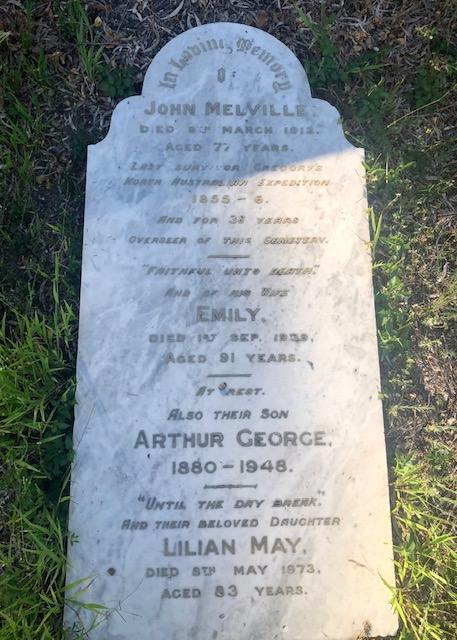

---
hide:
  - toc
  - navigation 
---

# John Melville

**1834 — 8 March 1912**

--8<-- "snippets/john-melville.md"

### Headstone

{ width="30%" }

### Inscription

>In loving memory  
>of  
>John Melville  
>Died 8^th^ March 1912  
>Aged 77   
>Last survivor Gregory's   
>North Australian Expedition   
>1855-6   
>and for 32 years  
>Overseer of this Cemetery 

--8<-- "snippets/add-to-this-story.md"