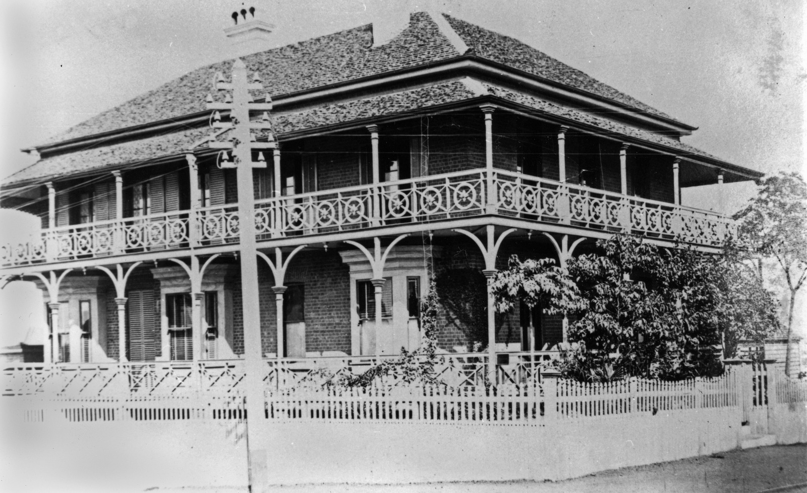

---
hide:
  - toc
  - navigation 
---

# Joseph Bancroft

**21 February 1836 — 16 June 1894**

--8<-- "snippets/joseph-bancroft.md"

<figure markdown>
  { width="70%" }
  <figcaption markdown>[Home of Dr. Joseph Bancroft in Ann Street, Brisbane, ca. 1882](https://onesearch.slq.qld.gov.au/permalink/61SLQ_INST/dls06p/alma99183509326502061) — State Library of Queensland</figcaption>
</figure>

--8<-- "snippets/add-to-this-story.md"