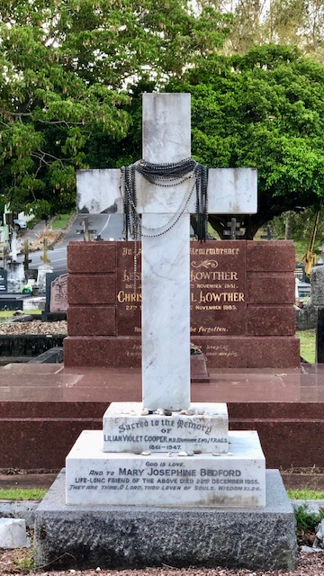

--8<-- "snippets/sem/research/lilian-cooper.json"

# Lilian Violet Cooper

**11 August 1861 — 18 August 1947**

--8<-- "snippets/lilian-cooper.md"

{ width="70%" }  

*<small>[Two friends seated in a horsedrawn buggy, Brisbane, ca. 1900](http://onesearch.slq.qld.gov.au/permalink/f/1oppkg1/slq_alma21272255460002061). Miss Josephine Bedford (left) and Dr. Lilian Cooper, the first registered female doctor in Queensland. Dr Cooper made house calls in a horse and sulky by day and a bicycle by night. Her surgery was in George Street, Brisbane. - State Library of Queensland </small>* 

### Headstone

{ width="25%" } { width="59.25%" }

### Learn more 

- Explore digitised newspaper articles about [Lilian Cooper](https://trove.nla.gov.au/list/146250) and [Josephine Bedford](https://trove.nla.gov.au/list/117121) on Trove.
- Discover [related John Oxley Library collections](http://onesearch.slq.qld.gov.au/primo-explore/search?query=usertag,contains,dr%20lilian%20violet%20cooper&amp;vid=SLQ&amp;lang=en_US") 
- [Lilian Cooper and Josephine Bedford](https://www.museumofbrisbane.com.au/mob-sunday-stories-lilian-cooper-and-josephine-bedford/) - Museum of Brisbane
- Listen to a State Library of Queensland Podcast about Dr. Lilian Cooper and Josephine Bedford

<iframe width="70%" height="166" scrolling="no" frameborder="no" allow="autoplay" src="https://w.soundcloud.com/player/?url=https%3A//api.soundcloud.com/tracks/894179215&color=ff5500"></iframe>
<a href="https://soundcloud.com/user-421634801" title="State Library of Queensland" target="_blank" style="color: #cccccc; text-decoration: none;">State Library of Queensland</a> · <a href="https://soundcloud.com/user-421634801/dangerouswomen-liliancooper-episode3" title="Episode 3: Dr Lilian Cooper" target="_blank" style="color: #cccccc; text-decoration: none;">Episode 3: Dr Lilian Cooper</a>

