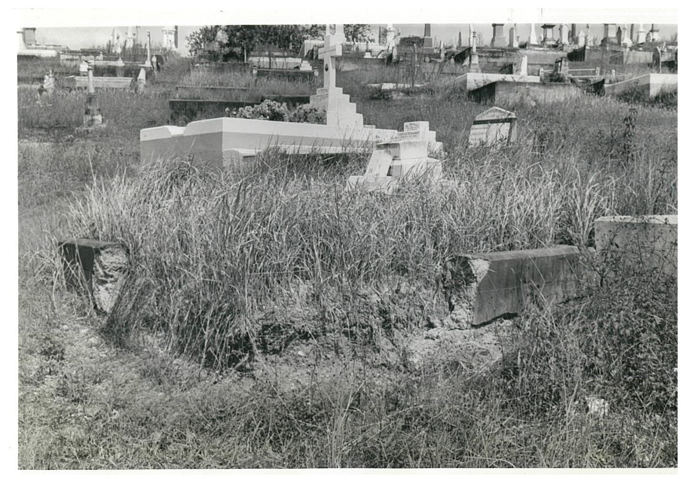

# Magdalene Dick

**ca. 1851 — 22 July 1922**

--8<-- "snippets/magdalene-dick.md"

### Headstone

<!-- reduce image size -->

<!--
{ width="40%" class="full-width" } 
-->

--8<-- "snippets/demolished-in-beautification-scheme.md"

### Inscription

> In Loving memory of William Heddle Dick died July 21st 1893 aged 43 years.  
> His wife Magdalene died July 22nd 1922 aged 70 years.  
> Mabel Nellie died July 6th 1889 aged 2½ years.  
> Also Lottie Magdalene Wells.  Died at Johannesburg July 27th 1923 aged 38 years.  
> Thomas Evan Price died at Sydney Jan 22nd 1893 aged 36 years.  

### Grave Marker

V1 924

### Learn more

- [Unsightly/Dangerous Grave Report](../../assets/demolished-toowong-headstones/18-35-24&25-dick/18-35-24&25-dick-report.jpg)

--8<-- "snippets/add-to-this-story.md"
