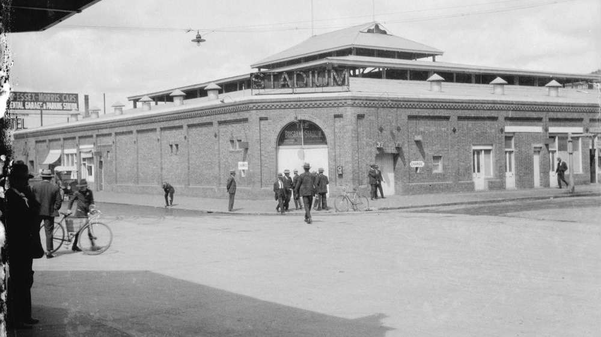

---
hide:
  - toc
  - navigation
---

# Patrick Francis Hill

**1899 — 3 August 1958**

--8<-- "snippets/pat-hill.md"

{ width="70%" }

*<small>[Brisbane Stadium, home of boxing in Brisbane, ca. 1925](http://onesearch.slq.qld.gov.au/permalink/f/1upgmng/slq_alma21256132430002061). Brisbane Stadium, situated on the corner of Albert and Elizabeth Streets, Brisbane - State Library of Queensland. Cropped. </small>* 

--8<-- "snippets/headstones/pat-hill.md"

### Learn more 

- Learn about [Pat Hill and the Prince of Sports contest](https://trove.nla.gov.au/newspaper/article/21482211).
- Read about [Pat's close call](https://trove.nla.gov.au/newspaper/article/201314701).
