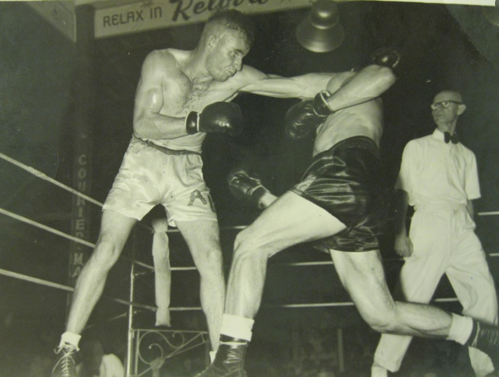

---
hide:
  - toc
  - navigation
---

# Patrick Francis Hill

**1899 — 3 August 1958**

--8<-- "snippets/pat-hill.md"

{ width="70%" }

*<small>[Brisbane Stadium, home of boxing in Brisbane, ca. 1925](http://onesearch.slq.qld.gov.au/permalink/f/1upgmng/slq_alma21256132430002061). Brisbane Stadium, situated on the corner of Albert and Elizabeth Streets, Brisbane - State Library of Queensland. Cropped. </small>* 

<figure markdown>
  { width="70%" class="full-width" }
  <figcaption markdown>Pat Hill, Boxing Referee. Source unknown.</figcaption>
</figure>

--8<-- "snippets/headstones/pat-hill.md"

### Learn more 

- Learn about [Pat Hill and the Prince of Sports contest](https://trove.nla.gov.au/newspaper/article/21482211).
- Read about [Pat's close call](https://trove.nla.gov.au/newspaper/article/201314701).

<!--
https://trove.nla.gov.au/newspaper/article/198688860?searchTerm=%22pat%20hill%22%20boxing
https://trove.nla.gov.au/newspaper/article/191590889?searchTerm=%22pat%20hill%22%20boxing
https://trove.nla.gov.au/newspaper/article/183433522?searchTerm=%22pat%20hill%22%20boxing

-->

--8<-- "snippets/add-to-this-story.md"