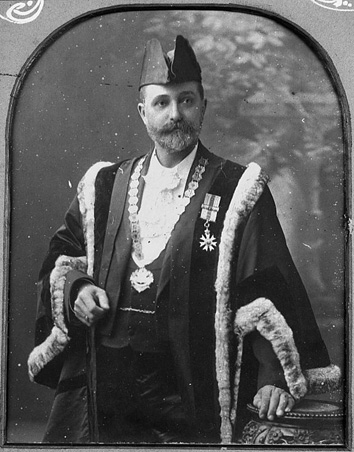

---
hide:
  - toc
  - navigation 
---

# Thomas Proe

**1852 — 17 December 1922**

--8<-- "snippets/thomas-proe.md"

{ width="48%" } { width="39.7%" }

*<small>[Mayor Thomas Proe](https://library-brisbane.ent.sirsidynix.net.au/client/en_AU/BrisbaneImages/search/results?qu=Mayor+Thomas+Proe&rm=BRISBANEIMAGES0%7C%7C%7C1%7C%7C%7C0%7C%7C%7Ctrue&te=ASSET&lm=ALL_ASSETS) 1901 and 1905 — Brisbane City Council.</small>*
