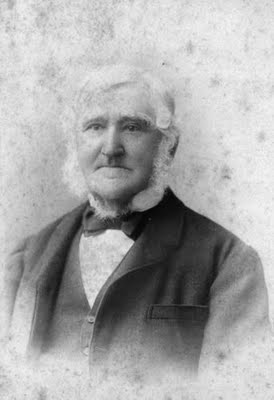

---
hide:
  - toc
  - navigation
---

# Walter Hill

**31 December 1819 — 4 February 1904**

--8<-- "snippets/walter-hill.md"

{ width="32%" }

<small>Unknown author - State Library of Queensland and John Oxley Library, [Public Domain](https://commons.wikimedia.org/w/index.php?curid=22616572)</small>

{ width="32%" }  

*<small>[Lord Mayor Clem Jones Unveiling the Walter Hill Plaque - Toowong Cemetery.](https://library-brisbane.ent.sirsidynix.net.au/client/en_AU/BrisbaneImages/search/detailnonmodal/ent:$002f$002fSD_ASSET$002f0$002fSD_ASSET:24873/one?qu=Lord+Mayor+Clem+Jones+Unveiling+the+Walter+Hill+Plaque+-+Toowong+Cemetery.&rm=BRISBANEIMAGES0%7C%7C%7C1%7C%7C%7C0%7C%7C%7Ctrue&te=ASSET&lm=ALL_ASSETS) - [Brisbane City Council](https://www.brisbane.qld.gov.au)</small>*

The plaque reads: 

>Walter Hill, The first director of The Brisbane Botanic Gardens, was born in 1920 in Scotsdyke, Dumfriesshire, Scotland. After training at The Royal Botanic Gardens of Edinburgh and Kew, He was appointed Superintendent of The Brisbane Botanic Gardens on 20 February 1855. Later he was designated Director and Government Botanist. He retired in 1881 and died at Eight Mile Plains on 4 February 1904. 
>
>Australia is indebted to him for introducing the Jacaranda and Poinciana. He was also responsible for the distribution of the Mango, Pawpaw, Sugar Cane, Ginger and Arrowrott, as well as other plants of economic importance. 
>
>To commemorate one who made a significant contribution to early Queensland Development this plaque was presented by The Queensland Council of Garden Clubs.

--8<-- "snippets/headstones/walter-hill.md"
