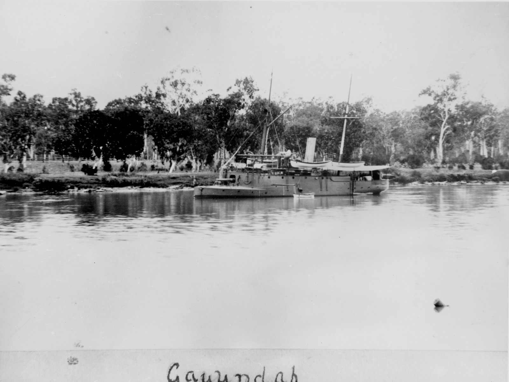
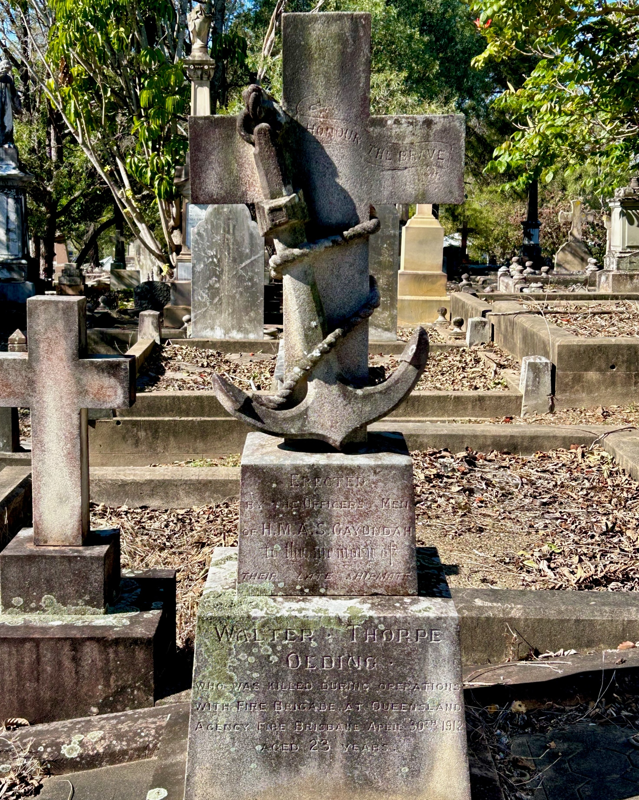

# Walter Thorpe Olding

**25 September 1888 — 30 April 1912**

--8<-- "snippets/walter-thorpe-olding.md"

{ width="40%" class="full-width" }

*<small>[Warehouse destroyed by fire in Edward Street, Brisbane, 1912](https://trove.nla.gov.au/newspaper/page/21126876), from *The Week*, 3 May 1912. — National Library of Australia.</small>*

{ width=66% class="full-width" }

*<small>[The 'Gayundah' gunship moored in the Fitzroy River, Rockhampton](https://onesearch.slq.qld.gov.au/permalink/61SLQ_INST/1dejkfd/alma99183513114502061) — State Library of Queensland</small>*

### Headstone

{ width="40%" }

*<small>Walter Thorpe Olding's headstone</small>*

### Inscription

>Honour the brave  
>Erected by the Officers & Men  
>of H.M.A.S. Gayundah  
>to the memory of   
>their late Shipmate  
>Walter Thorpe  
>Olding  
>Who was killed during operations  
>with Fire Brigade at Queensland  
>Agency Fire Brisbane April 30^th^ 1912  
>aged 23 years  

--8<-- "snippets/add-to-this-story.md"